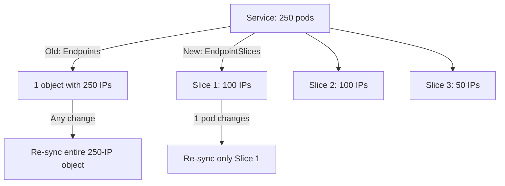

> 💡 **Quick Answer:** networking

## The Problem

This is a fundamental Kubernetes topic that engineers search for frequently. A comprehensive reference with production-ready examples saves hours of trial and error.

## The Solution

### EndpointSlices vs Endpoints

```bash
# Old: Endpoints (one object per Service, all IPs)
kubectl get endpoints my-service
# NAME         ENDPOINTS
# my-service   10.244.1.5:80,10.244.2.8:80,...  # Gets huge!

# New: EndpointSlices (chunked into ~100 endpoints each)
kubectl get endpointslices -l kubernetes.io/service-name=my-service
# NAME                  ADDRESSTYPE   PORTS   ENDPOINTS   AGE
# my-service-abc12      IPv4          80      100         1h
# my-service-def34      IPv4          80      100         1h
# my-service-ghi56      IPv4          80      50          1h
```

### Why EndpointSlices Matter

| Feature | Endpoints | EndpointSlices |
|---------|-----------|----------------|
| Max size | 1 object, grows unbounded | ~100 endpoints per slice |
| Update cost | Update entire object | Update only changed slice |
| Dual-stack | One object for IPv4+IPv6 | Separate slices per address type |
| Topology hints | ❌ | ✅ (route to same zone) |
| Default since | Legacy | K8s 1.21+ (default) |

### Topology-Aware Routing

```yaml
# EndpointSlice with topology hints
apiVersion: v1
kind: Service
metadata:
  name: my-service
  annotations:
    service.kubernetes.io/topology-mode: Auto
spec:
  selector:
    app: web
  ports:
    - port: 80
# Kubernetes routes traffic to pods in the same zone when possible
# Reduces cross-zone data transfer costs!
```



## Frequently Asked Questions

### Do I need to do anything to use EndpointSlices?

No — EndpointSlices are the default since K8s 1.21. The EndpointSlice controller automatically creates and manages them for every Service. You benefit automatically.

## Best Practices

- Start with the simplest configuration that meets your needs
- Test changes in staging before production
- Use `kubectl describe` and events for troubleshooting
- Document your decisions for the team

## Key Takeaways

- This is essential Kubernetes knowledge for production operations
- Follow the principle of least privilege and minimal configuration
- Monitor and iterate based on real-world behavior
- Automation reduces human error and improves consistency
