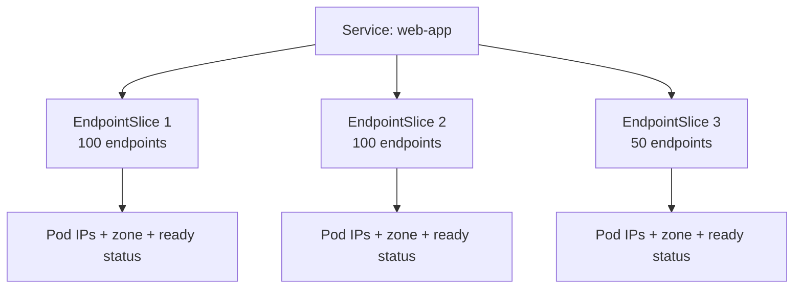

> 💡 **Quick Answer:** EndpointSlices replace legacy Endpoints for services with many backends. They're sharded into 100-endpoint chunks, reducing API server load and enabling topology-aware routing.

## The Problem

Legacy Endpoints objects store all pod IPs in a single resource. For services with hundreds of backends, every pod change triggers a full Endpoints update — overwhelming the API server and kube-proxy with large watch payloads.

## The Solution

### View EndpointSlices

```bash
# List EndpointSlices for a service
kubectl get endpointslices -l kubernetes.io/service-name=web-app

# Detailed view
kubectl describe endpointslice web-app-abc12
```

### EndpointSlice Structure

```yaml
apiVersion: discovery.k8s.io/v1
kind: EndpointSlice
metadata:
  name: web-app-abc12
  labels:
    kubernetes.io/service-name: web-app
addressType: IPv4
ports:
  - name: http
    port: 8080
    protocol: TCP
endpoints:
  - addresses:
      - "10.244.1.5"
    conditions:
      ready: true
      serving: true
      terminating: false
    nodeName: worker-01
    zone: us-east-1a
  - addresses:
      - "10.244.2.8"
    conditions:
      ready: true
    nodeName: worker-02
    zone: us-east-1b
```

### Enable Topology-Aware Routing

```yaml
apiVersion: v1
kind: Service
metadata:
  name: web-app
  annotations:
    service.kubernetes.io/topology-mode: Auto
spec:
  selector:
    app: web-app
  ports:
    - port: 80
      targetPort: 8080
```

### Custom EndpointSlice (External Service)

```yaml
apiVersion: discovery.k8s.io/v1
kind: EndpointSlice
metadata:
  name: external-db
  labels:
    kubernetes.io/service-name: external-db
addressType: IPv4
ports:
  - name: mysql
    port: 3306
    protocol: TCP
endpoints:
  - addresses:
      - "192.168.1.100"
    conditions:
      ready: true
---
apiVersion: v1
kind: Service
metadata:
  name: external-db
spec:
  ports:
    - port: 3306
```



## Common Issues

**EndpointSlice shows pods as not ready**
Check pod readiness probes:
```bash
kubectl get endpointslices -l kubernetes.io/service-name=web-app -o yaml | grep -A3 conditions
```

**Topology-aware routing causing uneven distribution**
If one zone has fewer pods, traffic may overflow to other zones. Ensure sufficient replicas per zone.

**Stale endpoints during rolling updates**
The `terminating` condition prevents traffic to shutting-down pods. Ensure `terminationGracePeriodSeconds` allows in-flight requests to complete.

## Best Practices

- EndpointSlices are created automatically — no manual management needed for standard services
- Use topology-aware routing to reduce cross-zone network costs
- Monitor EndpointSlice count for very large services (>1000 pods)
- Use `serving` condition to distinguish ready from terminating pods
- Set `publishNotReadyAddresses: true` on headless services for StatefulSets that need pre-ready DNS

## Key Takeaways

- EndpointSlices shard endpoints into 100-pod chunks (configurable)
- They replace legacy Endpoints for all new services (GA since 1.21)
- Each slice includes topology info (zone, node) for routing decisions
- `topology-mode: Auto` enables zone-preferring traffic routing
- The `terminating` condition enables graceful connection draining
- Manual EndpointSlices enable Kubernetes service discovery for external resources
