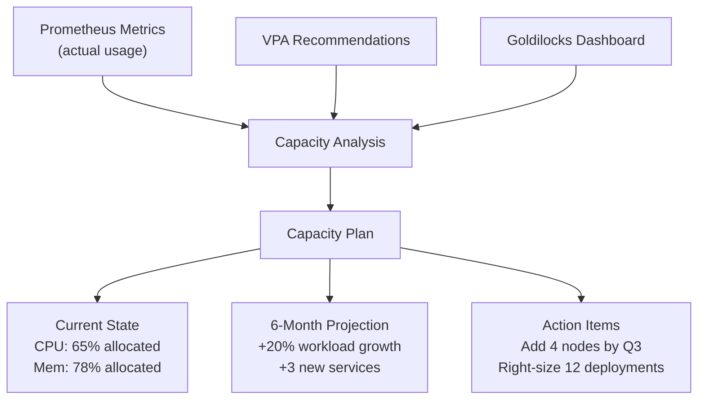

> 💡 **Quick Answer:** Use Prometheus metrics + VPA recommendations + Goldilocks to analyze actual resource usage. Calculate cluster capacity as: `(node count × node resources) - system overhead - headroom buffer (20-30%)`. Plan for peak + growth rate over 6-12 months.

## The Problem

Enterprise clusters either over-provision (wasting 40-60% of cloud spend) or under-provision (causing outages during traffic spikes). You need a data-driven approach to cluster sizing that accounts for actual workload patterns, growth projections, and required headroom for failover and burst capacity.



## The Solution

### Step 1: Measure Current Usage

```bash
# Cluster-wide resource allocation vs usage
kubectl top nodes
# NAME          CPU(cores)   CPU%   MEMORY(bytes)   MEMORY%
# node-01       3200m        40%    28Gi            55%
# node-02       4100m        51%    35Gi            68%
# node-03       2800m        35%    22Gi            43%

# Namespace-level resource consumption
kubectl get resourcequota --all-namespaces
```

### Prometheus Queries for Capacity Metrics

```promql
# CPU allocation ratio (requests vs capacity)
sum(kube_pod_container_resource_requests{resource="cpu"})
/
sum(kube_node_status_allocatable{resource="cpu"})

# Memory allocation ratio
sum(kube_pod_container_resource_requests{resource="memory"})
/
sum(kube_node_status_allocatable{resource="memory"})

# Actual CPU usage vs requests (over-provisioning indicator)
sum(rate(container_cpu_usage_seconds_total{container!=""}[5m]))
/
sum(kube_pod_container_resource_requests{resource="cpu"})

# Actual memory usage vs requests
sum(container_memory_working_set_bytes{container!=""})
/
sum(kube_pod_container_resource_requests{resource="memory"})

# Peak CPU usage over 30 days (for sizing)
max_over_time(
  sum(rate(container_cpu_usage_seconds_total{container!=""}[5m]))[30d:1h]
)

# Pods per node (bin-packing efficiency)
count by (node) (kube_pod_info{})
```

### Step 2: Capacity Planning Formula

```
Required Capacity = Peak Usage × (1 + Growth Rate) × (1 + Headroom Buffer)

Where:
- Peak Usage: max resource consumption over 30 days
- Growth Rate: projected workload increase (e.g., 20% over 6 months)
- Headroom Buffer: 20-30% for:
  - Node failure tolerance (N+1 or N+2)
  - Burst capacity (traffic spikes)
  - System overhead (kubelet, kube-proxy, CNI, monitoring)
```

### Capacity Planning Spreadsheet Template

```yaml
# capacity-plan.yaml
cluster: production-us-east
date: "2026-04-08"
planning_horizon: 6_months

current_state:
  nodes: 12
  node_type: m5.4xlarge  # 16 vCPU, 64Gi RAM
  total_cpu: 192          # 12 × 16
  total_memory_gi: 768    # 12 × 64
  system_overhead_cpu: 24   # ~2 CPU per node (kubelet, system)
  system_overhead_mem_gi: 96 # ~8Gi per node
  allocatable_cpu: 168      # 192 - 24
  allocatable_memory_gi: 672 # 768 - 96

  actual_usage:
    cpu_requests: 112       # 67% of allocatable
    cpu_actual_peak: 89     # 53% of allocatable
    memory_requests: 480    # 71% of allocatable
    memory_actual_peak: 390 # 58% of allocatable

  waste_analysis:
    cpu_overprovisioned: 23 # requests - actual peak
    memory_overprovisioned: 90
    estimated_monthly_waste: "$4,200"

projected_growth:
  new_services: 3
  estimated_new_cpu: 24
  estimated_new_memory_gi: 96
  organic_growth_pct: 15

required_capacity:
  cpu: 154  # (89 + 24) × 1.15 × 1.25
  memory_gi: 557  # (390 + 96) × 1.15 × 1.25

  nodes_needed: 11  # ceil(154 / 14) where 14 = allocatable per node
  current_nodes: 12
  action: "Right-size 12 deployments, no new nodes needed for 6 months"

recommendations:
  - "Right-size top 12 over-provisioned deployments (save 23 CPU cores)"
  - "Enable VPA for all stateless workloads"
  - "Review node type — m5.2xlarge may be more cost-effective"
  - "Add 2 nodes in Q4 if organic growth exceeds 15%"
  - "Set up Goldilocks dashboard for continuous monitoring"
```

### Automated Right-Sizing with VPA

```yaml
# Deploy VPA in recommendation mode for all namespaces
apiVersion: autoscaling.k8s.io/v1
kind: VerticalPodAutoscaler
metadata:
  name: api-gateway-vpa
  namespace: production
spec:
  targetRef:
    apiVersion: apps/v1
    kind: Deployment
    name: api-gateway
  updatePolicy:
    updateMode: "Off"  # Recommendation only
  resourcePolicy:
    containerPolicies:
      - containerName: "*"
        minAllowed:
          cpu: 50m
          memory: 64Mi
        maxAllowed:
          cpu: "4"
          memory: 8Gi
```

```bash
# Check VPA recommendations
kubectl get vpa -A -o custom-columns=\
  NAMESPACE:.metadata.namespace,\
  NAME:.metadata.name,\
  CPU_REQ:.status.recommendation.containerRecommendations[0].target.cpu,\
  MEM_REQ:.status.recommendation.containerRecommendations[0].target.memory
```

## Common Issues

| Issue | Cause | Fix |
|-------|-------|-----|
| High allocation but low usage | Developers set conservative requests | Deploy VPA in recommendation mode, review quarterly |
| Node full but cluster shows capacity | Memory fragmentation | Use `requests` not `limits` for scheduling, or add smaller nodes |
| Spiky workloads cause OOM | Requests too low for peak | Use VPA `percentile: 95` not `50` for recommendations |
| Cost keeps growing | No governance on resource requests | Enforce ResourceQuotas + LimitRanges per namespace |

## Best Practices

- **Measure before sizing** — never guess capacity; use 30 days of Prometheus metrics
- **Plan for N+2 node failure** — cluster must survive 2 node failures during peak
- **Review quarterly** — workload patterns change; update capacity plans every 3 months
- **Right-size before scaling** — fix over-provisioned deployments before adding nodes
- **Use Goldilocks** — visual dashboard makes right-sizing accessible to development teams
- **Separate node pools** — GPU, high-memory, and general-purpose nodes optimize bin-packing

## Key Takeaways

- Data-driven capacity planning uses actual usage metrics, not requested resources
- The capacity formula accounts for peak usage, growth rate, and headroom buffer
- Right-sizing existing workloads often frees 20-40% capacity without adding nodes
- VPA recommendations + Goldilocks dashboards make continuous optimization practical
- Review and update capacity plans quarterly as workloads and teams evolve
