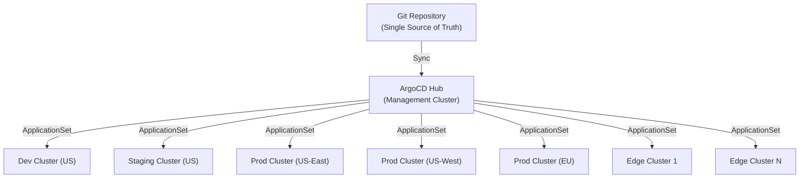

> 💡 **Quick Answer:** Use ArgoCD ApplicationSets with generators (Git, cluster, matrix) to declaratively manage applications across hundreds of clusters from a single Git repo. Combine with Kustomize overlays for environment-specific configuration and progressive rollouts.

## The Problem

Enterprise organizations manage tens to hundreds of Kubernetes clusters across regions, cloud providers, and environments. Manually deploying and updating applications on each cluster is error-prone and doesn't scale. You need a fleet management approach where Git is the single source of truth, changes propagate automatically, and drift is self-healed.



## The Solution

### Cluster Generator: Deploy to All Clusters

```yaml
apiVersion: argoproj.io/v1alpha1
kind: ApplicationSet
metadata:
  name: platform-monitoring
  namespace: argocd
spec:
  generators:
    - clusters:
        selector:
          matchLabels:
            environment: production
  template:
    metadata:
      name: "monitoring-{{name}}"
    spec:
      project: platform
      source:
        repoURL: https://git.example.com/platform/monitoring.git
        targetRevision: main
        path: "overlays/{{metadata.labels.environment}}"
      destination:
        server: "{{server}}"
        namespace: monitoring
      syncPolicy:
        automated:
          prune: true
          selfHeal: true
        syncOptions:
          - CreateNamespace=true
          - ServerSideApply=true
```

### Matrix Generator: Environments × Applications

```yaml
apiVersion: argoproj.io/v1alpha1
kind: ApplicationSet
metadata:
  name: microservices-fleet
  namespace: argocd
spec:
  generators:
    - matrix:
        generators:
          # All production clusters
          - clusters:
              selector:
                matchLabels:
                  environment: production
          # All microservices in Git
          - git:
              repoURL: https://git.example.com/apps/microservices.git
              revision: main
              directories:
                - path: "services/*"
  template:
    metadata:
      name: "{{path.basename}}-{{name}}"
      labels:
        app: "{{path.basename}}"
        cluster: "{{name}}"
    spec:
      project: microservices
      source:
        repoURL: https://git.example.com/apps/microservices.git
        targetRevision: main
        path: "{{path}}/overlays/production"
      destination:
        server: "{{server}}"
        namespace: "{{path.basename}}"
      syncPolicy:
        automated:
          prune: true
          selfHeal: true
```

### Progressive Rollout Across Clusters

```yaml
apiVersion: argoproj.io/v1alpha1
kind: ApplicationSet
metadata:
  name: progressive-rollout
  namespace: argocd
spec:
  generators:
    - clusters:
        selector:
          matchLabels:
            environment: production
  strategy:
    type: RollingSync
    rollingSync:
      steps:
        # Step 1: Canary cluster (1 cluster)
        - matchExpressions:
            - key: rollout-tier
              operator: In
              values: ["canary"]
          maxUpdate: 1
        # Step 2: Wait for manual approval
        - matchExpressions:
            - key: rollout-tier
              operator: In
              values: ["early"]
          maxUpdate: 2
        # Step 3: Remaining clusters
        - matchExpressions:
            - key: rollout-tier
              operator: In
              values: ["general"]
          maxUpdate: "25%"
  template:
    metadata:
      name: "app-{{name}}"
    spec:
      source:
        repoURL: https://git.example.com/apps/frontend.git
        targetRevision: main
        path: overlays/production
      destination:
        server: "{{server}}"
        namespace: frontend
```

### Git Repository Structure for Fleet

```
├── platform/                    # Platform-wide components
│   ├── monitoring/
│   │   ├── base/
│   │   │   ├── kustomization.yaml
│   │   │   ├── prometheus.yaml
│   │   │   └── grafana.yaml
│   │   └── overlays/
│   │       ├── production/
│   │       │   └── kustomization.yaml
│   │       └── staging/
│   │           └── kustomization.yaml
│   ├── logging/
│   ├── ingress/
│   └── security-policies/
├── services/                    # Application microservices
│   ├── api-gateway/
│   │   ├── base/
│   │   └── overlays/
│   ├── auth-service/
│   └── payment-service/
├── clusters/                    # Cluster-specific configs
│   ├── us-east-prod/
│   │   └── kustomization.yaml
│   ├── us-west-prod/
│   └── eu-prod/
└── policies/                    # Fleet-wide policies
    ├── network-policies/
    ├── resource-quotas/
    └── pod-security/
```

### Fleet-Wide Policy Enforcement

```yaml
# Deploy Kyverno policies to all clusters
apiVersion: argoproj.io/v1alpha1
kind: ApplicationSet
metadata:
  name: security-policies
  namespace: argocd
spec:
  generators:
    - clusters: {}  # ALL clusters
  template:
    metadata:
      name: "policies-{{name}}"
    spec:
      project: platform
      source:
        repoURL: https://git.example.com/platform/policies.git
        targetRevision: main
        path: policies
      destination:
        server: "{{server}}"
        namespace: kyverno
      syncPolicy:
        automated:
          prune: true
          selfHeal: true
        syncOptions:
          - ServerSideApply=true
```

## Common Issues

| Issue | Cause | Fix |
|-------|-------|-----|
| ApplicationSet generates too many apps | Broad cluster selector | Add label selectors to target specific cluster groups |
| Drift detected but self-heal fails | Resource conflicts with operators | Add `ServerSideApply=true` to sync options |
| Secret management across clusters | Secrets shouldn't be in Git | Use External Secrets Operator or Sealed Secrets per cluster |
| Slow sync across 100+ clusters | ArgoCD controller overloaded | Shard ArgoCD controllers, increase replicas |
| Rollout stuck on canary step | Canary cluster health check failing | Check Application health status, fix before proceeding |

## Best Practices

- **One Git repo for platform, one per app team** — platform team owns infra, app teams own their services
- **Kustomize overlays for environments** — base config + per-environment patches, never duplicate
- **Progressive rollouts** — canary → early adopters → general availability for production changes
- **Self-heal everything** — `selfHeal: true` ensures Git remains the source of truth
- **Shard ArgoCD for scale** — beyond 50 clusters, shard the application controller
- **Label clusters consistently** — `environment`, `region`, `provider`, `rollout-tier` for precise targeting

## Key Takeaways

- ApplicationSets with generators (cluster, git, matrix) declaratively manage fleet-wide deployments
- Progressive rollout strategies (canary → staged → full) reduce blast radius for changes
- Kustomize overlays + Git directory structure enable clean separation of concerns
- Fleet-wide policy enforcement via GitOps ensures consistent security posture across all clusters
