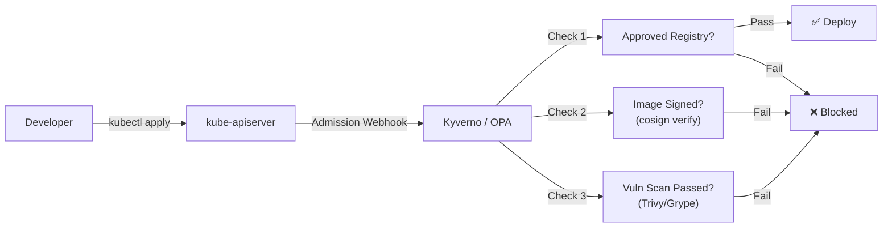

> 💡 **Quick Answer:** Use Kyverno or OPA Gatekeeper admission controllers to enforce that all container images come from approved registries, are signed with cosign, and pass vulnerability scans before deployment. Block `latest` tags and public registry pulls in production.

## The Problem

Enterprise environments require strict control over which container images can run in production clusters. Without governance, developers can deploy images from untrusted public registries, use unscanned images with known CVEs, or bypass the software supply chain. You need automated enforcement that blocks non-compliant images at admission time.



## The Solution

### Policy 1: Restrict to Approved Registries

```yaml
apiVersion: kyverno.io/v1
kind: ClusterPolicy
metadata:
  name: restrict-image-registries
  annotations:
    policies.kyverno.io/title: Restrict Image Registries
    policies.kyverno.io/severity: high
spec:
  validationFailureAction: Enforce
  background: true
  rules:
    - name: validate-registries
      match:
        any:
          - resources:
              kinds:
                - Pod
              namespaces: "production-*"
      validate:
        message: >-
          Images must come from approved registries:
          quay-int.registry.example.com or registry.internal.example.com.
          Image {{ element.image }} is not allowed.
        foreach:
          - list: "request.object.spec.[initContainers, containers, ephemeralContainers][]"
            deny:
              conditions:
                all:
                  - key: "{{ element.image }}"
                    operator: AnyNotIn
                    value:
                      - "quay-int.registry.example.com/*"
                      - "registry.internal.example.com/*"
                      - "registry.k8s.io/*"
```

### Policy 2: Block Latest Tags

```yaml
apiVersion: kyverno.io/v1
kind: ClusterPolicy
metadata:
  name: disallow-latest-tag
spec:
  validationFailureAction: Enforce
  rules:
    - name: require-image-tag
      match:
        any:
          - resources:
              kinds:
                - Pod
      validate:
        message: "Images must use a specific tag, not ':latest' or no tag. Image: {{ element.image }}"
        foreach:
          - list: "request.object.spec.containers[]"
            deny:
              conditions:
                any:
                  - key: "{{ element.image }}"
                    operator: Equals
                    value: "*:latest"
                  - key: "{{ regex_match('^[^:]+$', element.image) }}"
                    operator: Equals
                    value: true
```

### Policy 3: Require Image Signatures (cosign)

```yaml
apiVersion: kyverno.io/v1
kind: ClusterPolicy
metadata:
  name: verify-image-signatures
spec:
  validationFailureAction: Enforce
  webhookTimeoutSeconds: 30
  rules:
    - name: verify-cosign-signature
      match:
        any:
          - resources:
              kinds:
                - Pod
              namespaces: "production-*"
      verifyImages:
        - imageReferences:
            - "quay-int.registry.example.com/*"
          attestors:
            - entries:
                - keys:
                    publicKeys: |-
                      -----BEGIN PUBLIC KEY-----
                      MFkwEwYHKoZIzj0CAQYIKoZIzj0DAQcDQgAE...
                      -----END PUBLIC KEY-----
          required: true
```

### Sign Images in CI/CD

```bash
# Generate cosign key pair (one-time)
cosign generate-key-pair

# Sign image in CI pipeline after build + scan
cosign sign --key cosign.key \
  quay-int.registry.example.com/myapp:v1.2.3

# Verify signature
cosign verify --key cosign.pub \
  quay-int.registry.example.com/myapp:v1.2.3
```

### Policy 4: Vulnerability Scan Gate

```yaml
apiVersion: kyverno.io/v1
kind: ClusterPolicy
metadata:
  name: check-vulnerability-scan
spec:
  validationFailureAction: Enforce
  rules:
    - name: check-scan-annotation
      match:
        any:
          - resources:
              kinds:
                - Pod
              namespaces: "production-*"
      validate:
        message: "Image must have a passing vulnerability scan. Add annotation security.example.com/scan-status=passed"
        foreach:
          - list: "request.object.spec.containers[]"
            deny:
              conditions:
                all:
                  - key: "{{ request.object.metadata.annotations."security.example.com/scan-status" || 'missing' }}"
                    operator: NotEquals
                    value: "passed"
```

### Automated Pipeline Integration

```yaml
# GitHub Actions: build → scan → sign → deploy
name: Secure Image Pipeline
on:
  push:
    branches: [main]

jobs:
  build-and-deploy:
    runs-on: ubuntu-latest
    steps:
      - name: Build image
        run: |
          docker build -t quay-int.registry.example.com/myapp:${{ github.sha }} .
          docker push quay-int.registry.example.com/myapp:${{ github.sha }}

      - name: Scan with Trivy
        run: |
          trivy image --exit-code 1 --severity CRITICAL,HIGH \
            quay-int.registry.example.com/myapp:${{ github.sha }}

      - name: Sign with cosign
        run: |
          cosign sign --key env://COSIGN_KEY \
            quay-int.registry.example.com/myapp:${{ github.sha }}

      - name: Deploy to Kubernetes
        run: |
          kubectl set image deployment/myapp \
            myapp=quay-int.registry.example.com/myapp:${{ github.sha }}
```

## Common Issues

| Issue | Cause | Fix |
|-------|-------|-----|
| Admission webhook timeout | cosign verification slow | Increase `webhookTimeoutSeconds` to 30, cache verification results |
| System pods blocked | Policy matches kube-system | Exclude `kube-system` and `kyverno` namespaces from policies |
| CI pipeline cosign fails | Key not available | Store cosign private key in CI secrets (never in Git) |
| Legitimate images blocked | Missing signature | Add signing step to all CI pipelines before deployment |

## Best Practices

- **Enforce in production, audit in staging** — use `Enforce` in prod, `Audit` in staging/dev
- **Exclude system namespaces** — always whitelist `kube-system`, `kyverno`, and operator namespaces
- **Sign at CI time** — signing happens after build + scan, before push to registry
- **Use keyless signing** — cosign with Fulcio/Rekor for OIDC-based identity (no key management)
- **Block public registries entirely** — approved registries only, mirror needed public images internally
- **Audit policy violations** — even in audit mode, track and report non-compliant deployments

## Key Takeaways

- Admission controllers enforce image governance at deploy time — non-compliant images never run
- Layer policies: approved registries → no latest tag → signed images → vulnerability scan passed
- cosign provides lightweight image signing that integrates into any CI/CD pipeline
- Kyverno policies are Kubernetes-native YAML — no Rego learning curve like OPA
