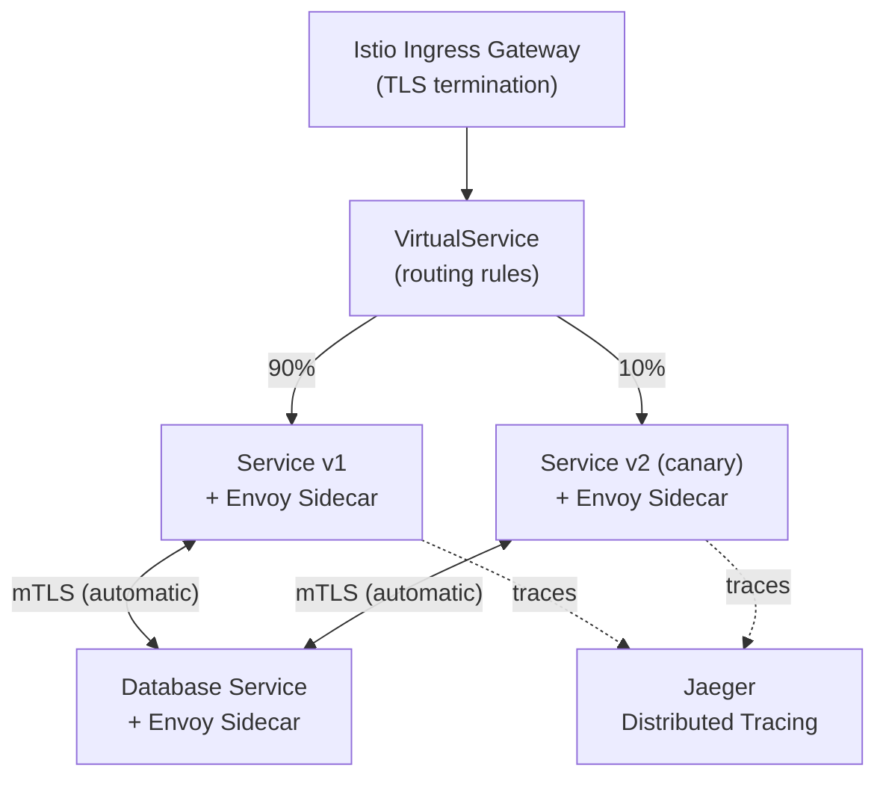

> 💡 **Quick Answer:** Install Istio with `STRICT` mTLS peer authentication to encrypt all pod-to-pod traffic automatically. Add VirtualServices for traffic splitting, DestinationRules for circuit breaking, and integrate with Jaeger for end-to-end distributed tracing.

## The Problem

Enterprise microservices architectures require encrypted service-to-service communication (mTLS), fine-grained traffic control (canary releases, retries, timeouts), circuit breaking for resilience, and distributed tracing for debugging. Implementing these at the application level creates inconsistency and duplicated effort across hundreds of services.



## The Solution

### Install Istio with Enterprise Profile

```bash
# Install istioctl
curl -L https://istio.io/downloadIstio | ISTIO_VERSION=1.24.0 sh -

# Install with production settings
istioctl install --set profile=default \
  --set meshConfig.accessLogFile=/dev/stdout \
  --set meshConfig.enableTracing=true \
  --set values.global.proxy.resources.requests.cpu=100m \
  --set values.global.proxy.resources.requests.memory=128Mi \
  --set values.global.proxy.resources.limits.cpu=500m \
  --set values.global.proxy.resources.limits.memory=256Mi

# Enable sidecar injection for application namespaces
kubectl label namespace production istio-injection=enabled
kubectl label namespace staging istio-injection=enabled
```

### Enforce Strict mTLS Mesh-Wide

```yaml
# Mesh-wide strict mTLS
apiVersion: security.istio.io/v1
kind: PeerAuthentication
metadata:
  name: default
  namespace: istio-system  # Mesh-wide
spec:
  mtls:
    mode: STRICT
---
# Exception: allow plaintext for legacy service
apiVersion: security.istio.io/v1
kind: PeerAuthentication
metadata:
  name: legacy-exception
  namespace: legacy-apps
spec:
  selector:
    matchLabels:
      app: legacy-api
  mtls:
    mode: PERMISSIVE
```

### Traffic Management: Canary Releases

```yaml
apiVersion: networking.istio.io/v1
kind: VirtualService
metadata:
  name: api-gateway
  namespace: production
spec:
  hosts:
    - api-gateway
  http:
    - match:
        - headers:
            x-canary:
              exact: "true"
      route:
        - destination:
            host: api-gateway
            subset: v2
    - route:
        - destination:
            host: api-gateway
            subset: v1
          weight: 90
        - destination:
            host: api-gateway
            subset: v2
          weight: 10
---
apiVersion: networking.istio.io/v1
kind: DestinationRule
metadata:
  name: api-gateway
  namespace: production
spec:
  host: api-gateway
  trafficPolicy:
    connectionPool:
      tcp:
        maxConnections: 100
      http:
        h2UpgradePolicy: DEFAULT
        http1MaxPendingRequests: 100
        http2MaxRequests: 1000
    outlierDetection:
      consecutive5xxErrors: 5
      interval: 10s
      baseEjectionTime: 30s
      maxEjectionPercent: 50
  subsets:
    - name: v1
      labels:
        version: v1
    - name: v2
      labels:
        version: v2
```

### Circuit Breaking and Retries

```yaml
apiVersion: networking.istio.io/v1
kind: VirtualService
metadata:
  name: payment-service
  namespace: production
spec:
  hosts:
    - payment-service
  http:
    - route:
        - destination:
            host: payment-service
      timeout: 5s
      retries:
        attempts: 3
        perTryTimeout: 2s
        retryOn: gateway-error,connect-failure,refused-stream
```

### Distributed Tracing with Jaeger

```bash
# Install Jaeger
kubectl apply -f https://raw.githubusercontent.com/istio/istio/release-1.24/samples/addons/jaeger.yaml

# Configure Istio for trace sampling
istioctl install --set meshConfig.defaultConfig.tracing.sampling=10.0
```

### Authorization Policies (Zero-Trust)

```yaml
# Only allow specific services to call payment-service
apiVersion: security.istio.io/v1
kind: AuthorizationPolicy
metadata:
  name: payment-service-authz
  namespace: production
spec:
  selector:
    matchLabels:
      app: payment-service
  action: ALLOW
  rules:
    - from:
        - source:
            principals:
              - "cluster.local/ns/production/sa/api-gateway"
              - "cluster.local/ns/production/sa/order-service"
      to:
        - operation:
            methods: ["POST"]
            paths: ["/api/v1/charge", "/api/v1/refund"]
```

## Common Issues

| Issue | Cause | Fix |
|-------|-------|-----|
| Sidecar injection not working | Namespace not labeled | `kubectl label ns <ns> istio-injection=enabled` |
| mTLS connection refused | Client not in mesh | Add sidecar or use `PERMISSIVE` mode for that service |
| High latency after mesh | Envoy proxy overhead | Tune proxy resources, check circuit breaker settings |
| Traces missing | Trace context not propagated | Application must forward `x-b3-*` or `traceparent` headers |
| Memory pressure from sidecars | Default proxy limits too high | Right-size with `proxy.resources` in MeshConfig |

## Best Practices

- **Start with `PERMISSIVE`, migrate to `STRICT`** — enable mTLS gradually as services join the mesh
- **Set resource limits on sidecars** — prevent Envoy from consuming excessive memory
- **Use authorization policies** — mTLS encrypts traffic, but AuthorizationPolicy controls who can call whom
- **Sample traces, don't collect all** — 1-10% sampling is sufficient for production debugging
- **Exclude high-throughput internal services** — some services (metrics, logging) may not need sidecar overhead

## Key Takeaways

- Istio service mesh provides automatic mTLS, traffic management, and observability for all microservices
- Strict mTLS encrypts all pod-to-pod communication without application changes
- VirtualServices + DestinationRules enable canary releases, circuit breaking, and retries
- Authorization policies implement zero-trust networking at the service level
- Distributed tracing with Jaeger provides end-to-end visibility across the mesh
