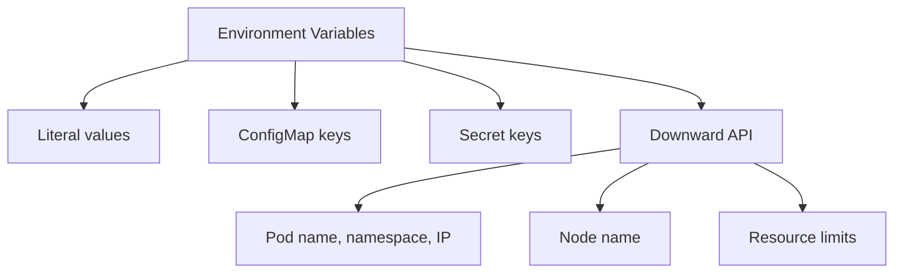

> 💡 **Quick Answer:** Set environment variables in Kubernetes pods from literals, ConfigMaps, Secrets, and the Downward API. Covers variable ordering, references, and best practices.

## The Problem

This is one of the most searched Kubernetes topics. Having a comprehensive, well-structured guide helps both beginners and experienced users quickly find what they need.

## The Solution

### Set Environment Variables

```yaml
apiVersion: v1
kind: Pod
metadata:
  name: my-app
spec:
  containers:
    - name: app
      image: my-app:v1
      env:
        # Literal value
        - name: APP_ENV
          value: "production"
        
        # From ConfigMap
        - name: DB_HOST
          valueFrom:
            configMapKeyRef:
              name: app-config
              key: database_host
        
        # From Secret
        - name: DB_PASSWORD
          valueFrom:
            secretKeyRef:
              name: db-secret
              key: password
        
        # From Downward API (pod metadata)
        - name: POD_NAME
          valueFrom:
            fieldRef:
              fieldPath: metadata.name
        - name: POD_NAMESPACE
          valueFrom:
            fieldRef:
              fieldPath: metadata.namespace
        - name: NODE_NAME
          valueFrom:
            fieldRef:
              fieldPath: spec.nodeName
        - name: POD_IP
          valueFrom:
            fieldRef:
              fieldPath: status.podIP
        
        # Resource limits
        - name: MEMORY_LIMIT
          valueFrom:
            resourceFieldRef:
              containerName: app
              resource: limits.memory

      # Import ALL keys from ConfigMap/Secret
      envFrom:
        - configMapRef:
            name: app-config
        - secretRef:
            name: app-secrets
            optional: true    # Don't fail if secret doesn't exist
```

### Variable References

```yaml
env:
  - name: BASE_URL
    value: "https://api.example.com"
  - name: CALLBACK_URL
    value: "$(BASE_URL)/callback"    # References BASE_URL
```

```bash
# Check environment variables in a running pod
kubectl exec <pod> -- env | sort
kubectl exec <pod> -- printenv DB_HOST
```



## Frequently Asked Questions

### Do environment variables update when ConfigMaps change?

No. Environment variables are set at pod startup and don't change. You must restart the pod. Use volume mounts if you need auto-updating config.

### What's the order of env vs envFrom?

`env` entries override `envFrom` entries with the same key. Variables defined later in `env` override earlier ones.

## Best Practices

- **Start simple** — use the basic form first, add complexity as needed
- **Be consistent** — follow naming conventions across your cluster
- **Document your choices** — add annotations explaining why, not just what
- **Monitor and iterate** — review configurations regularly

## Key Takeaways

- This is fundamental Kubernetes knowledge every engineer needs
- Start with the simplest approach that solves your problem
- Use `kubectl explain` and `kubectl describe` when unsure
- Practice in a test cluster before applying to production
