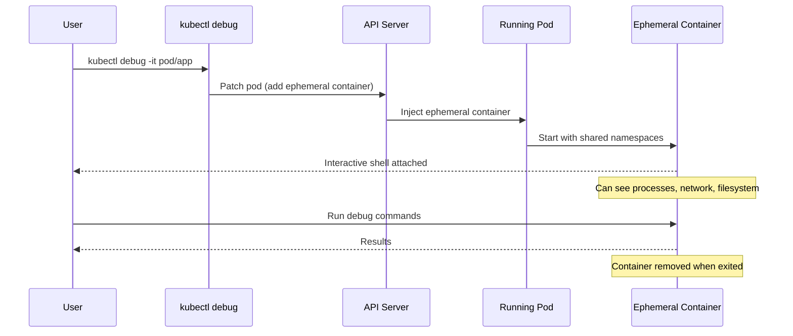

> 💡 **Quick Answer:** `kubectl debug` injects an ephemeral container into a running pod, sharing its namespaces, letting you run debugging tools without modifying the original image or restarting the pod.

## The Problem

Production containers are often distroless or minimal — no shell, no curl, no tcpdump. When issues arise you can't `kubectl exec` into them. Restarting with a debug image loses the problem state.

## The Solution

### Debug a Running Pod

```bash
# Attach a debug container sharing the pod's process namespace
kubectl debug -it pod/web-app-7f8d9c6b4-x2k9p \
  --image=busybox:1.36 \
  --target=app \
  -- sh
```

### Debug with Full Tools

```bash
# Use nicolaka/netshoot for network debugging
kubectl debug -it pod/web-app-7f8d9c6b4-x2k9p \
  --image=nicolaka/netshoot \
  --target=app \
  -- bash

# Inside: tcpdump, curl, dig, ss, ip, nslookup all available
tcpdump -i eth0 -n port 8080
ss -tlnp
curl localhost:8080/healthz
```

### Debug Node Issues

```bash
# Create a debug pod on a specific node
kubectl debug node/worker-01 -it --image=ubuntu:22.04

# Access host filesystem
chroot /host
journalctl -u kubelet --since "5 minutes ago"
crictl ps
```

### Copy Pod for Offline Debugging

```bash
# Create a copy of the pod with a different image
kubectl debug pod/web-app-7f8d9c6b4-x2k9p \
  --copy-to=debug-copy \
  --container=app \
  --image=myapp:debug \
  -- sleep infinity
```

### Custom Debug Profile

```bash
# Run as root with all capabilities
kubectl debug -it pod/web-app-7f8d9c6b4-x2k9p \
  --image=busybox \
  --target=app \
  --profile=sysadmin \
  -- sh
```

Available profiles: `general`, `baseline`, `restricted`, `netadmin`, `sysadmin`



## Common Issues

**Cannot see target container's processes**
Ensure `--target` flag specifies the correct container name. Process namespace sharing must be enabled (default since 1.17).

**Permission denied in ephemeral container**
Use `--profile=sysadmin` for root access:
```bash
kubectl debug -it pod/app --image=busybox --profile=sysadmin -- sh
```

**Ephemeral containers not supported**
The feature is GA since 1.25. Older clusters need the `EphemeralContainers` feature gate enabled.

**Can't access target container's filesystem**
The filesystem isn't shared by default. Access via `/proc/<PID>/root`:
```bash
ls /proc/1/root/app/config/
cat /proc/1/root/etc/resolv.conf
```

## Best Practices

- Keep a set of known-good debug images (netshoot, busybox, ubuntu)
- Use `--target` to share the process namespace with a specific container
- Use `--copy-to` when you need to modify the container image without affecting production
- Prefer `--profile=restricted` unless you need elevated permissions
- Document common debug commands in runbooks for your team
- Use node debugging for kubelet, containerd, and OS-level issues

## Key Takeaways

- Ephemeral containers are injected into running pods without restart
- `--target` shares the process namespace with the specified container
- `--copy-to` creates an independent copy for safe experimentation
- Node debugging mounts the host filesystem at `/host`
- Profiles control security context (`sysadmin` = root + all capabilities)
- Ephemeral containers cannot be removed — they stay until pod deletion
