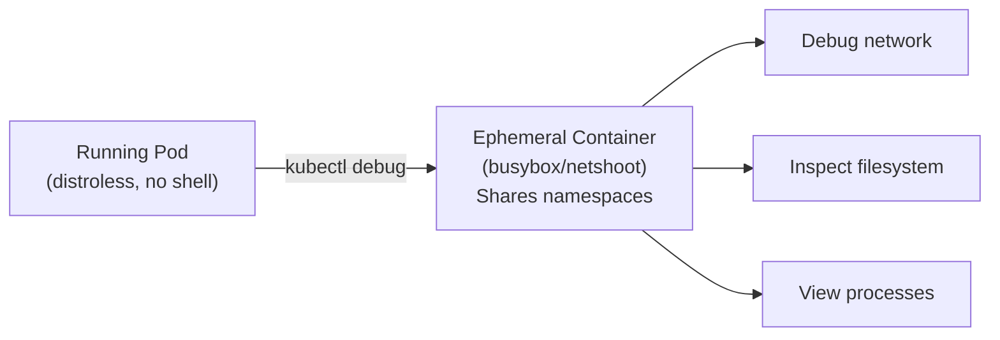

> 💡 **Quick Answer:** \`kubectl debug\` adds an ephemeral container to a running pod for troubleshooting — no restart required. Use it to inspect distroless/scratch images that have no shell, debug network issues, or attach to node namespaces. Available since Kubernetes 1.25 (GA).

## The Problem

Modern containers use minimal images (distroless, scratch, alpine without tools) for security. When something goes wrong, there's no \`sh\`, \`curl\`, \`dig\`, or \`strace\` inside the container. You can't exec in, and restarting with a debug image changes the behavior. Ephemeral containers let you attach a full debug toolkit to a running pod.



## The Solution

### Debug a Running Pod

```bash
# Add a debug container to an existing pod
kubectl debug -it my-app --image=busybox --target=my-app
# --target shares process namespace with the specified container

# With a full networking toolkit
kubectl debug -it my-app --image=nicolaka/netshoot --target=my-app

# Inside the debug container, you can:
# - See processes from the target container (ps aux)
# - Access the same network namespace (curl, dig, tcpdump)
# - Access the filesystem at /proc/1/root/
```

### Debug with Process Namespace Sharing

```bash
# Share PID namespace — see all processes in the pod
kubectl debug -it my-app \
  --image=busybox \
  --target=my-app \
  -- sh

# Inside debug container:
ps aux
# PID   USER     COMMAND
# 1     1000     /app/server          ← target container process
# 45    root     sh                   ← your debug shell

# Access target container filesystem
ls /proc/1/root/app/
cat /proc/1/root/etc/resolv.conf
```

### Debug a Pod by Copying

Create a copy of the pod with modifications:

```bash
# Copy pod with a different image (for debugging)
kubectl debug my-app --copy-to=my-app-debug --image=ubuntu -- bash

# Copy pod and change one container's image
kubectl debug my-app --copy-to=my-app-debug \
  --set-image=my-app=ubuntu:22.04

# Copy with shared process namespace
kubectl debug my-app --copy-to=my-app-debug \
  --share-processes \
  --image=busybox
```

### Debug a Node

Access the host filesystem and network:

```bash
# Create a debug pod on a specific node
kubectl debug node/worker-01 -it --image=ubuntu

# Inside the node debug pod:
chroot /host    # Access full host filesystem
systemctl status kubelet
journalctl -u kubelet --tail=50
crictl ps       # List containers on node
crictl logs <container-id>
ip addr show
iptables -L -n
```

### Common Debug Images

| Image | Size | Tools | Best For |
|-------|:----:|-------|----------|
| \`busybox\` | 1.4MB | Basic Unix tools, sh, wget | Quick checks |
| \`nicolaka/netshoot\` | 360MB | curl, dig, tcpdump, nmap, iperf | Network debugging |
| \`ubuntu:22.04\` | 77MB | apt-get for installing anything | General debugging |
| \`alpine\` | 7MB | sh, apk for installing tools | Lightweight debug |
| \`registry.k8s.io/e2e-test-images/jessie-dnsutils:1.3\` | 80MB | dig, nslookup, host | DNS debugging |

### Real-World Examples

```bash
# 1. Debug DNS resolution
kubectl debug -it my-app --image=nicolaka/netshoot -- dig kubernetes.default.svc.cluster.local

# 2. Check network connectivity
kubectl debug -it my-app --image=nicolaka/netshoot -- curl -v http://backend-svc:8080/health

# 3. Inspect environment variables of running container
kubectl debug -it my-app --image=busybox --target=my-app -- cat /proc/1/environ | tr '\0' '\n'

# 4. Check file permissions
kubectl debug -it my-app --image=busybox --target=my-app -- ls -la /proc/1/root/data/

# 5. Network capture
kubectl debug -it my-app --image=nicolaka/netshoot --target=my-app -- tcpdump -i eth0 port 8080 -w /tmp/capture.pcap

# 6. Strace a running process
kubectl debug -it my-app --image=ubuntu --target=my-app -- strace -p 1
```

### List Ephemeral Containers

```bash
kubectl get pod my-app -o jsonpath='{.spec.ephemeralContainers[*].name}'
# debugger-abc12

kubectl describe pod my-app | grep -A5 "Ephemeral Containers"
```

## Common Issues

| Issue | Cause | Fix |
|-------|-------|-----|
| \`ephemeral containers are disabled\` | K8s < 1.25 | Upgrade to 1.25+ (GA feature) |
| Can't see target processes | Missing \`--target\` flag | Add \`--target=container-name\` for PID sharing |
| Permission denied on /proc/1/root | Security context blocks access | Use \`--copy-to\` with modified security context |
| Can't install packages | No internet in pod | Use pre-built debug images like netshoot |
| Ephemeral container stays after debug | Normal — they persist until pod is deleted | Delete and recreate pod to clean up |

## Best Practices

- **Use \`--target\` for PID namespace sharing** — essential for inspecting running processes
- **Keep \`netshoot\` image cached** — pre-pull on nodes for faster debug sessions
- **Use \`--copy-to\` for security-restricted pods** — copies allow relaxed security context
- **Don't use in production long-term** — ephemeral containers are for debugging, not permanent sidecars
- **Use node debug for kubelet/host issues** — \`chroot /host\` gives full system access

## Key Takeaways

- \`kubectl debug\` adds temporary containers to running pods — no restart needed
- \`--target\` shares PID namespace for process inspection and filesystem access
- \`--copy-to\` creates a modified copy for deeper debugging
- Node debugging with \`kubectl debug node/\` gives host-level access
- Ephemeral containers persist until the pod is deleted
- Essential for debugging distroless/scratch images with no shell
