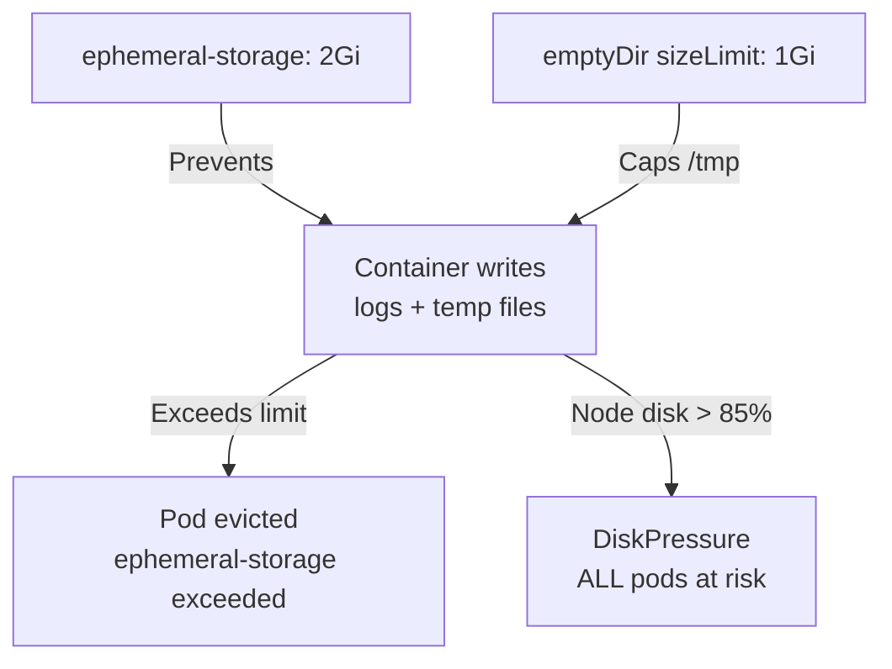

> 💡 **Quick Answer:** Set `resources.limits.ephemeral-storage: 2Gi` on containers to prevent runaway log/temp file growth. Use `emptyDir.sizeLimit: 1Gi` for temporary volumes. Monitor node disk usage — kubelet evicts pods when ephemeral storage exceeds limits or node hits disk pressure.

## The Problem

Containers write logs, temp files, and cached data to ephemeral storage (the node's filesystem). Without limits, a single pod writing unlimited logs can fill the node disk, triggering DiskPressure and evicting ALL pods on that node — including healthy ones.

## The Solution

### Ephemeral Storage Limits

```yaml
apiVersion: v1
kind: Pod
metadata:
  name: app
spec:
  containers:
    - name: app
      image: registry.example.com/app:1.0
      resources:
        requests:
          ephemeral-storage: 500Mi
        limits:
          ephemeral-storage: 2Gi
      volumeMounts:
        - name: tmp
          mountPath: /tmp
  volumes:
    - name: tmp
      emptyDir:
        sizeLimit: 1Gi
```

### What Counts as Ephemeral Storage

| Source | Counted? |
|--------|----------|
| Container writable layer | ✅ Yes |
| Container logs (/var/log/pods) | ✅ Yes |
| emptyDir volumes | ✅ Yes |
| emptyDir with `medium: Memory` | ❌ No (uses RAM) |
| PersistentVolume mounts | ❌ No |

### LimitRange for Namespace Defaults

```yaml
apiVersion: v1
kind: LimitRange
metadata:
  name: ephemeral-defaults
  namespace: production
spec:
  limits:
    - type: Container
      defaultRequest:
        ephemeral-storage: 256Mi
      default:
        ephemeral-storage: 1Gi
```



## Common Issues

**Pod evicted with "ephemeral-storage exceeded"**

Container + logs + emptyDir exceeded the limit. Check what's writing: `kubectl exec pod -- du -sh /tmp /var/log`.

**Node in DiskPressure — all pods being evicted**

A pod without ephemeral limits filled the disk. Set limits on all pods and configure kubelet eviction thresholds: `--eviction-hard=nodefs.available<15%`.

## Best Practices

- **Set ephemeral-storage limits on ALL containers** — one unbounded pod can take down a node
- **emptyDir sizeLimit** for temp volumes — prevents cache/scratch from growing unbounded
- **LimitRange for namespace defaults** — catches pods without explicit limits
- **Log rotation** in application — don't rely solely on K8s limits
- **Monitor `kubelet_volume_stats_used_bytes`** — alert before DiskPressure

## Key Takeaways

- Ephemeral storage includes container writes, logs, and emptyDir volumes
- Pods exceeding ephemeral-storage limits are evicted — not OOMKilled, evicted
- Without limits, one pod's logs can trigger DiskPressure and evict all pods on the node
- LimitRange provides namespace-wide defaults for pods without explicit limits
- emptyDir `sizeLimit` is separate from container ephemeral-storage limits
