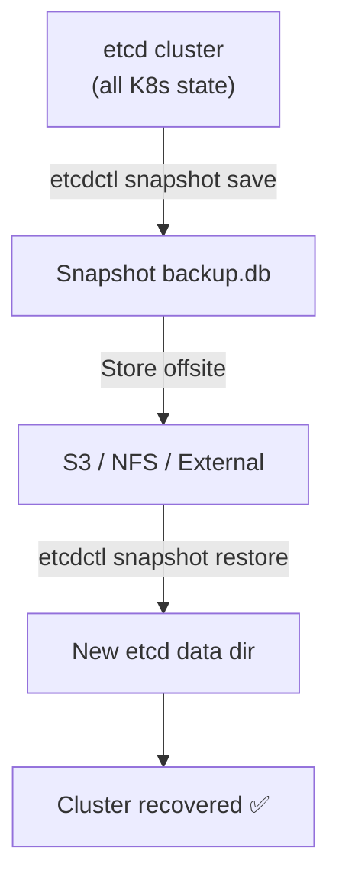

> 💡 **Quick Answer:** Backup etcd with \`etcdctl snapshot save backup.db\` using the etcd client certificates. Restore with \`etcdctl snapshot restore backup.db --data-dir=/var/lib/etcd-restored\`, then update the etcd static pod manifest to point to the new data directory. Automate with a CronJob that saves snapshots to S3.

## The Problem

etcd stores all Kubernetes cluster state — Deployments, Services, ConfigMaps, Secrets, everything. If etcd data is lost or corrupted, you lose the entire cluster. Regular backups are essential for disaster recovery, and you need to know how to restore before an emergency happens.



## The Solution

### Manual Backup

```bash
# Set etcd connection variables
export ETCDCTL_API=3
export ETCD_ENDPOINTS=https://127.0.0.1:2379
export ETCD_CACERT=/etc/kubernetes/pki/etcd/ca.crt
export ETCD_CERT=/etc/kubernetes/pki/etcd/server.crt
export ETCD_KEY=/etc/kubernetes/pki/etcd/server.key

# Create snapshot
etcdctl snapshot save /backup/etcd-$(date +%Y%m%d-%H%M%S).db \
  --endpoints=$ETCD_ENDPOINTS \
  --cacert=$ETCD_CACERT \
  --cert=$ETCD_CERT \
  --key=$ETCD_KEY

# Verify snapshot
etcdctl snapshot status /backup/etcd-20260412-100000.db --write-out=table
# +----------+----------+------------+------------+
# |   HASH   | REVISION | TOTAL KEYS | TOTAL SIZE |
# +----------+----------+------------+------------+
# | 9a350b2c |  1285032 |       2847 |   15 MB    |
# +----------+----------+------------+------------+
```

### Automated CronJob Backup

```yaml
apiVersion: batch/v1
kind: CronJob
metadata:
  name: etcd-backup
  namespace: kube-system
spec:
  schedule: "0 */6 * * *"         # Every 6 hours
  concurrencyPolicy: Forbid
  jobTemplate:
    spec:
      template:
        spec:
          hostNetwork: true
          nodeSelector:
            node-role.kubernetes.io/control-plane: ""
          tolerations:
            - key: node-role.kubernetes.io/control-plane
              effect: NoSchedule
          containers:
            - name: backup
              image: registry.k8s.io/etcd:3.5.15-0
              command: ["/bin/sh", "-c"]
              args:
                - |
                  BACKUP_FILE="/backup/etcd-$(date +%Y%m%d-%H%M%S).db"
                  etcdctl snapshot save "$BACKUP_FILE" \
                    --endpoints=https://127.0.0.1:2379 \
                    --cacert=/etc/kubernetes/pki/etcd/ca.crt \
                    --cert=/etc/kubernetes/pki/etcd/server.crt \
                    --key=/etc/kubernetes/pki/etcd/server.key
                  etcdctl snapshot status "$BACKUP_FILE" --write-out=table
                  echo "Backup saved: $BACKUP_FILE"
                  # Clean up backups older than 7 days
                  find /backup -name "etcd-*.db" -mtime +7 -delete
              volumeMounts:
                - name: etcd-certs
                  mountPath: /etc/kubernetes/pki/etcd
                  readOnly: true
                - name: backup-dir
                  mountPath: /backup
          volumes:
            - name: etcd-certs
              hostPath:
                path: /etc/kubernetes/pki/etcd
            - name: backup-dir
              hostPath:
                path: /var/backups/etcd
          restartPolicy: OnFailure
```

### Upload to S3

```bash
#!/bin/bash
# backup-etcd-s3.sh
BACKUP_FILE="/tmp/etcd-$(date +%Y%m%d-%H%M%S).db"

etcdctl snapshot save "$BACKUP_FILE" \
  --endpoints=https://127.0.0.1:2379 \
  --cacert=/etc/kubernetes/pki/etcd/ca.crt \
  --cert=/etc/kubernetes/pki/etcd/server.crt \
  --key=/etc/kubernetes/pki/etcd/server.key

# Upload to S3
aws s3 cp "$BACKUP_FILE" s3://my-etcd-backups/$(hostname)/ \
  --sse AES256

# Verify upload
aws s3 ls s3://my-etcd-backups/$(hostname)/ | tail -1

rm -f "$BACKUP_FILE"
echo "Backup uploaded to S3"
```

### Restore from Backup

```bash
# 1. Stop kube-apiserver and etcd
# Move static pod manifests to pause them
sudo mv /etc/kubernetes/manifests/kube-apiserver.yaml /tmp/
sudo mv /etc/kubernetes/manifests/etcd.yaml /tmp/

# 2. Verify containers stopped
sudo crictl ps | grep -E "etcd|apiserver"

# 3. Restore snapshot to new data directory
sudo ETCDCTL_API=3 etcdctl snapshot restore /backup/etcd-20260412-100000.db \
  --data-dir=/var/lib/etcd-restored \
  --name=master-01 \
  --initial-cluster=master-01=https://192.168.1.10:2380 \
  --initial-advertise-peer-urls=https://192.168.1.10:2380

# 4. Replace etcd data directory
sudo mv /var/lib/etcd /var/lib/etcd.old
sudo mv /var/lib/etcd-restored /var/lib/etcd

# 5. Restore static pod manifests
sudo mv /tmp/etcd.yaml /etc/kubernetes/manifests/
sudo mv /tmp/kube-apiserver.yaml /etc/kubernetes/manifests/

# 6. Wait for etcd and apiserver to start
watch crictl ps

# 7. Verify cluster
kubectl get nodes
kubectl get pods --all-namespaces
```

### Multi-Node etcd Cluster Restore

```bash
# On EACH control plane node, restore with correct member info:
# Node 1:
etcdctl snapshot restore backup.db \
  --data-dir=/var/lib/etcd-restored \
  --name=master-01 \
  --initial-cluster="master-01=https://10.0.0.1:2380,master-02=https://10.0.0.2:2380,master-03=https://10.0.0.3:2380" \
  --initial-advertise-peer-urls=https://10.0.0.1:2380

# Node 2:
etcdctl snapshot restore backup.db \
  --data-dir=/var/lib/etcd-restored \
  --name=master-02 \
  --initial-cluster="master-01=https://10.0.0.1:2380,master-02=https://10.0.0.2:2380,master-03=https://10.0.0.3:2380" \
  --initial-advertise-peer-urls=https://10.0.0.2:2380

# Node 3: (same pattern with master-03)
```

## Common Issues

| Issue | Cause | Fix |
|-------|-------|-----|
| \`permission denied\` on certs | Running as non-root | Use \`sudo\` or copy certs with correct permissions |
| \`context deadline exceeded\` | etcd not reachable | Check endpoint and firewall |
| Restored cluster has stale data | Backup is old | Use most recent backup, accept data loss since snapshot |
| Pods in wrong state after restore | Controllers re-reconcile | Wait for controllers to sync — may take 5-10 minutes |
| etcd won't start after restore | Wrong data-dir in static pod manifest | Verify \`--data-dir\` matches restored path |

## Best Practices

- **Backup every 6 hours minimum** — more frequent for high-change clusters
- **Store backups offsite** — S3, GCS, NFS separate from cluster
- **Test restores regularly** — untested backups are not backups
- **Encrypt backup files** — they contain Secrets in plaintext
- **Monitor backup job success** — alert on CronJob failures
- **Keep 7-30 days retention** — balance storage vs recovery options
- **Document the restore procedure** — every team member should know the steps

## Key Takeaways

- etcd contains ALL Kubernetes state — losing it means losing the cluster
- \`etcdctl snapshot save\` creates a consistent point-in-time backup
- Restore requires stopping etcd, restoring to a new data-dir, then restarting
- Automate with a CronJob on control plane nodes
- Always store backups offsite (S3) and encrypt them
- Test your restore procedure before you need it in an emergency
