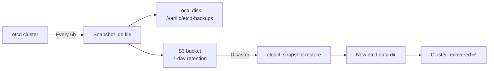

> 💡 **Quick Answer:** Run `etcdctl snapshot save /backup/etcd-$(date +%Y%m%d).db` as a CronJob every 6 hours. Upload to S3 with lifecycle policies. Restore with `etcdctl snapshot restore` on a fresh cluster. Always test restores — untested backups aren't backups.

## The Problem

etcd holds your entire cluster state — every Deployment, Secret, ConfigMap, and RBAC rule. If etcd is lost without a backup, you lose everything. Yet many teams skip etcd backups because the control plane is 'managed' — until their managed provider has an outage.

## The Solution

### Automated etcd Backup CronJob

```yaml
apiVersion: batch/v1
kind: CronJob
metadata:
  name: etcd-backup
  namespace: kube-system
spec:
  schedule: "0 */6 * * *"
  jobTemplate:
    spec:
      template:
        spec:
          hostNetwork: true
          nodeSelector:
            node-role.kubernetes.io/control-plane: ""
          tolerations:
            - key: node-role.kubernetes.io/control-plane
              effect: NoSchedule
          containers:
            - name: etcd-backup
              image: registry.example.com/etcd:3.5.15
              command:
                - /bin/sh
                - -c
                - |
                  BACKUP_FILE="/backup/etcd-$(date +%Y%m%d-%H%M%S).db"
                  etcdctl snapshot save $BACKUP_FILE \
                    --endpoints=https://127.0.0.1:2379 \
                    --cacert=/etc/kubernetes/pki/etcd/ca.crt \
                    --cert=/etc/kubernetes/pki/etcd/server.crt \
                    --key=/etc/kubernetes/pki/etcd/server.key
                  etcdctl snapshot status $BACKUP_FILE --write-table
                  # Upload to S3
                  aws s3 cp $BACKUP_FILE s3://cluster-backups/etcd/
                  # Keep only last 7 days locally
                  find /backup -name "etcd-*.db" -mtime +7 -delete
              volumeMounts:
                - name: etcd-certs
                  mountPath: /etc/kubernetes/pki/etcd
                  readOnly: true
                - name: backup
                  mountPath: /backup
          volumes:
            - name: etcd-certs
              hostPath:
                path: /etc/kubernetes/pki/etcd
            - name: backup
              hostPath:
                path: /var/lib/etcd-backups
          restartPolicy: OnFailure
```

### Restore from Snapshot

```bash
# Stop kube-apiserver (move manifest)
sudo mv /etc/kubernetes/manifests/kube-apiserver.yaml /tmp/

# Restore etcd
sudo etcdctl snapshot restore /backup/etcd-20260424.db \
  --data-dir=/var/lib/etcd-restored \
  --initial-cluster="master-1=https://10.0.0.10:2380" \
  --initial-advertise-peer-urls=https://10.0.0.10:2380 \
  --name=master-1

# Replace etcd data directory
sudo mv /var/lib/etcd /var/lib/etcd.old
sudo mv /var/lib/etcd-restored /var/lib/etcd

# Restart kube-apiserver
sudo mv /tmp/kube-apiserver.yaml /etc/kubernetes/manifests/
```



## Common Issues

**Restore fails with "member already bootstrapped"**

You must restore to a NEW data directory, not the existing one. Use `--data-dir=/var/lib/etcd-restored` then swap directories.

**Snapshot is 0 bytes**

etcdctl can't reach the endpoint. Verify certs and that etcd is listening on 127.0.0.1:2379.

## Best Practices

- **Backup every 6 hours minimum** — RPO of 6 hours for most clusters
- **Upload to remote storage** — local backups are useless if the node dies
- **Test restores quarterly** — untested backups are not backups
- **Monitor backup job failures** — alert if CronJob hasn't succeeded in 12 hours
- **Encrypt backups at rest** — etcd contains Secrets in base64 (not encrypted)

## Key Takeaways

- etcd holds all cluster state — losing it means losing everything
- `etcdctl snapshot save` creates a point-in-time backup
- Automate with CronJob on control plane nodes every 6 hours
- Upload to S3/GCS for off-site disaster recovery
- Always test restores — the backup is worthless if restore doesn't work
