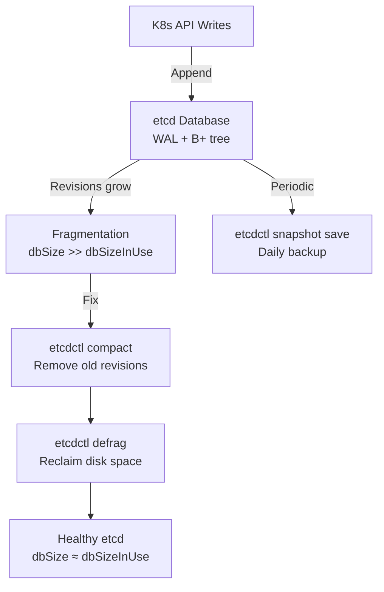

> 💡 **Quick Answer:** Run `etcdctl defrag` after compaction to reclaim disk space, take snapshots with `etcdctl snapshot save`, check member health with `etcdctl endpoint health --cluster`, and monitor `db_size` vs `db_size_in_use` to detect fragmentation.

## The Problem

etcd stores all Kubernetes cluster state. Without maintenance, etcd's database grows unbounded (fragmentation), performance degrades, and snapshots become unreliable. A full etcd disk (default quota: 2GB) causes the cluster to become read-only — no new pods, no updates, no scaling.

## The Solution

### Health Check

```bash
# Set etcd connection variables
export ETCDCTL_API=3
export ETCDCTL_ENDPOINTS=https://127.0.0.1:2379
export ETCDCTL_CACERT=/etc/kubernetes/pki/etcd/ca.crt
export ETCDCTL_CERT=/etc/kubernetes/pki/etcd/server.crt
export ETCDCTL_KEY=/etc/kubernetes/pki/etcd/server.key

# Cluster health
etcdctl endpoint health --cluster
# https://10.0.0.1:2379 is healthy: committed proposal: took = 2ms
# https://10.0.0.2:2379 is healthy: committed proposal: took = 3ms
# https://10.0.0.3:2379 is healthy: committed proposal: took = 2ms

# Cluster status (db size, leader, raft index)
etcdctl endpoint status --cluster -w table
```

### Snapshot Backup

```bash
# Take snapshot
etcdctl snapshot save /backup/etcd-$(date +%Y%m%d-%H%M%S).db

# Verify snapshot
etcdctl snapshot status /backup/etcd-20260424-020000.db -w table
# +----------+----------+------------+------------+
# |   HASH   | REVISION | TOTAL KEYS | TOTAL SIZE |
# +----------+----------+------------+------------+
# | 3c27e36a |  1285023 |       4521 |    45 MB   |
# +----------+----------+------------+------------+
```

### Compaction and Defragmentation

```bash
# Get current revision
REV=$(etcdctl endpoint status -w json | jq '.[0].Status.header.revision')

# Compact old revisions (keeps only current state)
etcdctl compact $REV

# Defragment to reclaim disk space (run on each member)
etcdctl defrag --endpoints=https://10.0.0.1:2379
etcdctl defrag --endpoints=https://10.0.0.2:2379
etcdctl defrag --endpoints=https://10.0.0.3:2379
```

> ⚠️ Defragmentation blocks the member briefly. Run on one member at a time, not the leader first.

### Monitoring Queries

```bash
# Database size vs in-use (fragmentation indicator)
etcdctl endpoint status -w json | jq '.[] | {
  endpoint: .Endpoint,
  dbSize: (.Status.dbSize / 1048576 | floor | tostring + " MB"),
  dbSizeInUse: (.Status.dbSizeInUse / 1048576 | floor | tostring + " MB"),
  leader: .Status.leader,
  raftIndex: .Status.raftIndex
}'

# Alarm check (NOSPACE alarm means quota exceeded)
etcdctl alarm list

# Clear alarm after fixing space
etcdctl alarm disarm
```



## Common Issues

**etcd NOSPACE alarm — cluster read-only**

The database exceeded its quota (default 2GB). Emergency fix:
```bash
etcdctl alarm list              # Confirm NOSPACE
REV=$(etcdctl endpoint status -w json | jq '.[0].Status.header.revision')
etcdctl compact $REV            # Compact
etcdctl defrag                  # Reclaim space
etcdctl alarm disarm            # Clear alarm
```

**Defragmentation makes member unresponsive**

Expected — defrag blocks I/O briefly. Run on followers first, leader last. Monitor with `endpoint health` between each.

**etcd slow — high latency on API operations**

Check disk I/O: `iostat -x 1`. etcd needs fast fsync — SSDs are required. Also check `dbSize` for fragmentation.

## Best Practices

- **Daily snapshot backups** — automate with CronJob or systemd timer
- **Compact + defrag weekly** — prevents unbounded database growth
- **Monitor `db_size` Prometheus metric** — alert when approaching quota
- **SSD storage is mandatory** — etcd performance depends entirely on disk fsync latency
- **3 or 5 member clusters** — odd numbers for quorum; 5 tolerates 2 failures
- **Defrag one member at a time** — followers first, leader last

## Key Takeaways

- etcd fragmentation causes `dbSize` >> `dbSizeInUse` — defrag reclaims the difference
- NOSPACE alarm makes the cluster read-only — compact + defrag + disarm to recover
- Daily snapshots are your DR lifeline — verify them with `snapshot status`
- SSD storage is non-negotiable for etcd — spinning disks cause cluster instability
- Run defrag on followers first, leader last, one at a time
