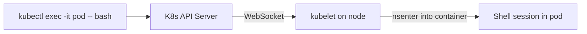

> 💡 **Quick Answer:** Use kubectl exec to run commands inside Kubernetes pods. Covers interactive sessions, multi-container pods, and ephemeral container debugging.

## The Problem

This is one of the most searched Kubernetes topics. Having a comprehensive, well-structured guide helps both beginners and experienced users quickly find what they need.

## The Solution

### Basic exec

```bash
# Run a single command
kubectl exec my-pod -- ls /app
kubectl exec my-pod -- cat /etc/config/app.yaml
kubectl exec my-pod -- env | grep DATABASE

# Interactive shell
kubectl exec -it my-pod -- /bin/bash
kubectl exec -it my-pod -- /bin/sh    # If bash isn't available

# Specific container (multi-container pod)
kubectl exec -it my-pod -c sidecar -- sh

# Specific namespace
kubectl exec -it my-pod -n production -- bash
```

### Common Debugging Commands Inside Pods

```bash
# Network
curl -s http://other-service:8080/health
wget -qO- http://other-service:8080/health
nslookup kubernetes.default
cat /etc/resolv.conf

# Files and config
cat /etc/config/app.yaml
ls -la /data/
df -h                        # Disk usage

# Process info
ps aux
top

# Environment
env | sort
printenv DATABASE_URL
```

### When exec Doesn't Work

```bash
# Pod has no shell (distroless/scratch images)
# Use ephemeral debug containers instead:
kubectl debug my-pod -it --image=nicolaka/netshoot --target=my-container

# Pod is CrashLoopBackOff (keeps restarting)
# Override the entrypoint:
kubectl debug my-pod -it --copy-to=debug-pod --container=my-container -- /bin/sh

# Node-level debugging
kubectl debug node/worker-1 -it --image=ubuntu
# chroot /host
```



## Frequently Asked Questions

### Can I exec into an init container?

No — init containers have already completed by the time the pod is Running. You can check their logs with `kubectl logs <pod> -c <init-container>`.

### Is kubectl exec secure?

It uses your RBAC permissions and goes through the API server. Restrict `pods/exec` permission in RBAC to prevent unauthorized access.

## Best Practices

- **Start simple** — use the basic form first, add complexity as needed
- **Be consistent** — follow naming conventions across your cluster
- **Document your choices** — add annotations explaining why, not just what
- **Monitor and iterate** — review configurations regularly

## Key Takeaways

- This is fundamental Kubernetes knowledge every engineer needs
- Start with the simplest approach that solves your problem
- Use `kubectl explain` and `kubectl describe` when unsure
- Practice in a test cluster before applying to production
