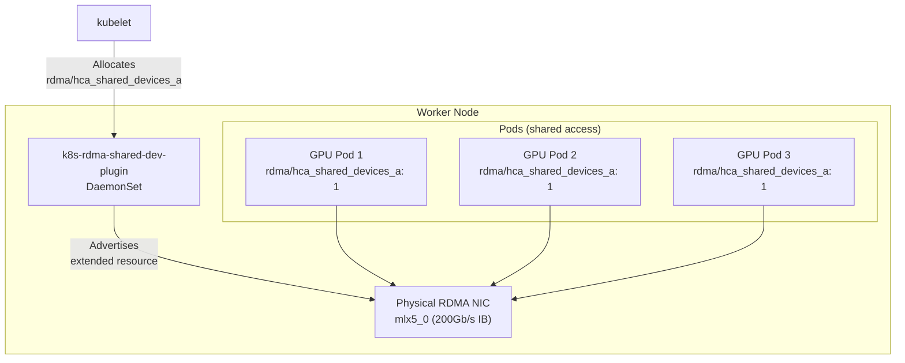

> 💡 **Quick Answer:** The **k8s-rdma-shared-dev-plugin** advertises RDMA devices (InfiniBand/RoCE) as Kubernetes extended resources without SR-IOV. Multiple pods share the same physical RDMA NIC via the host network namespace. Pods request `rdma/hca_shared_devices_a: 1` in their resource limits. This is the simplest way to enable GPUDirect RDMA for AI training workloads when SR-IOV VFs aren't needed.

## The Problem

AI training jobs need RDMA (Remote Direct Memory Access) for high-bandwidth, low-latency GPU-to-GPU communication across nodes. Kubernetes doesn't natively understand RDMA devices. You have two options:

1. **SR-IOV** — Each pod gets a dedicated Virtual Function (VF). Full isolation, but complex setup.
2. **Shared device plugin** — Multiple pods share the same physical RDMA NIC. Simpler, and sufficient when pods are trusted (same tenant).

The shared device plugin is the right choice for most AI/HPC clusters where all pods on a node belong to the same training job.



## How Extended Resources Work

Kubernetes **extended resources** are a mechanism for advertising custom resources beyond CPU and memory. Device plugins register with the kubelet to advertise them:

```bash
# After deploying the RDMA shared device plugin, the node advertises:
kubectl describe node gpu-worker-0 | grep -A5 "Allocatable:"
# Allocatable:
#   cpu:                           64
#   memory:                        512Gi
#   nvidia.com/gpu:                8
#   rdma/hca_shared_devices_a:     63    # ← RDMA extended resource
#   rdma/hca_shared_devices_b:     63    # ← Second RDMA NIC (if configured)

# Pods request them like any other resource:
# resources:
#   limits:
#     nvidia.com/gpu: 1
#     rdma/hca_shared_devices_a: 1
```

### Extended Resource Properties

| Property | Behavior |
|----------|----------|
| **Integer only** | Cannot request 0.5 — always whole numbers |
| **No overcommit** | Unlike CPU, extended resources are hard limits |
| **Scheduler-aware** | Pods only schedule on nodes with available capacity |
| **Opaque to Kubernetes** | K8s doesn't know what the resource is — just counts |
| **Device plugin managed** | Plugin handles allocation and health checks |

## The Solution

### Deploy k8s-rdma-shared-dev-plugin

**Step 1: Create the ConfigMap**

```yaml
apiVersion: v1
kind: ConfigMap
metadata:
  name: rdma-devices
  namespace: kube-system
data:
  config.json: |
    {
      "periodicUpdateInterval": 300,
      "configList": [
        {
          "resourceName": "hca_shared_devices_a",
          "rdmaHcaMax": 63,
          "selectors": {
            "ifNames": ["ens8f0np0"]
          }
        },
        {
          "resourceName": "hca_shared_devices_b",
          "rdmaHcaMax": 63,
          "selectors": {
            "ifNames": ["ens8f1np1"]
          }
        }
      ]
    }
```

**Configuration fields:**

| Field | Description |
|-------|-------------|
| `resourceName` | Name exposed as `rdma/<resourceName>` in K8s |
| `rdmaHcaMax` | Max number of pods that can share this device (set to max expected pods per node) |
| `selectors.ifNames` | Network interface names to match |
| `selectors.vendors` | PCI vendor IDs (e.g., `["15b3"]` for Mellanox) |
| `selectors.deviceIDs` | PCI device IDs |
| `selectors.drivers` | Kernel driver names (e.g., `["mlx5_core"]`) |
| `periodicUpdateInterval` | Seconds between device re-scan (0 = disabled) |

**Step 2: Selector strategies**

```json
// Option A: Match by interface name (most precise)
{
  "resourceName": "hca_shared_devices_a",
  "rdmaHcaMax": 63,
  "selectors": {
    "ifNames": ["ens8f0np0"]
  }
}

// Option B: Match by vendor (all Mellanox/NVIDIA NICs)
{
  "resourceName": "hca_shared_devices_all",
  "rdmaHcaMax": 63,
  "selectors": {
    "vendors": ["15b3"]
  }
}

// Option C: Match by driver
{
  "resourceName": "hca_shared_devices_mlx5",
  "rdmaHcaMax": 63,
  "selectors": {
    "drivers": ["mlx5_core"]
  }
}

// Option D: Match by PCI device ID (specific NIC model)
{
  "resourceName": "hca_shared_devices_cx7",
  "rdmaHcaMax": 63,
  "selectors": {
    "vendors": ["15b3"],
    "deviceIDs": ["1021"]
  }
}
```

**Step 3: Deploy the DaemonSet**

```yaml
apiVersion: apps/v1
kind: DaemonSet
metadata:
  name: rdma-shared-dp-ds
  namespace: kube-system
spec:
  selector:
    matchLabels:
      name: rdma-shared-dp-ds
  template:
    metadata:
      labels:
        name: rdma-shared-dp-ds
    spec:
      hostNetwork: true
      priorityClassName: system-node-critical
      nodeSelector:
        feature.node.kubernetes.io/rdma.capable: "true"   # NFD label
      tolerations:
        - operator: Exists    # Schedule on all matching nodes
      containers:
        - name: k8s-rdma-shared-dp-ds
          image: ghcr.io/mellanox/k8s-rdma-shared-dev-plugin:latest
          imagePullPolicy: IfNotPresent
          securityContext:
            privileged: true
          resources:
            requests:
              cpu: 100m
              memory: 50Mi
            limits:
              cpu: 300m
              memory: 150Mi
          volumeMounts:
            - name: device-plugin
              mountPath: /var/lib/kubelet/device-plugins
              readOnly: false
            - name: config
              mountPath: /k8s-rdma-shared-dev-plugin
            - name: devs
              mountPath: /dev
      volumes:
        - name: device-plugin
          hostPath:
            path: /var/lib/kubelet/device-plugins
        - name: config
          configMap:
            name: rdma-devices
            items:
              - key: config.json
                path: config.json
        - name: devs
          hostPath:
            path: /dev
```

**Step 4: Verify**

```bash
# Check DaemonSet is running
kubectl -n kube-system get ds rdma-shared-dp-ds

# Check device plugin registration
kubectl -n kube-system logs -l name=rdma-shared-dp-ds | grep -i "device\|resource"
# "RDMA shared  device plugin started"
# "Resource: rdma/hca_shared_devices_a, device count: 63"

# Verify extended resource on nodes
kubectl get nodes -o json | jq '.items[] | {name: .metadata.name, rdma: .status.allocatable | to_entries | map(select(.key | startswith("rdma/")))}'
# "rdma/hca_shared_devices_a": "63"
```

### Use RDMA in Pods

```yaml
apiVersion: v1
kind: Pod
metadata:
  name: nccl-test
spec:
  hostNetwork: true    # Required for shared RDMA (no SR-IOV)
  containers:
    - name: nccl
      image: nvcr.io/nvidia/pytorch:24.07-py3
      resources:
        limits:
          nvidia.com/gpu: 8
          rdma/hca_shared_devices_a: 1    # Request RDMA access
      env:
        - name: NCCL_IB_DISABLE
          value: "0"                       # Enable InfiniBand
        - name: NCCL_DEBUG
          value: "INFO"                    # Verify RDMA is used
        - name: NCCL_IB_HCA
          value: "mlx5"                    # Target Mellanox HCAs
      command: ["sleep", "infinity"]
```

### Multi-NIC RDMA for AI Training

For 8-GPU nodes with 8 RDMA NICs (1:1 GPU-to-NIC mapping):

```json
{
  "configList": [
    {"resourceName": "hca_shared_devices_0", "rdmaHcaMax": 63, "selectors": {"ifNames": ["ens8f0np0"]}},
    {"resourceName": "hca_shared_devices_1", "rdmaHcaMax": 63, "selectors": {"ifNames": ["ens9f0np0"]}},
    {"resourceName": "hca_shared_devices_2", "rdmaHcaMax": 63, "selectors": {"ifNames": ["ens10f0np0"]}},
    {"resourceName": "hca_shared_devices_3", "rdmaHcaMax": 63, "selectors": {"ifNames": ["ens11f0np0"]}},
    {"resourceName": "hca_shared_devices_4", "rdmaHcaMax": 63, "selectors": {"ifNames": ["ens12f0np0"]}},
    {"resourceName": "hca_shared_devices_5", "rdmaHcaMax": 63, "selectors": {"ifNames": ["ens13f0np0"]}},
    {"resourceName": "hca_shared_devices_6", "rdmaHcaMax": 63, "selectors": {"ifNames": ["ens14f0np0"]}},
    {"resourceName": "hca_shared_devices_7", "rdmaHcaMax": 63, "selectors": {"ifNames": ["ens15f0np0"]}}
  ]
}
```

```yaml
# Pod requesting all 8 RDMA NICs
resources:
  limits:
    nvidia.com/gpu: 8
    rdma/hca_shared_devices_0: 1
    rdma/hca_shared_devices_1: 1
    rdma/hca_shared_devices_2: 1
    rdma/hca_shared_devices_3: 1
    rdma/hca_shared_devices_4: 1
    rdma/hca_shared_devices_5: 1
    rdma/hca_shared_devices_6: 1
    rdma/hca_shared_devices_7: 1
```

## Shared vs SR-IOV: When to Use Which

| Criteria | Shared Device Plugin | SR-IOV |
|----------|---------------------|--------|
| **Isolation** | None — pods share NIC | Full — each pod gets a VF |
| **Setup complexity** | Low — just a DaemonSet | High — VF config, IOMMU, PF driver |
| **Performance** | Native (no virtualization) | Near-native (hardware VF) |
| **Multi-tenant** | ❌ Not safe | ✅ Isolated |
| **AI training (single tenant)** | ✅ Perfect fit | Overkill |
| **Requires hostNetwork** | Yes | No (VF injected into pod netns) |
| **Max pods per NIC** | Configurable (rdmaHcaMax) | Limited by VF count (usually 8-128) |
| **GPUDirect RDMA** | ✅ Works with hostNetwork | ✅ Works with `deviceType: netdevice` |

## Common Issues

| Issue | Cause | Fix |
|-------|-------|-----|
| `rdma/hca_shared_devices_a: 0` on node | Device plugin not finding NIC | Check `ifNames` in ConfigMap matches `ip link` output |
| Pod stuck Pending | No RDMA resource available | Check `kubectl describe node` for allocatable count |
| NCCL falls back to TCP | Missing `hostNetwork: true` | Shared plugin requires hostNetwork for RDMA verbs |
| `Permission denied` on `/dev/infiniband` | Missing privileges | Add `privileged: true` or `IPC_LOCK` + `/dev` volume |
| Plugin CrashLoopBackOff | Wrong config.json format | Validate JSON, check plugin logs |
| Multiple NICs not detected | Selector too narrow | Use `vendors` selector or list all `ifNames` |

## OpenShift Deployment

On OpenShift, use the NVIDIA Network Operator which deploys the shared device plugin automatically:

```yaml
apiVersion: mellanox.com/v1alpha1
kind: NicClusterPolicy
metadata:
  name: nic-cluster-policy
spec:
  rdmaSharedDevicePlugin:
    image: k8s-rdma-shared-dev-plugin
    repository: ghcr.io/mellanox
    version: latest
    config: |
      {
        "configList": [
          {
            "resourceName": "hca_shared_devices_a",
            "rdmaHcaMax": 63,
            "selectors": {
              "vendors": ["15b3"]
            }
          }
        ]
      }
```

```bash
# Verify on OpenShift
oc get nicclusterpolicy
oc get ds -n nvidia-network-operator | grep rdma
oc describe node gpu-worker-0 | grep rdma
```

## Best Practices

- **Use shared plugin for single-tenant AI clusters** — simpler than SR-IOV, same performance
- **Set `rdmaHcaMax` to your max pods per node** — 63 is a safe default
- **Use `ifNames` selector for precision** — `vendors` is too broad if you have management NICs
- **Always set `hostNetwork: true`** — shared RDMA requires host network namespace
- **Deploy with `system-node-critical` priority** — device plugin must run before AI workloads
- **Use NFD labels for node selection** — `feature.node.kubernetes.io/rdma.capable: "true"`
- **One resource per NIC for GPU affinity** — map each RDMA NIC to a separate extended resource for NUMA-aware scheduling
- **Monitor with `rdma statistics`** — check for dropped packets or congestion

## Key Takeaways

- Extended resources let Kubernetes schedule arbitrary hardware (GPUs, RDMA NICs, FPGAs)
- The **k8s-rdma-shared-dev-plugin** is the simplest way to expose RDMA to pods
- Shared = multiple pods use the same physical NIC (requires hostNetwork)
- SR-IOV = each pod gets an isolated VF (more complex, for multi-tenant)
- For AI training: shared plugin + hostNetwork + GPUDirect RDMA = optimal
- Configure one extended resource per NIC for 1:1 GPU-to-NIC affinity
- OpenShift: use NicClusterPolicy CRD (NVIDIA Network Operator deploys it automatically)
