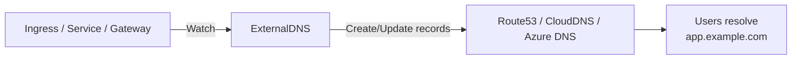

> 💡 **Quick Answer:** Deploy ExternalDNS as a Deployment with permissions to manage DNS records. Annotate Ingress/Service/Gateway resources with `external-dns.alpha.kubernetes.io/hostname` — ExternalDNS automatically creates and updates A/CNAME records in your DNS provider.

## The Problem

Every time you create an Ingress or LoadBalancer Service, you manually create DNS records. When the load balancer IP changes, you update DNS manually. ExternalDNS automates this — it watches Kubernetes resources and synchronizes DNS records automatically.

## The Solution

### Deploy ExternalDNS (Route53)

```yaml
apiVersion: apps/v1
kind: Deployment
metadata:
  name: external-dns
  namespace: external-dns
spec:
  replicas: 1
  template:
    spec:
      serviceAccountName: external-dns
      containers:
        - name: external-dns
          image: registry.k8s.io/external-dns/external-dns:v0.15.0
          args:
            - --source=ingress
            - --source=service
            - --source=gateway-httproute
            - --provider=aws
            - --aws-zone-type=public
            - --registry=txt
            - --txt-owner-id=my-cluster
            - --domain-filter=example.com
            - --policy=upsert-only
```

### Annotated Ingress

```yaml
apiVersion: networking.k8s.io/v1
kind: Ingress
metadata:
  name: web-app
  annotations:
    external-dns.alpha.kubernetes.io/hostname: app.example.com
    external-dns.alpha.kubernetes.io/ttl: "300"
spec:
  rules:
    - host: app.example.com
      http:
        paths:
          - path: /
            pathType: Prefix
            backend:
              service:
                name: web-app
                port:
                  number: 80
```

ExternalDNS creates: `app.example.com → A → <load-balancer-ip>`

### Gateway API Integration

```yaml
apiVersion: gateway.networking.k8s.io/v1
kind: HTTPRoute
metadata:
  name: web-route
  annotations:
    external-dns.alpha.kubernetes.io/hostname: web.example.com
spec:
  parentRefs:
    - name: main-gateway
  hostnames:
    - web.example.com
  rules:
    - matches:
        - path:
            type: PathPrefix
            value: /
      backendRefs:
        - name: web-service
          port: 80
```



## Common Issues

**DNS records not created**: Check ExternalDNS logs: `kubectl logs -n external-dns deploy/external-dns`. Common: IAM permissions missing, domain filter doesn't match.

**Old DNS records not cleaned up**: Use `--policy=sync` instead of `upsert-only` for automatic cleanup. Caution: sync deletes records not managed by ExternalDNS.

## Best Practices

- **`upsert-only` policy for safety** — creates and updates but never deletes
- **`domain-filter`** — restrict to your domains only
- **TXT record registry** — prevents conflicts between multiple clusters
- **RBAC per namespace** — restrict which namespaces can create DNS records
- **TTL 300s** — good balance between propagation speed and DNS caching

## Key Takeaways

- ExternalDNS automates DNS record management from Kubernetes resources
- Supports Ingress, Service, and Gateway API as sources
- Works with Route53, CloudDNS, Azure DNS, Cloudflare, and 30+ providers
- TXT record registry prevents conflicts between multiple clusters
- `upsert-only` policy is safest — never accidentally deletes DNS records
