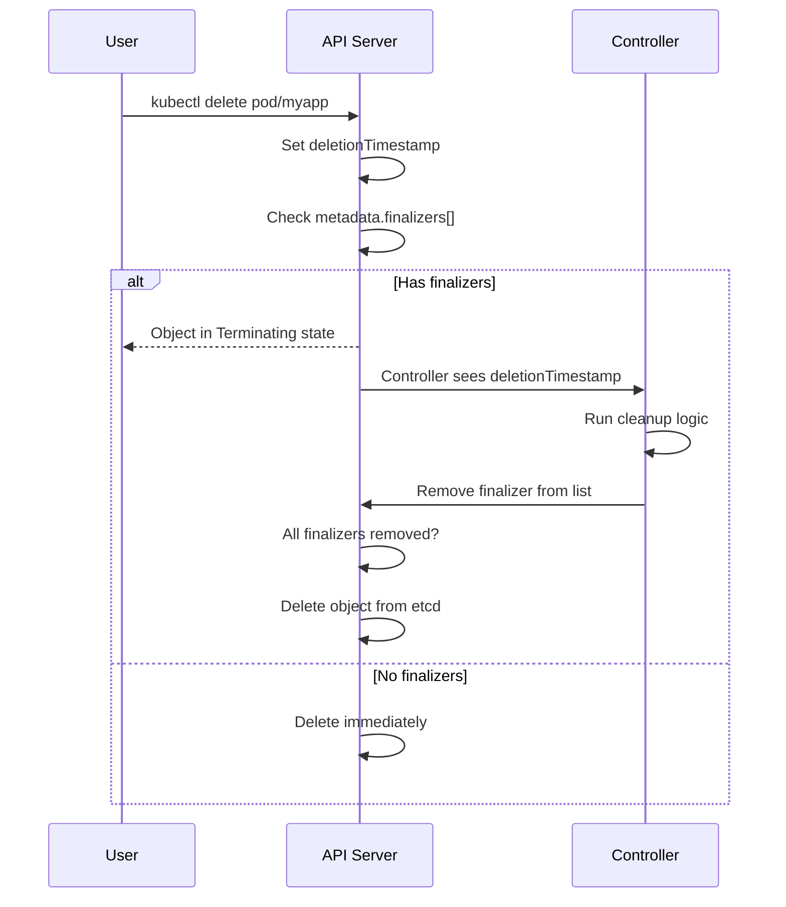

> 💡 **Quick Answer:** Finalizers are strings in `metadata.finalizers[]` that block resource deletion until a controller removes them. When you delete a resource with finalizers, it enters `Terminating` state but isn't removed until all finalizers are cleared. Use `kubectl patch` to remove stuck finalizers.

## The Problem

- Namespace stuck in "Terminating" forever
- PV/PVC won't delete — hangs indefinitely
- Custom resources not cleaning up external dependencies
- Need to ensure cloud resources (load balancers, DNS records) are deleted before K8s objects

## The Solution

### How Finalizers Work



### View Finalizers

```bash
# Check finalizers on a resource
kubectl get namespace production -o jsonpath='{.metadata.finalizers}'
# ["kubernetes"]

kubectl get pv my-volume -o jsonpath='{.metadata.finalizers}'
# ["kubernetes.io/pv-protection"]

kubectl get pvc data-postgres-0 -o jsonpath='{.metadata.finalizers}'
# ["kubernetes.io/pvc-protection"]

# Find all resources with finalizers in a namespace
kubectl api-resources --verbs=list --namespaced -o name | \
  xargs -n1 -I{} kubectl get {} -n production -o json 2>/dev/null | \
  jq '.items[] | select(.metadata.finalizers != null) | {kind: .kind, name: .metadata.name, finalizers: .metadata.finalizers}'
```

### Built-in Finalizers

| Finalizer | Applied To | Purpose |
|-----------|-----------|---------|
| `kubernetes` | Namespace | Wait for all resources in NS to be deleted |
| `kubernetes.io/pv-protection` | PersistentVolume | Prevent deletion while bound to PVC |
| `kubernetes.io/pvc-protection` | PersistentVolumeClaim | Prevent deletion while mounted by pod |
| `foregroundDeletion` | Any | Delete dependents before owner |
| `orphan` | Any | Don't delete dependents when owner deleted |

### Fix Stuck Terminating Resources

```bash
# Remove finalizer from stuck namespace
kubectl get namespace stuck-ns -o json | \
  jq '.spec.finalizers = []' | \
  kubectl replace --raw "/api/v1/namespaces/stuck-ns/finalize" -f -

# Remove finalizer from any resource
kubectl patch pv my-volume -p '{"metadata":{"finalizers":null}}' --type=merge

# Remove specific finalizer from a CRD
kubectl patch mycrd my-resource --type=json \
  -p='[{"op":"remove","path":"/metadata/finalizers/0"}]'

# Force delete (bypass graceful deletion)
kubectl delete pod stuck-pod --grace-period=0 --force
```

### Custom Finalizer (Controller Pattern)

```yaml
# Add finalizer when creating resource
apiVersion: v1
kind: ConfigMap
metadata:
  name: external-config
  finalizers:
    - mycompany.io/cleanup-external
```

```go
// Controller logic (simplified)
func (r *Reconciler) Reconcile(ctx context.Context, req ctrl.Request) (ctrl.Result, error) {
    obj := &v1.ConfigMap{}
    if err := r.Get(ctx, req.NamespacedName, obj); err != nil {
        return ctrl.Result{}, client.IgnoreNotFound(err)
    }

    finalizerName := "mycompany.io/cleanup-external"

    // Object is being deleted
    if !obj.DeletionTimestamp.IsZero() {
        if containsFinalizer(obj, finalizerName) {
            // Run cleanup logic
            if err := r.deleteExternalResources(obj); err != nil {
                return ctrl.Result{}, err
            }
            // Remove finalizer
            removeFinalizer(obj, finalizerName)
            if err := r.Update(ctx, obj); err != nil {
                return ctrl.Result{}, err
            }
        }
        return ctrl.Result{}, nil
    }

    // Object is not being deleted — ensure finalizer is present
    if !containsFinalizer(obj, finalizerName) {
        addFinalizer(obj, finalizerName)
        if err := r.Update(ctx, obj); err != nil {
            return ctrl.Result{}, err
        }
    }

    return ctrl.Result{}, nil
}
```

### Common Patterns

```bash
# Ingress controller finalizer (cleanup LB)
# kubernetes.io/ingress-controller — deletes cloud LB before Ingress removal

# Cert-manager finalizer
# cert-manager.io/certificate-cleanup — revokes cert before deletion

# ArgoCD finalizer
# resources-finalizer.argocd.argoproj.io — deletes managed resources

# Remove ArgoCD finalizer to force-delete an Application
kubectl patch application my-app -n argocd \
  --type=json \
  -p='[{"op":"remove","path":"/metadata/finalizers"}]'
```

## Common Issues

| Issue | Cause | Fix |
|-------|-------|-----|
| Namespace stuck Terminating | Resources with finalizers still exist | Delete child resources first, or patch finalizers |
| PV won't delete | `pv-protection` — still bound to PVC | Delete the PVC first |
| PVC won't delete | `pvc-protection` — still mounted | Delete the pod using it first |
| CRD instances stuck | Custom controller not running | Start controller or patch finalizers |
| ArgoCD app stuck | `resources-finalizer` can't reach cluster | Remove finalizer with patch |

## Best Practices

1. **Don't remove finalizers blindly** — understand what cleanup they protect first
2. **Fix the root cause** — if a controller should remove the finalizer, fix the controller
3. **Use finalizers for external resources** — cloud LBs, DNS records, certificates
4. **Keep finalizer names namespaced** — `mycompany.io/cleanup-x` avoids collisions
5. **Handle cleanup errors gracefully** — retry with backoff, don't leave resources orphaned

## Key Takeaways

- Finalizers block deletion until removed — resource enters Terminating but persists
- Built-in: `kubernetes` (namespace), `pv-protection`, `pvc-protection`
- Controller pattern: add finalizer on create → run cleanup on delete → remove finalizer
- Force removal: `kubectl patch resource -p '{"metadata":{"finalizers":null}}'`
- Always investigate WHY a resource is stuck before removing its finalizers
