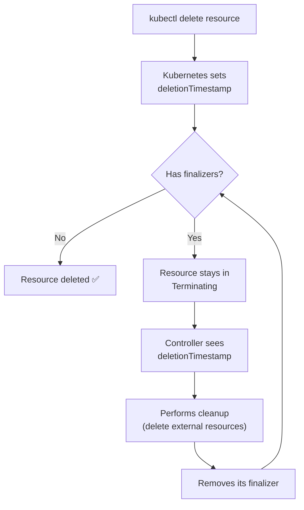

> 💡 **Quick Answer:** Finalizers are metadata entries that prevent a resource from being deleted until a controller performs cleanup. When you delete a resource with finalizers, Kubernetes sets \`deletionTimestamp\` but doesn't remove it until all finalizers are cleared. Stuck finalizers are the #1 cause of namespaces and PVCs that won't delete.

## The Problem

You try to delete a namespace, PVC, or custom resource, but it stays in \`Terminating\` state forever:

```bash
kubectl delete namespace test-ns
# namespace "test-ns" deleted   ← lies! It's still there

kubectl get namespace test-ns
# NAME      STATUS        AGE
# test-ns   Terminating   30m   ← stuck
```

This happens because a finalizer is blocking deletion — a controller needs to perform cleanup first, but that controller may be gone, broken, or unaware.



## The Solution

### How Finalizers Work

```yaml
apiVersion: v1
kind: PersistentVolumeClaim
metadata:
  name: my-data
  finalizers:
    - kubernetes.io/pvc-protection    # Prevents deletion while mounted
```

When you \`kubectl delete\` this PVC:
1. Kubernetes adds \`deletionTimestamp: 2026-04-12T10:00:00Z\`
2. PVC enters \`Terminating\` state
3. The PVC protection controller checks if any pod mounts it
4. If no pods mount it → controller removes the finalizer
5. With no finalizers left → Kubernetes actually deletes the PVC

### Common Built-In Finalizers

| Finalizer | Used On | Purpose |
|-----------|---------|---------|
| \`kubernetes.io/pvc-protection\` | PVC | Prevents deletion while mounted by a pod |
| \`kubernetes.io/pv-protection\` | PV | Prevents deletion while bound to a PVC |
| \`kubernetes\` | Namespace | Waits for all resources in namespace to be deleted |
| \`foregroundDeletion\` | Any | Waits for dependents to be deleted first |
| \`orphan\` | Any | Orphans dependents (don't delete them) |

### Fix Stuck Namespace

```bash
# 1. Check what's blocking
kubectl get namespace test-ns -o json | jq '.status'
# "conditions": [{
#   "type": "NamespaceDeletionContentFailure",
#   "message": "Some resources still exist..."
# }]

# 2. Find remaining resources
kubectl api-resources --verbs=list --namespaced -o name | \
  xargs -I{} kubectl get {} -n test-ns --no-headers 2>/dev/null

# 3. Delete stuck resources
kubectl delete all --all -n test-ns
kubectl delete configmaps,secrets,pvc --all -n test-ns

# 4. If still stuck — remove the finalizer (last resort)
kubectl get namespace test-ns -o json | \
  jq '.spec.finalizers = []' | \
  kubectl replace --raw "/api/v1/namespaces/test-ns/finalize" -f -
```

### Fix Stuck PVC

```bash
# Check which pod is using the PVC
kubectl get pods --all-namespaces -o json | \
  jq -r '.items[] | select(.spec.volumes[]?.persistentVolumeClaim.claimName == "my-data") | .metadata.name'

# Delete the pod first, then PVC will terminate
kubectl delete pod my-app

# Or force-remove finalizer (if no pod is using it)
kubectl patch pvc my-data -p '{"metadata":{"finalizers":null}}'
```

### Fix Stuck Custom Resource

```bash
# Check finalizers
kubectl get myresource my-cr -o jsonpath='{.metadata.finalizers}'
# ["mycontroller.example.com/cleanup"]

# If the controller is gone, remove the finalizer
kubectl patch myresource my-cr --type=json \
  -p='[{"op": "remove", "path": "/metadata/finalizers"}]'
```

### Add Finalizers (For Operator Development)

```yaml
# In your controller, add a finalizer when creating
apiVersion: example.com/v1
kind: MyResource
metadata:
  name: my-cr
  finalizers:
    - mycontroller.example.com/cleanup
spec:
  # ...
```

```go
// Go controller pattern
const finalizerName = "mycontroller.example.com/cleanup"

func (r *Reconciler) Reconcile(ctx context.Context, req ctrl.Request) (ctrl.Result, error) {
    obj := &v1.MyResource{}
    r.Get(ctx, req.NamespacedName, obj)

    if obj.DeletionTimestamp.IsZero() {
        // Resource not being deleted — ensure finalizer exists
        if !containsFinalizer(obj, finalizerName) {
            addFinalizer(obj, finalizerName)
            r.Update(ctx, obj)
        }
        return ctrl.Result{}, nil
    }

    // Resource being deleted — perform cleanup
    if containsFinalizer(obj, finalizerName) {
        // Delete external resources (e.g., cloud resources, DNS records)
        if err := r.cleanupExternalResources(obj); err != nil {
            return ctrl.Result{}, err
        }
        // Remove finalizer
        removeFinalizer(obj, finalizerName)
        r.Update(ctx, obj)
    }
    return ctrl.Result{}, nil
}
```

## Common Issues

| Issue | Cause | Fix |
|-------|-------|-----|
| Namespace stuck in Terminating | Resources with finalizers inside namespace | Delete all resources first, then remove namespace finalizer |
| PVC won't delete | Mounted by a running pod | Delete the pod first |
| CR stuck after operator uninstall | Finalizer controller is gone | Patch to remove finalizer manually |
| \`kubectl delete\` hangs | Waiting for finalizers | Use \`--wait=false\` to return immediately (resource still exists) |
| Can't edit resource in Terminating | Some fields are immutable once deletion starts | Use \`kubectl patch\` for metadata changes |

## Best Practices

- **Only add finalizers when external cleanup is needed** — cloud resources, DNS, certificates
- **Always implement the cleanup logic** — a finalizer without a controller = stuck deletion
- **Handle controller restarts** — finalizer logic must be idempotent
- **Don't remove finalizers casually** — they exist for a reason (data protection)
- **Check before force-removing** — understand what cleanup was supposed to happen
- **Use \`kubectl patch\` for emergency finalizer removal** — faster than editing JSON

## Key Takeaways

- Finalizers prevent resource deletion until cleanup completes
- Deletion adds \`deletionTimestamp\` but keeps the resource until finalizers are empty
- \`kubernetes.io/pvc-protection\` prevents PVC deletion while in use by pods
- Stuck namespace deletion is almost always caused by finalizers on inner resources
- Remove finalizers with \`kubectl patch\` only as a last resort — you may skip important cleanup
- Operators should always implement finalizer cleanup logic for external resources
