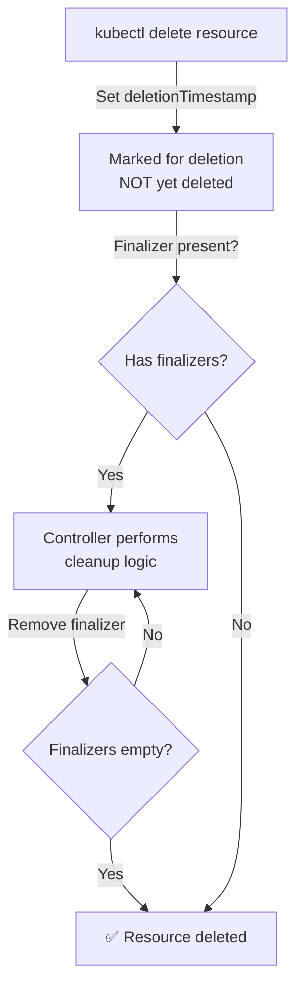

> 💡 **Quick Answer:** Finalizers prevent resource deletion until cleanup logic completes. Add `metadata.finalizers: ["my-operator.example.com/cleanup"]` to resources that need external cleanup (cloud resources, DNS records). Your controller removes the finalizer after cleanup, allowing Kubernetes to delete the object.

## The Problem

You delete a Namespace, CRD, or PVC and it gets stuck in `Terminating` forever. Or you delete a Deployment but its cloud load balancer remains orphaned. Finalizers and owner references control what happens when resources are deleted.

## The Solution

### Finalizers

```yaml
apiVersion: v1
kind: ConfigMap
metadata:
  name: important-config
  finalizers:
    - "my-operator.example.com/cleanup"
```

Deletion flow:
1. `kubectl delete configmap important-config`
2. Kubernetes sets `metadata.deletionTimestamp` (marks for deletion)
3. Object is NOT deleted — waiting for finalizers
4. Your controller detects `deletionTimestamp`, performs cleanup
5. Controller removes finalizer from `metadata.finalizers`
6. All finalizers removed → Kubernetes deletes the object

### Owner References (Cascading Deletion)

```yaml
apiVersion: v1
kind: Pod
metadata:
  name: web-abc123
  ownerReferences:
    - apiVersion: apps/v1
      kind: ReplicaSet
      name: web-5d8c4b7f6
      uid: "a1b2c3d4-e5f6-7890-abcd-ef1234567890"
      controller: true
      blockOwnerDeletion: true
```

When the ReplicaSet is deleted, its owned Pods are garbage collected automatically.

### Debugging Stuck Deletions

```bash
# Find what's blocking deletion
kubectl get namespace stuck-ns -o json | jq '.status.conditions'
kubectl get namespace stuck-ns -o json | jq '.spec.finalizers'

# Emergency: Remove finalizer to force deletion (USE WITH CAUTION)
kubectl patch namespace stuck-ns --type=json \
  -p='[{"op":"remove","path":"/spec/finalizers/0"}]'

# Find all resources in a stuck namespace
kubectl api-resources --verbs=list -o name | \
  xargs -I {} kubectl get {} -n stuck-ns --no-headers 2>/dev/null
```



## Common Issues

**Namespace stuck in Terminating**

A resource in the namespace has a finalizer whose controller is gone. Find it: `kubectl get all -n stuck-ns` and check for finalizers. Remove the finalizer or delete the blocking resource.

**CRD deletion stuck**

CRD has `customresourcecleanup` finalizer and instances still exist. Delete all CR instances first, then the CRD.

## Best Practices

- **Only add finalizers if you have a controller to remove them** — otherwise resources get stuck forever
- **Owner references for cascading cleanup** — child resources auto-delete with parent
- **`blockOwnerDeletion: true`** — parent can't be deleted until owned resources are gone
- **Never force-remove finalizers in production** unless you understand the consequences
- **Namespace finalizers** are special — Kubernetes handles them for resource cleanup

## Key Takeaways

- Finalizers prevent deletion until external cleanup completes
- Owner references enable cascading garbage collection (delete parent → delete children)
- Stuck `Terminating` resources almost always have a finalizer whose controller is missing
- Emergency fix: patch to remove finalizers — but understand what cleanup is being skipped
- Always pair finalizers with a running controller that handles cleanup and removes them
