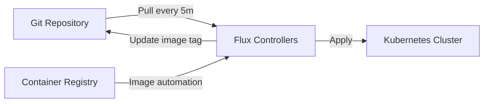

> 💡 **Quick Answer:** Bootstrap Flux with `flux bootstrap github` to install Flux components and connect to your Git repository. Define `GitRepository` sources, `Kustomization` for directory-based deployment, and `HelmRelease` for Helm chart management. Flux reconciles cluster state with Git every 1-5 minutes.

## The Problem

ArgoCD provides a UI-driven GitOps experience, but Flux takes a different approach: lightweight, CLI-first, and composable. Flux excels at multi-tenant fleet management, image automation (auto-updating tags from registries), and tight Helm integration.

## The Solution

### Bootstrap Flux

```bash
flux bootstrap github \
  --owner=my-org \
  --repository=fleet-infra \
  --branch=main \
  --path=clusters/production \
  --personal
```

### GitRepository + Kustomization

```yaml
apiVersion: source.toolkit.fluxcd.io/v1
kind: GitRepository
metadata:
  name: app-repo
  namespace: flux-system
spec:
  interval: 5m
  url: https://github.com/my-org/app-manifests
  ref:
    branch: main
---
apiVersion: kustomize.toolkit.fluxcd.io/v1
kind: Kustomization
metadata:
  name: app-production
  namespace: flux-system
spec:
  interval: 5m
  path: ./overlays/production
  prune: true
  sourceRef:
    kind: GitRepository
    name: app-repo
  healthChecks:
    - apiVersion: apps/v1
      kind: Deployment
      name: web-app
      namespace: production
```

### HelmRelease

```yaml
apiVersion: helm.toolkit.fluxcd.io/v2
kind: HelmRelease
metadata:
  name: ingress-nginx
  namespace: ingress-nginx
spec:
  interval: 30m
  chart:
    spec:
      chart: ingress-nginx
      version: "4.x"
      sourceRef:
        kind: HelmRepository
        name: ingress-nginx
  values:
    controller:
      replicas: 3
      resources:
        requests:
          cpu: 200m
          memory: 256Mi
```

### Image Automation

```yaml
apiVersion: image.toolkit.fluxcd.io/v1beta2
kind: ImagePolicy
metadata:
  name: app-policy
spec:
  imageRepositoryRef:
    name: app-repo
  policy:
    semver:
      range: ">=1.0.0"
```



## Common Issues

**Kustomization not reconciling**: Check `flux get kustomizations` for errors. Common: path doesn't exist in repo, or Kustomize build fails.

**HelmRelease stuck in 'Not Ready'**: Check `flux get helmreleases`. Helm chart values may be invalid — `flux logs --kind=HelmRelease --name=ingress-nginx`.

## Best Practices

- **`prune: true`** for drift correction — Flux deletes resources removed from Git
- **Health checks** for deployment verification — Flux waits for rollout
- **Image automation** for auto-updates — Flux commits new tags back to Git
- **Multi-tenant with Flux** — separate GitRepositories per team
- **`interval: 5m`** for apps, `30m` for infrastructure charts

## Key Takeaways

- Flux provides lightweight, CLI-first GitOps for Kubernetes
- GitRepository + Kustomization for directory-based deployments
- HelmRelease for declarative Helm chart management with drift correction
- Image automation detects new container tags and commits updates to Git
- Reconciliation every 1-5 minutes ensures cluster matches Git state
