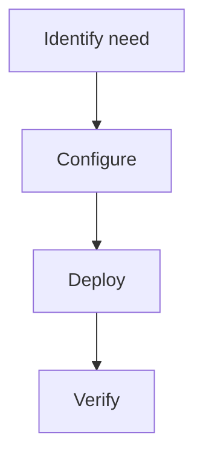

> 💡 **Quick Answer:** Configure fsGroupChangePolicy OnRootMismatch to skip recursive chown on volume mounts. Fix slow pod startup with large persistent volumes on Kubernetes.

## The Problem

Configure fsGroupChangePolicy OnRootMismatch to skip recursive chown on volume mounts. Without proper configuration, teams encounter unexpected behavior, errors, or security gaps in production.

## The Solution

### Configuration

```yaml
# fsGroupChangePolicy OnRootMismatch example
apiVersion: v1
kind: ConfigMap
metadata:
  name: example
data:
  key: value
```

### Steps

```bash
kubectl apply -f config.yaml
kubectl get all -n production
```



## Common Issues

**Configuration not working**: Check YAML syntax and ensure the namespace exists. Use `kubectl apply --dry-run=server` to validate before applying.

## Best Practices

- Test changes in staging first
- Version all configs in Git
- Monitor after deployment
- Document decisions for the team

## Key Takeaways

- fsGroupChangePolicy OnRootMismatch is essential for production Kubernetes
- Follow the configuration patterns shown above
- Always validate before applying to production
- Combine with monitoring for full observability
