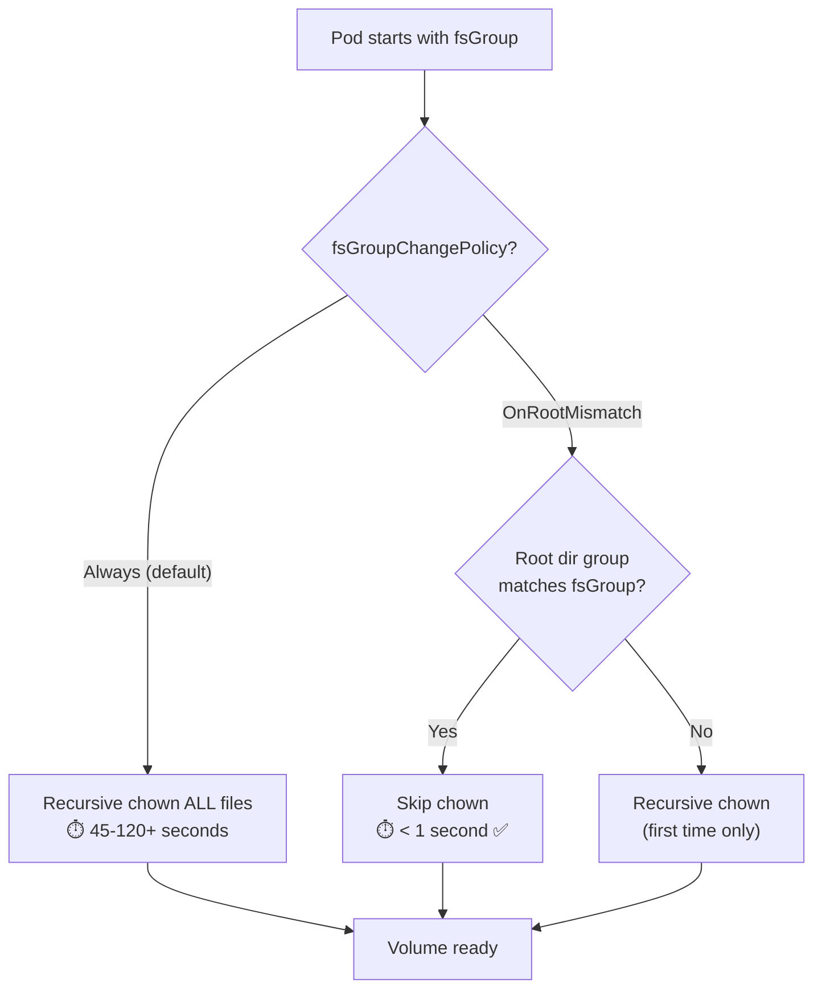

> 💡 **Quick Answer:** When you set \`fsGroup\` in a pod's security context, Kubernetes recursively \`chown\`s every file in mounted volumes on startup. For volumes with millions of files, this takes minutes. Set \`fsGroupChangePolicy: OnRootMismatch\` to only change ownership when the root directory's group doesn't match — reducing mount time from minutes to seconds.

## The Problem

Setting \`fsGroup\` is common for non-root containers that need write access to persistent volumes. But Kubernetes's default behavior (\`Always\`) runs recursive \`chown\` on every file and directory in the volume mount on every pod start:

```
Volume with 1M files:
  fsGroupChangePolicy: Always       → chown takes 45-120 seconds
  fsGroupChangePolicy: OnRootMismatch → chown takes <1 second (skipped!)
```

This causes:
- Pod start times of 1-5+ minutes for large volumes
- Pod restart storms when volumes have millions of files
- Init container timeouts waiting for volume to be ready



## The Solution

### The Fix

```yaml
apiVersion: v1
kind: Pod
metadata:
  name: my-app
spec:
  securityContext:
    fsGroup: 1000
    fsGroupChangePolicy: OnRootMismatch   # ← The fix
  containers:
    - name: app
      image: nginx
      securityContext:
        runAsUser: 1000
        runAsGroup: 1000
      volumeMounts:
        - name: data
          mountPath: /data
  volumes:
    - name: data
      persistentVolumeClaim:
        claimName: my-data-pvc
```

### Policy Comparison

| Policy | Behavior | Speed | Use Case |
|--------|----------|:-----:|----------|
| \`Always\` (default) | Recursive chown on every pod start | Slow | Security-critical: must guarantee every file has correct group |
| \`OnRootMismatch\` | Chown only if volume root dir group ≠ fsGroup | Fast | Standard workloads, large volumes, databases |

### When OnRootMismatch Triggers Chown

```bash
# Scenario 1: First mount (empty volume)
# Root dir has no group set → chown runs ONCE → fast on empty volume

# Scenario 2: Pod restarts (same fsGroup)
# Root dir group matches → chown SKIPPED → instant ✅

# Scenario 3: fsGroup changes (e.g., 1000 → 2000)
# Root dir group doesn't match → chown runs again

# Scenario 4: New files added by other processes (e.g., sidecar, backup)
# Root dir still matches → chown SKIPPED
# New files may have wrong group → app must handle this
```

### StatefulSet Example (Database)

```yaml
apiVersion: apps/v1
kind: StatefulSet
metadata:
  name: postgres
spec:
  replicas: 3
  template:
    spec:
      securityContext:
        fsGroup: 999              # postgres group
        fsGroupChangePolicy: OnRootMismatch
        runAsUser: 999
        runAsGroup: 999
      containers:
        - name: postgres
          image: postgres:16
          volumeMounts:
            - name: pgdata
              mountPath: /var/lib/postgresql/data
  volumeClaimTemplates:
    - metadata:
        name: pgdata
      spec:
        accessModes: ["ReadWriteOnce"]
        resources:
          requests:
            storage: 100Gi
```

### Init Container Race Condition Fix

A common pattern where \`fsGroupChangePolicy\` helps:

```yaml
spec:
  securityContext:
    fsGroup: 1000
    fsGroupChangePolicy: OnRootMismatch
  initContainers:
    - name: fix-permissions
      image: busybox
      # NO LONGER NEEDED with fsGroupChangePolicy!
      # command: ["sh", "-c", "chown -R 1000:1000 /data"]
      # This was the old workaround — remove it
  containers:
    - name: app
      image: myapp
      volumeMounts:
        - name: data
          mountPath: /data
```

### Verify the Setting

```bash
# Check pod's security context
kubectl get pod my-app -o jsonpath='{.spec.securityContext.fsGroupChangePolicy}'
# OnRootMismatch

# Check volume mount ownership
kubectl exec my-app -- ls -la /data/
# drwxrwsr-x 2 1000 1000 4096 Apr 12 10:00 .
# -rw-r--r-- 1 1000 1000  512 Apr 12 10:00 myfile.txt

# Monitor pod start time
kubectl get pod my-app -o jsonpath='{.status.conditions[?(@.type=="Ready")].lastTransitionTime}'
```

## Common Issues

| Issue | Cause | Fix |
|-------|-------|-----|
| Pod takes 2+ minutes to start | Recursive chown on large volume | Set \`fsGroupChangePolicy: OnRootMismatch\` |
| New files have wrong group | \`OnRootMismatch\` doesn't chown new files | Set \`umask\` or use \`setgid\` bit on directory |
| Init container \`chown -R\` slow | Manual recursive permission fix | Remove init container, use \`fsGroupChangePolicy\` instead |
| Permission denied after restart | fsGroup changed between deploys | OnRootMismatch will re-chown when group doesn't match |
| NFS volumes ignore fsGroup | NFS doesn't support fsGroup | Use \`supplementalGroups\` or server-side permissions |

## Best Practices

- **Always use \`OnRootMismatch\` for volumes > 10K files** — prevents slow pod starts
- **Remove manual chown init containers** — \`fsGroupChangePolicy\` handles this natively
- **Set \`setgid\` on directories** — ensures new files inherit the group: \`chmod g+s /data\`
- **Test with large volumes** — verify start time improvement before production
- **Use \`Always\` only for strict compliance** — where every file must be verified on every restart

## Key Takeaways

- \`fsGroupChangePolicy: Always\` (default) runs recursive chown on every pod start — very slow for large volumes
- \`OnRootMismatch\` checks only the volume root directory — skips chown if group already matches
- This can reduce pod start time from minutes to under a second
- Requires Kubernetes 1.20+ (GA since 1.23)
- Doesn't affect NFS or CSI volumes that don't support fsGroup
- Remove manual \`chown -R\` init containers — use this instead
