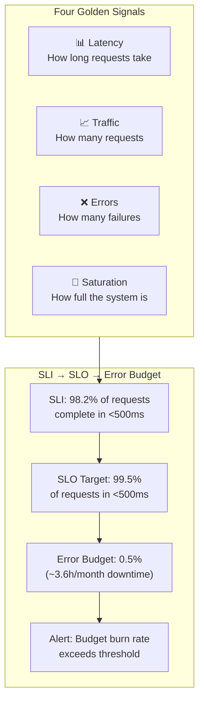

> 💡 **Quick Answer:** The four golden signals are latency, traffic, errors, and saturation. Define SLIs as Prometheus queries (e.g., `http_request_duration_seconds_bucket` for latency), set SLO targets (e.g., 99.9% requests under 500ms), calculate error budgets, and alert when budgets are burning too fast. Use Sloth to auto-generate Prometheus recording rules from SLO definitions.

## The Problem

Most Kubernetes monitoring alerts on symptoms (CPU > 80%, pod restarting) rather than user impact. A pod using 90% CPU might be fine if users are happy. SLIs/SLOs flip the model: define what "good" means from the user's perspective, measure it, and only alert when you're burning through your error budget.



## The Solution

### Define SLIs with PromQL

```promql
# SLI: Availability (percentage of successful requests)
sum(rate(http_requests_total{status!~"5.."}[5m]))
/
sum(rate(http_requests_total[5m]))

# SLI: Latency (percentage of requests under 500ms)
sum(rate(http_request_duration_seconds_bucket{le="0.5"}[5m]))
/
sum(rate(http_request_duration_seconds_count[5m]))

# SLI: Freshness (data pipeline delivered within SLA)
(time() - max(pipeline_last_success_timestamp)) < 3600

# Golden Signal: Traffic
sum(rate(http_requests_total[5m])) by (service)

# Golden Signal: Saturation
# CPU saturation
sum(rate(container_cpu_usage_seconds_total[5m])) by (pod)
/
sum(kube_pod_container_resource_limits{resource="cpu"}) by (pod)

# Memory saturation
container_memory_working_set_bytes / container_spec_memory_limit_bytes
```

### SLO Definition with Sloth

```yaml
# sloth.yaml — generates Prometheus recording rules
apiVersion: sloth.slok.dev/v1
kind: PrometheusServiceLevel
metadata:
  name: api-server
spec:
  service: "api-server"
  labels:
    team: platform
  slos:
    - name: "requests-availability"
      objective: 99.9               # 99.9% SLO
      description: "99.9% of API requests succeed"
      sli:
        events:
          errorQuery: sum(rate(http_requests_total{service="api-server",status=~"5.."}[{{.window}}]))
          totalQuery: sum(rate(http_requests_total{service="api-server"}[{{.window}}]))
      alerting:
        name: APIServerAvailability
        labels:
          severity: critical
        annotations:
          summary: "API server error budget burn rate is too high"
        pageAlert:
          labels:
            severity: critical
        ticketAlert:
          labels:
            severity: warning

    - name: "requests-latency"
      objective: 99.5               # 99.5% SLO
      description: "99.5% of requests complete in under 500ms"
      sli:
        events:
          errorQuery: |
            sum(rate(http_request_duration_seconds_count{service="api-server"}[{{.window}}]))
            -
            sum(rate(http_request_duration_seconds_bucket{service="api-server",le="0.5"}[{{.window}}]))
          totalQuery: sum(rate(http_request_duration_seconds_count{service="api-server"}[{{.window}}]))
      alerting:
        name: APIServerLatency
```

```bash
# Generate Prometheus rules from Sloth SLO
sloth generate -i sloth.yaml -o prometheus-rules.yaml
kubectl apply -f prometheus-rules.yaml
```

### Error Budget Calculation

```promql
# Error budget remaining (30-day window)
# SLO = 99.9% → Error budget = 0.1% = 43.2 minutes/month

# Budget consumed (percentage)
1 - (
  sum_over_time(slo:sli_error:ratio_rate5m{sloth_service="api-server",sloth_slo="requests-availability"}[30d])
  / (30 * 24 * 12)  # 30 days × 24h × 12 five-minute windows/hour
) / (1 - 0.999)     # 0.999 = SLO target

# Burn rate (how fast are we consuming budget?)
# 1.0 = consuming at exactly the SLO rate
# 2.0 = burning 2× faster than sustainable
sum(rate(http_requests_total{status=~"5.."}[1h]))
/
sum(rate(http_requests_total[1h]))
/
(1 - 0.999)         # Normalize by error budget
```

### Multi-Window Burn Rate Alerts

```yaml
# Google SRE multi-window burn rate alerting
apiVersion: monitoring.coreos.com/v1
kind: PrometheusRule
metadata:
  name: slo-burn-rate-alerts
spec:
  groups:
    - name: slo.burn-rate
      rules:
        # Page: 2% budget consumed in 1 hour (14.4× burn rate)
        - alert: SLOBurnRateCritical
          expr: |
            slo:sli_error:ratio_rate1h{sloth_service="api-server"} > (14.4 * 0.001)
            and
            slo:sli_error:ratio_rate5m{sloth_service="api-server"} > (14.4 * 0.001)
          for: 2m
          labels:
            severity: critical
          annotations:
            summary: "High error budget burn rate — page on-call"

        # Ticket: 5% budget consumed in 6 hours (6× burn rate)  
        - alert: SLOBurnRateWarning
          expr: |
            slo:sli_error:ratio_rate6h{sloth_service="api-server"} > (6 * 0.001)
            and
            slo:sli_error:ratio_rate30m{sloth_service="api-server"} > (6 * 0.001)
          for: 5m
          labels:
            severity: warning
          annotations:
            summary: "Elevated error budget burn rate — create ticket"
```

### Grafana SLO Dashboard

```json
{
  "title": "SLO Dashboard",
  "panels": [
    {
      "title": "Error Budget Remaining",
      "type": "gauge",
      "thresholds": [
        {"color": "red", "value": 0},
        {"color": "yellow", "value": 25},
        {"color": "green", "value": 50}
      ]
    },
    {
      "title": "SLI: Availability (30d rolling)",
      "type": "stat",
      "targets": [{"expr": "avg_over_time(slo:sli_error:ratio_rate5m{sloth_slo='requests-availability'}[30d])"}]
    },
    {
      "title": "Burn Rate (1h window)",
      "type": "timeseries"
    },
    {
      "title": "Error Budget Consumption Over Time",
      "type": "timeseries"
    }
  ]
}
```

## Common Issues

| Issue | Cause | Fix |
|-------|-------|-----|
| SLI always 100% | Too few requests | Increase measurement window or lower SLO |
| Error budget depleted too fast | Single outage consumed all budget | Improve MTTR; don't change SLO |
| Alerts too noisy | Burn rate threshold too sensitive | Use multi-window approach (1h AND 5m) |
| No data for SLI | Wrong metric name or labels | Verify metric exists in Prometheus |
| SLO too aggressive | 99.99% unrealistic for your tier | Start with 99.5% and tighten over time |

## Best Practices

- **Start with 3 SLOs per service** — availability, latency, and one domain-specific
- **Use multi-window burn rates** — prevents alert fatigue while catching real incidents
- **Review error budgets monthly** — adjust SLO targets based on business needs
- **Don't change SLOs after incidents** — improve reliability, not the target
- **Automate with Sloth** — generates recording rules from declarative SLO definitions
- **Display SLO dashboards publicly** — transparency builds trust with stakeholders

## Key Takeaways

- Four golden signals: latency, traffic, errors, saturation — measure all four
- SLIs are the metrics; SLOs are the targets; error budgets are the consequence
- Multi-window burn rate alerts catch real incidents without false alarms
- Sloth generates all Prometheus recording rules from a simple YAML SLO spec
- Error budget policy: when budget is exhausted, prioritize reliability over features
- SRE approach shifts from "is the system healthy?" to "are users happy?"
