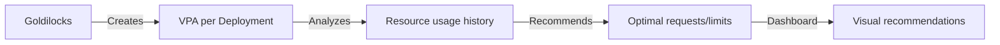

> 💡 **Quick Answer:** Deploy Goldilocks to visualize Vertical Pod Autoscaler recommendations across all namespaces. Right-size Kubernetes resource requests and limits with a web dashboard.

## The Problem

Engineers frequently search for this topic but find scattered, incomplete guides. This recipe provides a comprehensive, production-ready reference.

## The Solution

### Install Goldilocks

```bash
# Prerequisites: VPA must be installed
helm repo add fairwinds-stable https://charts.fairwinds.com/stable
helm install vpa fairwinds-stable/vpa --namespace vpa --create-namespace

# Install Goldilocks
helm install goldilocks fairwinds-stable/goldilocks --namespace goldilocks --create-namespace
```

### Enable for a Namespace

```bash
# Label namespaces to enable VPA recommendations
kubectl label namespace default goldilocks.fairwinds.com/enabled=true
kubectl label namespace production goldilocks.fairwinds.com/enabled=true

# Goldilocks creates VPA objects in "Off" mode (recommend-only)
kubectl get vpa -n default
```

### Access the Dashboard

```bash
kubectl port-forward -n goldilocks svc/goldilocks-dashboard 8080:80
# Open http://localhost:8080
# Shows per-container recommendations for: Lower Bound, Target, Upper Bound
```

### Use Recommendations

```yaml
# Before (guessing)
resources:
  requests:
    cpu: 500m
    memory: 512Mi
  limits:
    cpu: "1"
    memory: 1Gi

# After (Goldilocks target recommendation)
resources:
  requests:
    cpu: 120m       # Was over-provisioned by 4x!
    memory: 230Mi   # Was over-provisioned by 2x!
  limits:
    cpu: 250m
    memory: 460Mi
```



## Frequently Asked Questions

### Does Goldilocks change my resources automatically?

No — it runs VPA in "Off" mode (recommendation only). You review the dashboard and manually update resource values. This is the safest approach.

### How long until I get good recommendations?

VPA needs at least 24-48 hours of data for reliable recommendations. For workloads with weekly patterns, wait a full week.

## Best Practices

- Start with the simplest approach that solves your problem
- Test thoroughly in staging before production
- Monitor and iterate based on real metrics
- Document decisions for your team

## Key Takeaways

- This is essential Kubernetes operational knowledge
- Production-readiness requires proper configuration and monitoring
- Use `kubectl describe` and logs for troubleshooting
- Automate where possible to reduce human error
