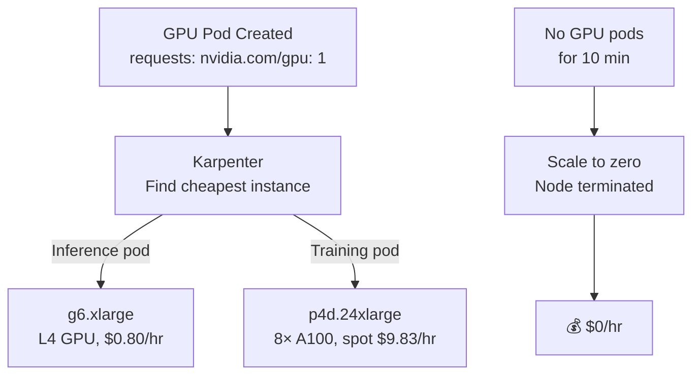

> 💡 **Quick Answer:** Use Karpenter with GPU-aware NodePools to automatically provision the right GPU instance type based on pod requirements. Define constraints for instance families (p5, g6), GPU count, and spot vs on-demand. Implement scale-to-zero for dev/staging GPU nodes.

## The Problem

GPU nodes are expensive ($2-100/hour) and manually managing node pools for different GPU types (T4, A10, A100, H100) wastes money. You need automatic provisioning that matches GPU requests to the cheapest available instance, scales to zero when idle, and uses spot instances where possible.

## The Solution

### Karpenter NodePool for GPUs

```yaml
apiVersion: karpenter.sh/v1beta1
kind: NodePool
metadata:
  name: gpu-inference
spec:
  template:
    spec:
      requirements:
        - key: karpenter.k8s.aws/instance-family
          operator: In
          values: ["g6", "g5", "p4d"]
        - key: karpenter.sh/capacity-type
          operator: In
          values: ["on-demand"]
        - key: nvidia.com/gpu.count
          operator: In
          values: ["1", "2", "4"]
      nodeClassRef:
        apiVersion: karpenter.k8s.aws/v1beta1
        kind: EC2NodeClass
        name: gpu-nodeclass
  limits:
    nvidia.com/gpu: 32
  disruption:
    consolidationPolicy: WhenUnderutilized
    consolidateAfter: 10m
---
apiVersion: karpenter.sh/v1beta1
kind: NodePool
metadata:
  name: gpu-training-spot
spec:
  template:
    spec:
      requirements:
        - key: karpenter.k8s.aws/instance-family
          operator: In
          values: ["p4d", "p5"]
        - key: karpenter.sh/capacity-type
          operator: In
          values: ["spot"]
        - key: nvidia.com/gpu.count
          operator: In
          values: ["8"]
      nodeClassRef:
        apiVersion: karpenter.k8s.aws/v1beta1
        kind: EC2NodeClass
        name: gpu-nodeclass
      taints:
        - key: nvidia.com/gpu
          value: "true"
          effect: NoSchedule
  limits:
    nvidia.com/gpu: 64
  disruption:
    consolidationPolicy: WhenEmpty
    consolidateAfter: 5m
```

### EC2NodeClass for GPU AMI

```yaml
apiVersion: karpenter.k8s.aws/v1beta1
kind: EC2NodeClass
metadata:
  name: gpu-nodeclass
spec:
  amiFamily: AL2
  blockDeviceMappings:
    - deviceName: /dev/xvda
      ebs:
        volumeSize: 200Gi
        volumeType: gp3
  subnetSelectorTerms:
    - tags:
        karpenter.sh/discovery: my-cluster
  securityGroupSelectorTerms:
    - tags:
        karpenter.sh/discovery: my-cluster
  userData: |
    #!/bin/bash
    # Install NVIDIA drivers
    yum install -y nvidia-driver-latest
```

### Cluster Autoscaler Alternative

```yaml
apiVersion: v1
kind: ConfigMap
metadata:
  name: cluster-autoscaler-config
data:
  config: |
    nodeGroups:
      - name: gpu-a100
        minSize: 0
        maxSize: 8
        scaleDownUtilizationThreshold: 0.3
        scaleDownUnneededTime: 10m
```

### GPU Instance Decision Matrix

| Workload | GPU | Instance (AWS) | Spot? | Cost/hr |
|----------|-----|----------------|-------|---------|
| Small inference | T4 | g4dn.xlarge | Yes | $0.16 |
| Medium inference | L4 | g6.xlarge | Yes | $0.24 |
| Large inference | A10G | g5.xlarge | On-demand | $1.01 |
| Training (single) | A100 | p4d.24xlarge | Spot | $9.83 |
| Training (multi) | H100 | p5.48xlarge | Spot | $32.77 |



## Common Issues

**GPU node provisioning slow (5-10 minutes)**

GPU instances take longer to launch than CPU instances. Pre-warm by keeping `minSize: 1` for critical node pools, or use Karpenter's `consolidationPolicy: WhenEmpty` instead of `WhenUnderutilized`.

**Spot GPU instance reclaimed during training**

Use checkpointing + Karpenter interruption handling. Set `terminationGracePeriodSeconds: 120` to save checkpoint before node termination.

## Best Practices

- **Separate NodePools for inference and training** — different instance types and pricing
- **Spot for training, on-demand for inference** — training can tolerate interruption
- **Scale-to-zero for dev/staging** — no GPU cost when idle
- **GPU taints** — prevent non-GPU pods from accidentally scheduling on expensive nodes
- **200GB root volume** — GPU drivers and model cache need space

## Key Takeaways

- Karpenter automatically provisions the cheapest GPU instance matching pod requirements
- Separate NodePools for inference (on-demand, small GPUs) and training (spot, large GPUs)
- Scale-to-zero saves 100% cost when no GPU workloads are running
- GPU taints prevent non-GPU pods from wasting expensive GPU nodes
- Spot instances save 60-80% for training with checkpoint-based fault tolerance
