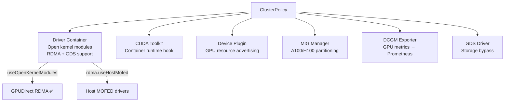

> 💡 **Quick Answer:** Configure GPU Operator ClusterPolicy for production: enable `driver.useOpenKernelModules: true` for GPUDirect RDMA, configure `gds.enabled: true` for storage bypass, set `migManager.enabled: true` for A100/H100 MIG support, and customize DCGM Exporter metrics for Prometheus.

## The Problem

The default GPU Operator install gets basic GPU support working, but production AI clusters need: open kernel modules for RDMA/DMA-BUF, GDS for storage bypass, MIG for GPU sharing, custom driver versions per node pool, and DCGM monitoring integration. Advanced ClusterPolicy configuration unlocks these features.

## The Solution

### Production ClusterPolicy

```yaml
apiVersion: nvidia.com/v1
kind: ClusterPolicy
metadata:
  name: gpu-cluster-policy
spec:
  operator:
    defaultRuntime: containerd
  driver:
    enabled: true
    useOpenKernelModules: true
    version: "550.127.05"
    licensingConfig:
      nlsEnabled: false
    rdma:
      enabled: true
      useHostMofed: true
    upgradePolicy:
      autoUpgrade: false
      maxParallelUpgrades: 1
      drain:
        enable: true
        force: true
        timeoutSeconds: 300
  toolkit:
    enabled: true
    version: v1.16.2-ubuntu22.04
  devicePlugin:
    enabled: true
    config:
      name: device-plugin-config
  dcgm:
    enabled: true
  dcgmExporter:
    enabled: true
    config:
      name: dcgm-metrics-config
    serviceMonitor:
      enabled: true
  gds:
    enabled: true
  migManager:
    enabled: true
    config:
      name: mig-partition-config
  nodeStatusExporter:
    enabled: true
  sandboxDevicePlugin:
    enabled: false
  vfioManager:
    enabled: false
```

### Custom DCGM Metrics

```yaml
apiVersion: v1
kind: ConfigMap
metadata:
  name: dcgm-metrics-config
  namespace: gpu-operator
data:
  dcgm-metrics.csv: |
    DCGM_FI_DEV_GPU_UTIL,      gauge, GPU utilization
    DCGM_FI_DEV_FB_FREE,       gauge, Free framebuffer memory (MB)
    DCGM_FI_DEV_FB_USED,       gauge, Used framebuffer memory (MB)
    DCGM_FI_DEV_GPU_TEMP,      gauge, GPU temperature (C)
    DCGM_FI_DEV_POWER_USAGE,   gauge, Power usage (W)
    DCGM_FI_DEV_SM_CLOCK,      gauge, SM clock (MHz)
    DCGM_FI_DEV_MEM_CLOCK,     gauge, Memory clock (MHz)
    DCGM_FI_DEV_PCIE_TX_THROUGHPUT, gauge, PCIe TX throughput (KB/s)
    DCGM_FI_DEV_PCIE_RX_THROUGHPUT, gauge, PCIe RX throughput (KB/s)
    DCGM_FI_DEV_XID_ERRORS,    gauge, XID error count
    DCGM_FI_DEV_NVLINK_BANDWIDTH_TOTAL, gauge, NVLink bandwidth (MB/s)
    DCGM_FI_PROF_GR_ENGINE_ACTIVE,     gauge, Graphics engine active ratio
    DCGM_FI_PROF_SM_ACTIVE,            gauge, SM active ratio
    DCGM_FI_PROF_DRAM_ACTIVE,          gauge, DRAM active ratio
```

### Per-Node Driver Customization

```yaml
# Label nodes for different driver versions
kubectl label node gpu-worker-1 nvidia.com/driver-version=550.127.05
kubectl label node gpu-worker-2 nvidia.com/driver-version=535.183.01

# Device plugin config per GPU type
apiVersion: v1
kind: ConfigMap
metadata:
  name: device-plugin-config
  namespace: gpu-operator
data:
  config.yaml: |
    version: v1
    flags:
      migStrategy: mixed
    sharing:
      timeSlicing:
        renameByDefault: false
        resources:
          - name: nvidia.com/gpu
            replicas: 1
```



## Common Issues

**Driver container crashlooping after upgrade**

Kernel version mismatch. Check: `kubectl logs -n gpu-operator ds/nvidia-driver-daemonset`. Set `driver.version` to match your kernel or use `driver.usePrecompiled: true`.

**GPUDirect RDMA not working**

Must use open kernel modules: `driver.useOpenKernelModules: true`. Closed-source drivers don't support DMA-BUF, which is required for GPU RDMA.

## Best Practices

- **`useOpenKernelModules: true`** is mandatory for GPUDirect RDMA and GDS
- **Pin driver versions** — `autoUpgrade: false` prevents unexpected driver changes
- **Drain before upgrade** — `maxParallelUpgrades: 1` with drain enabled for safe rolling updates
- **Custom DCGM metrics** — export only what you need to reduce Prometheus cardinality
- **`rdma.useHostMofed: true`** when MOFED is installed on the host (not in container)

## Key Takeaways

- GPU Operator ClusterPolicy controls all NVIDIA components on the cluster
- Open kernel modules are mandatory for GPUDirect RDMA and GDS
- Pin driver versions and disable auto-upgrade for production stability
- DCGM Exporter metrics are customizable — export only what Prometheus needs
- MIG Manager handles A100/H100 GPU partitioning automatically
- Per-node driver customization supports mixed GPU hardware in the same cluster
