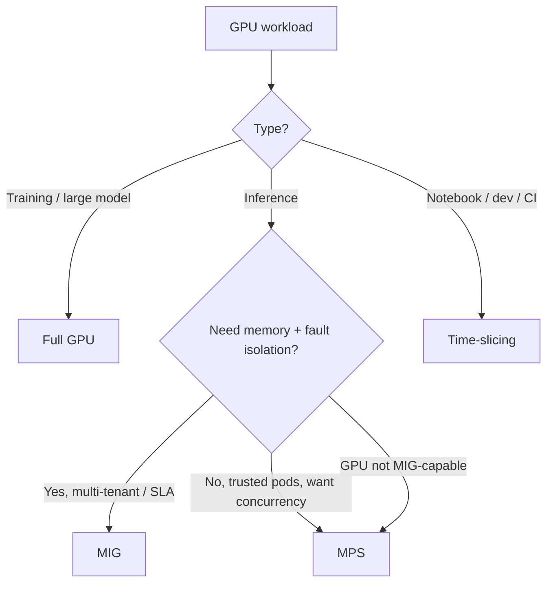

> 💡 **Quick Answer:** Kubernetes can't split `nvidia.com/gpu` natively; the NVIDIA device plugin (via the GPU Operator) offers three ways to share one GPU. **Time-slicing** — any NVIDIA GPU, pods take turns, *no memory or fault isolation*; good for notebooks/dev. **MPS** — processes run concurrently with per-client memory and compute limits, but a fault can still affect other clients; good for many small inference pods. **MIG** — hardware partitions with dedicated memory, cache and SMs and full fault isolation, on MIG-capable data-center GPUs (A30, A100, H100/H200, Blackwell); good for multi-tenant production inference. Keep **full GPUs** for training.

## Comparison

| | Full GPU | Time-slicing | MPS | MIG |
|---|---|---|---|---|
| **How** | Exclusive device | Temporal context switching | Concurrent kernels via MPS server | Hardware partitions |
| **GPUs** | All | All NVIDIA GPUs | Volta and newer | MIG-capable: A30, A100, H100, H200, B200/GB200 and some RTX PRO Blackwell |
| **Max per GPU** | 1 | `replicas` you configure | `replicas` you configure | Up to 7 (A30: 4) |
| **Memory isolation** | Yes | **No** — all pods see full VRAM | Per-client limit (enforced by MPS) | Yes (hardware) |
| **Compute isolation** | Yes | No (time-shared) | Per-client SM % limit | Yes (dedicated SMs) |
| **Fault isolation** | Yes | No | **No** — a fatal fault can hit all clients | Yes |
| **Concurrency** | — | One context at a time | Truly concurrent | Truly concurrent |
| **Reconfigure** | — | ConfigMap + device-plugin restart | ConfigMap + device-plugin restart | MIG manager repartitions; GPU must be idle |
| **K8s resource** | `nvidia.com/gpu` | `nvidia.com/gpu` (or `nvidia.com/gpu.shared`) | `nvidia.com/gpu` (or `.shared`) | `nvidia.com/mig-<profile>` (mixed) or `nvidia.com/gpu` (single) |
| **Best for** | Training, large models | Notebooks, dev, CI | Many small, trusted inference pods | Multi-tenant, SLA inference |

Overhead: MIG and MPS add little; time-slicing costs context switches and, more importantly, every pod sees contention from the others. Measure with your workload rather than trusting a percentage.



## Time-Slicing

Device plugin config in a ConfigMap, referenced from the ClusterPolicy:

```yaml
apiVersion: v1
kind: ConfigMap
metadata:
  name: time-slicing-config
  namespace: gpu-operator
data:
  any: |-
    version: v1
    sharing:
      timeSlicing:
        renameByDefault: false
        failRequestsGreaterThanOne: true
        resources:
          - name: nvidia.com/gpu
            replicas: 4
```

```bash
kubectl patch clusterpolicies.nvidia.com/cluster-policy --type merge \
  -p '{"spec":{"devicePlugin":{"config":{"name":"time-slicing-config","default":"any"}}}}'
```

Each GPU is then advertised as 4 `nvidia.com/gpu`. A pod requesting `nvidia.com/gpu: 1` gets a share, not a quarter — nothing stops it from using all the memory. Full walkthrough, per-node profiles and verification: [GPU time-slicing on Kubernetes](/recipes/ai/gpu-time-slicing-kubernetes/).

## MPS

Supported by the NVIDIA device plugin since v0.15 (initially flagged experimental; shipped with recent GPU Operator releases). The plugin runs an MPS control daemon per GPU and splits it into equal replicas:

```yaml
apiVersion: v1
kind: ConfigMap
metadata:
  name: mps-config
  namespace: gpu-operator
data:
  mps-4: |-
    version: v1
    sharing:
      mps:
        resources:
          - name: nvidia.com/gpu
            replicas: 4
```

With `replicas: 4`, each client is limited to roughly a quarter of the GPU's memory and compute. Apply it like time-slicing (ClusterPolicy `devicePlugin.config`, optionally per node with the `nvidia.com/device-plugin.config=mps-4` label). The device plugin does not support MPS on MIG-enabled GPUs.

## MIG

The GPU Operator's MIG manager partitions GPUs according to the node label `nvidia.com/mig.config`. The built-in `default-mig-parted-config` already contains common layouts (`all-1g.10gb`, `all-3g.40gb`, `all-balanced`, ...):

```bash
# choose the strategy once (mixed = per-profile resource names)
kubectl patch clusterpolicies.nvidia.com/cluster-policy --type merge \
  -p '{"spec":{"mig":{"strategy":"mixed"}}}'

# partition a node (A100/H100 80GB: 7 × 1g.10gb)
kubectl label node gpu-node-1 nvidia.com/mig.config=all-1g.10gb --overwrite

# watch the MIG manager apply it
kubectl get node gpu-node-1 -L nvidia.com/mig.config.state
```

For custom layouts, point `spec.migManager.config.name` at your own ConfigMap:

```yaml
apiVersion: v1
kind: ConfigMap
metadata:
  name: custom-mig-config
  namespace: gpu-operator
data:
  config.yaml: |
    version: v1
    mig-configs:
      one-big-three-small:          # A100/H100 80GB
        - devices: all
          mig-enabled: true
          mig-devices:
            "3g.40gb": 1
            "1g.10gb": 3
```

Request a slice by profile (mixed strategy):

```yaml
resources:
  limits:
    nvidia.com/mig-1g.10gb: 1
```

Profile names depend on the GPU's memory size:

| GPU | Example profiles |
|-----|------------------|
| A100 40GB | `1g.5gb`, `2g.10gb`, `3g.20gb`, `4g.20gb`, `7g.40gb` |
| A100 80GB / H100 80GB | `1g.10gb`, `1g.20gb`, `2g.20gb`, `3g.40gb`, `4g.40gb`, `7g.80gb` |
| H200 141GB | `1g.18gb`, `1g.35gb`, `2g.35gb`, `3g.71gb`, `4g.71gb`, `7g.141gb` |

Run `nvidia-smi mig -lgip` on the node for the authoritative list. With `strategy: single` all GPUs on a node use one profile and slices appear as plain `nvidia.com/gpu`.

Repartitioning needs the GPU idle: the MIG manager stops GPU operand pods on the node, and workloads using the GPU must be drained first. On some platforms enabling MIG mode also requires a GPU reset or node reboot. Platform-specific procedures: [OpenShift MIG reconfiguration](/recipes/ai/openshift-nvidia-mig-reconfiguration/), [Talos + MIG](/recipes/ai/talos-kubernetes-nvidia-mig-gpu-operator/), and dynamic partitioning with [DRA](/recipes/configuration/dra-mig-partitioning/).

## Combining Strategies

- **Per node:** label nodes for their role (full GPUs for training, MIG for inference, time-slicing for notebooks) and steer workloads with `nodeSelector`/affinity. Don't mix strategies on the same GPU unless you mean to.
- **Time-slicing on top of MIG:** the time-slicing config can oversubscribe MIG devices too (e.g. `name: nvidia.com/mig-1g.10gb`, `replicas: 2`) — isolation between slices, sharing within one.
- **Scheduler-level sharing:** fractional GPU requests and fair-share queues are what [KAI Scheduler](/recipes/ai/kai-scheduler-gpu-sharing/) adds on top.
- **Quotas:** cap GPU consumption per namespace with [ResourceQuotas](/recipes/configuration/resourcequota-limitrange-gpu/); note that a time-sliced or MPS replica counts as one `nvidia.com/gpu`.

## Common Issues

| Symptom | Cause | Fix |
|---------|-------|-----|
| One pod's CUDA OOM kills others' allocations | Time-slicing has no memory isolation | Use MPS or MIG; or cap usage in the framework (`torch.cuda.set_per_process_memory_fraction`, vLLM `--gpu-memory-utilization`) |
| MIG resources don't appear | Strategy/label not set, MIG manager failed, GPU busy | `kubectl logs -n gpu-operator ds/nvidia-mig-manager`; check `nvidia.com/mig.config.state` |
| `nvidia.com/mig-*` requested but pod Pending | `single` strategy exposes `nvidia.com/gpu` instead | Use `mixed`, or request `nvidia.com/gpu` |
| Allocatable didn't change after editing the ConfigMap | Device plugin hasn't reloaded | `kubectl rollout restart -n gpu-operator ds/nvidia-device-plugin-daemonset` |
| MIG not supported | Consumer, T4, V100, L4, L40S and similar GPUs lack MIG | Time-slicing or MPS |
| Unexpected latency spikes | Noisy neighbours on a time-sliced GPU | Fewer replicas, MPS limits, or MIG for SLA workloads |

## Frequently Asked Questions

### What is the difference between GPU time-slicing and MIG?

Time-slicing lets several pods take turns on the whole GPU; they share all memory and there is no fault isolation, but it works on any NVIDIA GPU. MIG splits a supported GPU into hardware partitions, each with its own memory, cache and SMs, so one tenant can't exhaust another's memory or crash its work.

### When should I use MPS instead of time-slicing?

When several small, trusted inference processes should run *concurrently* on one GPU with per-client memory and compute limits. MPS gives better utilisation than time-slicing for small kernels, but lacks MIG's fault isolation.

### Which GPUs support MIG?

Data-center GPUs from Ampere onward that NVIDIA lists as MIG-capable: A30 (up to 4 instances), A100, H100, H200, and Blackwell B200/GB200 (up to 7), plus some RTX PRO Blackwell cards. T4, V100, L4 and L40S do not support MIG.

### Can I combine MIG and time-slicing?

Yes. Configure time-slicing for a MIG resource name (for example `nvidia.com/mig-1g.10gb` with `replicas: 2`) to oversubscribe each slice while keeping hardware isolation between slices.

### Does time-slicing limit GPU memory per pod?

No. Every time-sliced pod can allocate the full GPU memory. Use MPS or MIG for enforced limits, or cap allocation inside the application.
