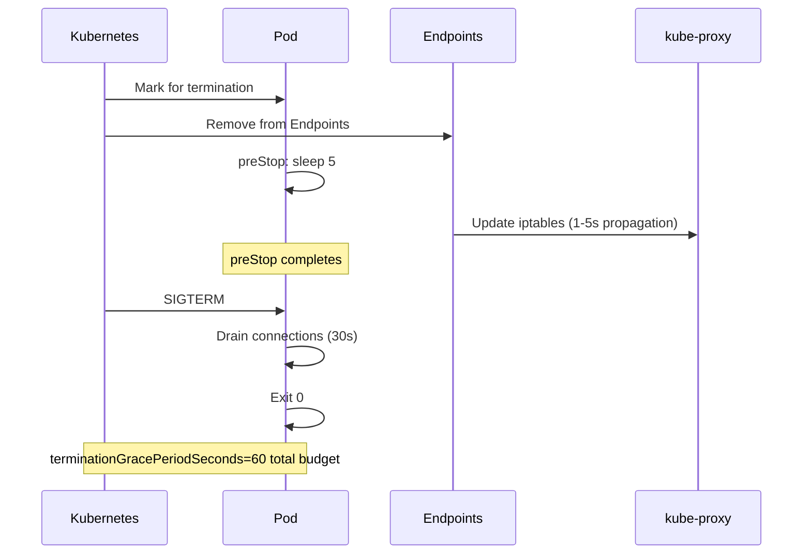

> 💡 **Quick Answer:** Set `terminationGracePeriodSeconds: 60`, add a `preStop` hook with `sleep 5` to allow endpoint removal propagation, and handle SIGTERM in your application to drain connections. This prevents 502 errors during rolling updates.

## The Problem

During rolling updates, users see 502/503 errors for 1-5 seconds. The pod receives traffic AFTER receiving SIGTERM because endpoint removal is asynchronous — the pod terminates before all kube-proxies/ingress controllers update their routing tables.

## The Solution

### The Shutdown Race Condition

```
1. Pod marked for termination
2. SIMULTANEOUSLY:
   a. kubelet sends SIGTERM to container
   b. Endpoint controller removes pod from Endpoints
3. Problem: kube-proxy/ingress may still route traffic for 1-5 seconds
   after SIGTERM — app already shutting down = 502 errors
```

### Solution: preStop Hook Delay

```yaml
apiVersion: apps/v1
kind: Deployment
metadata:
  name: web-server
spec:
  template:
    spec:
      terminationGracePeriodSeconds: 60
      containers:
        - name: web
          image: registry.example.com/web:1.0
          lifecycle:
            preStop:
              exec:
                command: ["sh", "-c", "sleep 5"]
          ports:
            - containerPort: 8080
              name: http
```

The `sleep 5` in preStop runs BEFORE SIGTERM is sent to the container, giving time for endpoint removal to propagate.

### Application-Side SIGTERM Handling

```python
import signal
import sys

# Flag to stop accepting new requests
shutting_down = False

def handle_sigterm(signum, frame):
    global shutting_down
    shutting_down = True
    # Stop accepting new connections
    server.stop_accepting()
    # Wait for in-flight requests (max 30s)
    server.drain(timeout=30)
    sys.exit(0)

signal.signal(signal.SIGTERM, handle_sigterm)
```

### Complete Timeline



## Common Issues

**502 errors during rolling update**

preStop hook missing or too short. Add `sleep 5` preStop to allow endpoint removal propagation.

**Pod killed with SIGKILL after grace period**

`terminationGracePeriodSeconds` is too short. The total budget must cover: preStop delay + connection drain + cleanup. Set to `preStop + drain + 10s buffer`.

## Best Practices

- **Always add `preStop: sleep 5`** for HTTP services — prevents 502 during rolling updates
- **`terminationGracePeriodSeconds`** = preStop + drain time + buffer (minimum 30s)
- **Handle SIGTERM in your application** — stop accepting new connections, drain in-flight
- **Never use SIGKILL for shutdown** — it's the last resort after grace period expires
- **Test with `kubectl rollout restart`** — watch for errors during rollout

## Key Takeaways

- The pod termination / endpoint removal race causes 502 errors during rolling updates
- `preStop: sleep 5` delays SIGTERM, giving time for routing tables to update
- `terminationGracePeriodSeconds` is the TOTAL budget for preStop + SIGTERM handling
- Applications must handle SIGTERM: stop accepting, drain connections, then exit
- This applies to every HTTP service — without it, every rolling update has a brief error window
