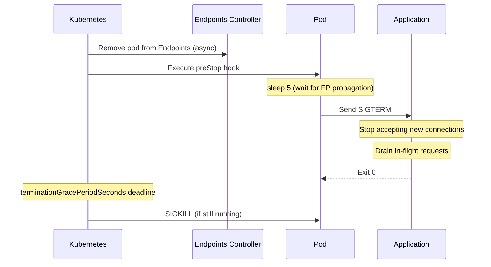

> 💡 **Quick Answer:** Use `preStop` hooks to delay SIGTERM until endpoints are removed, and set `terminationGracePeriodSeconds` to give your app time to drain connections and finish in-flight requests.

## The Problem

When Kubernetes terminates a pod, endpoint removal and SIGTERM happen in parallel. Without a preStop hook, pods receive traffic after they've started shutting down, causing connection resets and 5xx errors.

## The Solution

### PreStop Hook with Sleep

```yaml
apiVersion: apps/v1
kind: Deployment
metadata:
  name: web-api
spec:
  replicas: 3
  selector:
    matchLabels:
      app: web-api
  template:
    spec:
      terminationGracePeriodSeconds: 60
      containers:
        - name: api
          image: api-server:2.0
          ports:
            - containerPort: 8080
          lifecycle:
            preStop:
              exec:
                command: ["/bin/sh", "-c", "sleep 5"]
          readinessProbe:
            httpGet:
              path: /ready
              port: 8080
```

### HTTP PreStop Hook

```yaml
lifecycle:
  preStop:
    httpGet:
      path: /shutdown
      port: 8080
```

### NGINX Graceful Shutdown

```yaml
lifecycle:
  preStop:
    exec:
      command: ["/bin/sh", "-c", "nginx -s quit && sleep 10"]
```



## Common Issues

**Pod killed before preStop completes**
`terminationGracePeriodSeconds` includes preStop time. If preStop takes 10s and app needs 30s to drain, set grace period to 45s+:
```yaml
terminationGracePeriodSeconds: 45
```

**Connections still arriving during shutdown**
The 5-second preStop sleep covers endpoint propagation delay. Increase to 10s in large clusters or with external load balancers.

**App doesn't handle SIGTERM**
Many languages require explicit signal handling:
```python
import signal, sys
def shutdown(signum, frame):
    # drain connections, close DB pools
    sys.exit(0)
signal.signal(signal.SIGTERM, shutdown)
```

## Best Practices

- Always add a `preStop: sleep 5` for HTTP services (covers endpoint removal delay)
- Set `terminationGracePeriodSeconds` = preStop time + max request duration + buffer
- Ensure your app handles SIGTERM by draining connections (not abrupt exit)
- Stop accepting new connections on SIGTERM, finish existing ones
- Use readiness probe removal as an additional signal to load balancers
- Test shutdown behavior with `kubectl delete pod --grace-period=30`

## Key Takeaways

- SIGTERM and endpoint removal happen concurrently — preStop bridges the gap
- `preStop` runs before SIGTERM; the grace period timer starts immediately
- After grace period expires, SIGKILL forces termination (not catchable)
- HTTP services need 3-10s preStop sleep for endpoint propagation
- `terminationGracePeriodSeconds` default is 30 seconds
- PreStop hooks can be exec commands or HTTP requests
