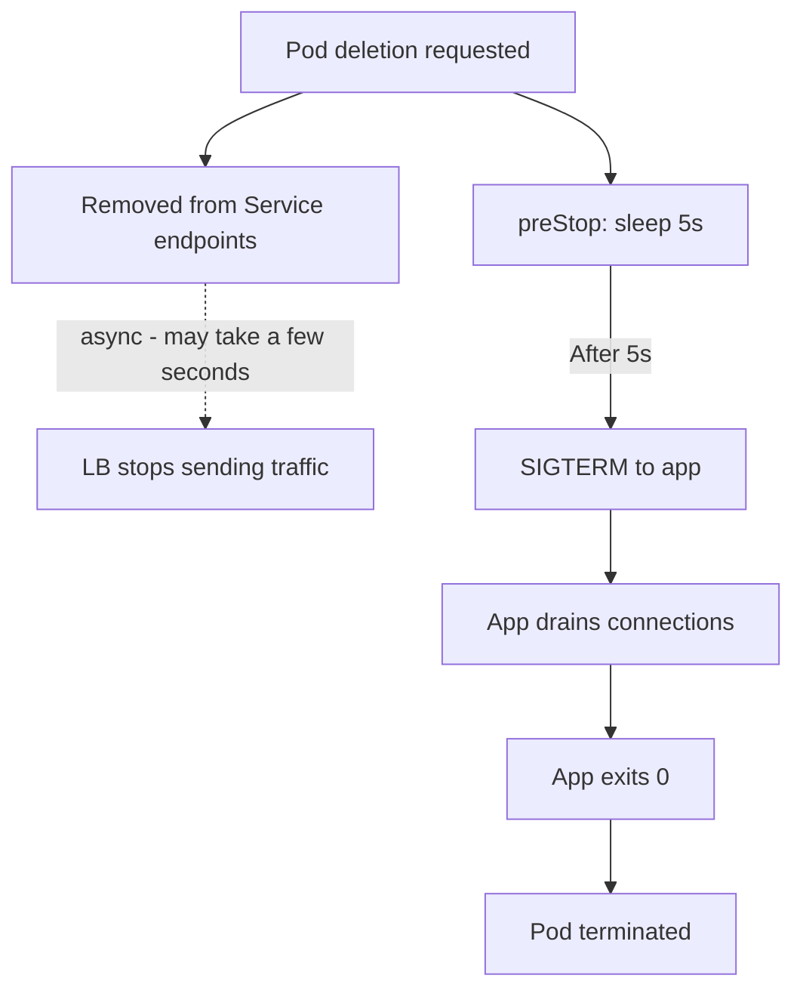

> 💡 **Quick Answer:** deployments

## The Problem

This is a fundamental Kubernetes topic that engineers search for frequently. A comprehensive reference with production-ready examples saves hours of trial and error.

## The Solution

### Shutdown Sequence

```
1. Pod marked for deletion
2. Pod removed from Service endpoints (no NEW traffic)
3. preStop hook runs (if defined)
4. SIGTERM sent to PID 1 in each container
5. Wait up to terminationGracePeriodSeconds (default: 30)
6. SIGKILL sent if still running
```

### Correct Configuration

```yaml
apiVersion: apps/v1
kind: Deployment
spec:
  template:
    spec:
      terminationGracePeriodSeconds: 60   # Give app time to drain
      containers:
        - name: app
          image: my-app:v1
          lifecycle:
            preStop:
              exec:
                # Wait for load balancer to update (race condition fix)
                command: ["sh", "-c", "sleep 5"]
          # Your app must handle SIGTERM!
```

### Handle SIGTERM in Your App

```python
# Python
import signal, sys

def shutdown(signum, frame):
    print("Received SIGTERM, draining connections...")
    server.stop(grace=10)  # Stop accepting new, finish existing
    sys.exit(0)

signal.signal(signal.SIGTERM, shutdown)
```

```javascript
// Node.js
process.on('SIGTERM', () => {
  console.log('SIGTERM received, shutting down gracefully');
  server.close(() => {
    console.log('Connections drained');
    process.exit(0);
  });
  // Force exit after timeout
  setTimeout(() => process.exit(1), 25000);
});
```

### The preStop Sleep Trick

```yaml
# Why sleep 5 in preStop?
# Race condition: Service endpoint removal is ASYNC
# Without sleep: SIGTERM → app stops → but LB still sending traffic → 502 errors
# With sleep: preStop sleep 5s → LB removes endpoint → SIGTERM → clean shutdown
lifecycle:
  preStop:
    exec:
      command: ["sh", "-c", "sleep 5"]
```



## Frequently Asked Questions

### Why do I get 502 errors during deployments?

The load balancer hasn't removed the pod's endpoint yet when the pod starts shutting down. Fix: add `preStop: sleep 5` to give the Service time to update endpoints before SIGTERM.

### What if my app ignores SIGTERM?

After `terminationGracePeriodSeconds` (default 30s), Kubernetes sends SIGKILL — which cannot be caught. Your app dies immediately. Always handle SIGTERM in your code.

## Best Practices

- Start with the simplest configuration that meets your needs
- Test changes in staging before production
- Use `kubectl describe` and events for troubleshooting
- Document your decisions for the team

## Key Takeaways

- This is essential Kubernetes knowledge for production operations
- Follow the principle of least privilege and minimal configuration
- Monitor and iterate based on real-world behavior
- Automation reduces human error and improves consistency
