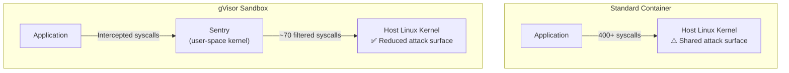

> 💡 **Quick Answer:** gVisor (`runsc`) provides a user-space kernel that intercepts system calls, isolating containers from the host kernel. Install `runsc` on nodes, configure containerd with a `runsc` handler, create a `RuntimeClass` named `gvisor`, then deploy pods with `runtimeClassName: gvisor`. Ideal for running untrusted code, multi-tenant workloads, or CI/CD build containers.

## The Problem

Standard containers share the host Linux kernel — a kernel exploit in any container compromises the entire node. Kubernetes NetworkPolicies and PodSecurity restrict network and API access, but don't protect against kernel vulnerabilities. gVisor interposes an application-level kernel (Sentry) between the container and the host, reducing the attack surface from ~400 syscalls to a hardened subset.



## The Solution

### Install gVisor on Nodes

```bash
# Install runsc binary (on each node)
curl -fsSL https://gvisor.dev/archive.key | sudo gpg --dearmor -o /usr/share/keyrings/gvisor-archive-keyring.gpg
echo "deb [arch=$(dpkg --print-architecture) signed-by=/usr/share/keyrings/gvisor-archive-keyring.gpg] https://storage.googleapis.com/gvisor/releases release main" | \
  sudo tee /etc/apt/sources.list.d/gvisor.list
sudo apt-get update && sudo apt-get install -y runsc

# Verify installation
runsc --version
```

### Configure containerd

```toml
# /etc/containerd/config.toml — add gvisor runtime handler
[plugins."io.containerd.grpc.v1.cri".containerd.runtimes.runsc]
  runtime_type = "io.containerd.runsc.v1"

[plugins."io.containerd.grpc.v1.cri".containerd.runtimes.runsc.options]
  TypeUrl = "io.containerd.runsc.v1.options"
```

```bash
# Restart containerd
sudo systemctl restart containerd

# Verify handler exists
sudo ctr plugins ls | grep runsc
```

### Create RuntimeClass

```yaml
apiVersion: node.k8s.io/v1
kind: RuntimeClass
metadata:
  name: gvisor
handler: runsc
overhead:
  podFixed:
    memory: "64Mi"                   # Sentry overhead
    cpu: "50m"
scheduling:
  nodeSelector:
    gvisor.io/enabled: "true"        # Only schedule on gVisor nodes
```

### Deploy Sandboxed Pods

```yaml
# Untrusted workload — runs in gVisor sandbox
apiVersion: v1
kind: Pod
metadata:
  name: untrusted-workload
  labels:
    sandbox: gvisor
spec:
  runtimeClassName: gvisor           # Use gVisor sandbox
  containers:
    - name: app
      image: nginx:1.27
      ports:
        - containerPort: 80
      resources:
        requests:
          memory: 128Mi
          cpu: 100m
---
# CI/CD build runner — sandboxed to prevent breakouts
apiVersion: batch/v1
kind: Job
metadata:
  name: ci-build
spec:
  template:
    spec:
      runtimeClassName: gvisor
      containers:
        - name: builder
          image: docker.io/library/golang:1.22
          command: ["go", "build", "-o", "/output/app", "."]
          volumeMounts:
            - name: source
              mountPath: /workspace
      restartPolicy: Never
      volumes:
        - name: source
          configMap:
            name: build-source
```

### Enforce gVisor for Specific Namespaces

```yaml
# Use admission webhook or policy engine to enforce RuntimeClass
# Example: Kyverno policy
apiVersion: kyverno.io/v1
kind: ClusterPolicy
metadata:
  name: require-gvisor-sandbox
spec:
  validationFailureAction: Enforce
  rules:
    - name: require-gvisor
      match:
        resources:
          kinds: ["Pod"]
          namespaces: ["untrusted", "ci-builds"]
      validate:
        message: "Pods in untrusted namespaces must use gVisor sandbox"
        pattern:
          spec:
            runtimeClassName: gvisor
```

### gVisor vs Other Runtimes

| Feature | runc (default) | gVisor (runsc) | Kata Containers |
|---------|---------------|----------------|-----------------|
| **Isolation** | Namespace/cgroup | User-space kernel | VM |
| **Overhead** | None | ~50m CPU, 64Mi RAM | ~128Mi RAM, 1-2s boot |
| **Syscall filtering** | seccomp only | Full interception | Full VM |
| **Performance** | Native | 5-20% overhead | 2-10% overhead |
| **GPU support** | ✅ | ⚠️ Limited | ✅ |
| **Network perf** | Native | ~90% native | ~95% native |
| **Best for** | Trusted workloads | Untrusted code, multi-tenant | Confidential computing |

### Verify Sandbox

```bash
# Check that pod is actually running in gVisor
kubectl exec -it untrusted-workload -- dmesg 2>&1 | head -3
# Output should show gVisor kernel, not host kernel:
# [    0.000000] Starting gVisor...
# [    0.000000] Daemonizing children...

# Check system calls are intercepted
kubectl exec -it untrusted-workload -- cat /proc/version
# Linux version 4.4.0 (gVisor)

# Verify on node
sudo runsc list
```

## Common Issues

| Issue | Cause | Fix |
|-------|-------|-----|
| `RuntimeClass not found` | runsc not installed on node | Install runsc + configure containerd |
| Pod stuck in `ContainerCreating` | containerd handler misconfigured | Check containerd config.toml + restart |
| App doesn't work in gVisor | Unsupported syscall | Check `runsc debug` logs; some apps need runc |
| Network performance drop | gVisor netstack | Use `--network=host` passthrough (reduces isolation) |
| Volume mount issues | gVisor filesystem overlay | Check gVisor compatibility with storage driver |

## Best Practices

- **Use gVisor for untrusted workloads** — CI/CD builds, user-submitted code, multi-tenant
- **Don't use gVisor for everything** — overhead is unnecessary for trusted internal services
- **Label gVisor nodes** — use `nodeSelector` to schedule only on capable nodes
- **Test application compatibility** — some apps use unsupported syscalls (raw sockets, io_uring)
- **Set resource overhead** — account for Sentry memory in RuntimeClass `overhead`
- **Monitor with `runsc debug`** — provides gVisor-specific diagnostics

## Key Takeaways

- gVisor interposes a user-space kernel between containers and the host
- Reduces host kernel attack surface from ~400 to ~70 syscalls
- Deploy via `RuntimeClass: gvisor` — no application changes needed
- 5-20% performance overhead — acceptable for security-sensitive workloads
- Ideal for multi-tenant platforms, CI/CD runners, and untrusted code execution
- Combine with NetworkPolicy and PodSecurity for defense-in-depth
