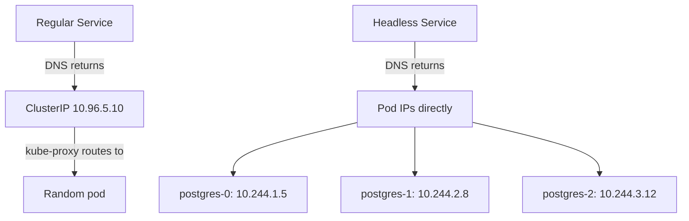

> 💡 **Quick Answer:** networking

## The Problem

This is a fundamental Kubernetes topic that engineers search for frequently. A comprehensive reference with production-ready examples saves hours of trial and error.

## The Solution

### Create a Headless Service

```yaml
apiVersion: v1
kind: Service
metadata:
  name: postgres
spec:
  clusterIP: None       # ← This makes it headless
  selector:
    app: postgres
  ports:
    - port: 5432
```

### DNS Behavior Difference

```bash
# Regular Service DNS → returns ClusterIP (virtual IP, load-balanced)
dig my-service.default.svc.cluster.local
# ANSWER: 10.96.5.10

# Headless Service DNS → returns ALL pod IPs (no load balancing)
dig postgres.default.svc.cluster.local
# ANSWER: 10.244.1.5, 10.244.2.8, 10.244.3.12

# With StatefulSet → individual pod DNS records
dig postgres-0.postgres.default.svc.cluster.local
# ANSWER: 10.244.1.5
dig postgres-1.postgres.default.svc.cluster.local
# ANSWER: 10.244.2.8
```

### When to Use Headless Services

| Use Case | Why Headless |
|----------|-------------|
| StatefulSet (databases) | Clients need to connect to specific pods |
| Client-side load balancing | App does its own routing (gRPC) |
| Peer discovery | Pods need to find each other (clustering) |
| DNS-based service discovery | External tools need pod IPs |

### Headless + StatefulSet (Required)

```yaml
apiVersion: apps/v1
kind: StatefulSet
metadata:
  name: postgres
spec:
  serviceName: postgres   # Must match headless Service name
  replicas: 3
```



## Frequently Asked Questions

### Can I have both headless and regular services for the same pods?

Yes! Common pattern: headless service for StatefulSet pod addressing + regular ClusterIP service for load-balanced client access.

## Best Practices

- Start with the simplest configuration that meets your needs
- Test changes in staging before production
- Use `kubectl describe` and events for troubleshooting
- Document your decisions for the team

## Key Takeaways

- This is essential Kubernetes knowledge for production operations
- Follow the principle of least privilege and minimal configuration
- Monitor and iterate based on real-world behavior
- Automation reduces human error and improves consistency
