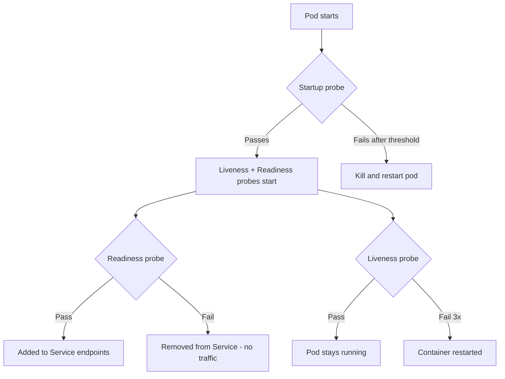

> 💡 **Quick Answer:** configuration

## The Problem

This is a fundamental Kubernetes topic that engineers search for frequently. A comprehensive reference with production-ready examples saves hours of trial and error.

## The Solution

### The Three Probes

```yaml
spec:
  containers:
    - name: app
      image: my-app:v1
      # Startup probe: wait for slow-starting apps
      startupProbe:
        httpGet:
          path: /healthz
          port: 8080
        failureThreshold: 30      # 30 × 10s = 5 min max startup
        periodSeconds: 10

      # Liveness probe: restart if dead
      livenessProbe:
        httpGet:
          path: /healthz
          port: 8080
        initialDelaySeconds: 0     # Startup probe handles the wait
        periodSeconds: 10
        failureThreshold: 3        # 3 failures = restart

      # Readiness probe: remove from Service if not ready
      readinessProbe:
        httpGet:
          path: /ready
          port: 8080
        periodSeconds: 5
        failureThreshold: 3
```

### Anti-Patterns to AVOID

| Anti-Pattern | Why It's Bad | Fix |
|-------------|-------------|-----|
| Liveness checks database | DB down → all pods restart → thundering herd | Only check app process health |
| Same endpoint for liveness + readiness | Can't distinguish "dead" from "temporarily busy" | Separate `/healthz` and `/ready` |
| Too aggressive liveness (1s period, 1 failure) | Normal GC pauses trigger restarts | 10s period, 3 failures |
| No startup probe for slow apps | Liveness kills pod before it starts | Add startupProbe |
| Readiness checks external deps | External service down → all pods unready → no traffic | Only check local readiness |

### Probe Types

```yaml
# HTTP GET (most common)
livenessProbe:
  httpGet:
    path: /healthz
    port: 8080
    httpHeaders:
      - name: Accept
        value: application/json

# TCP Socket (databases, Redis)
livenessProbe:
  tcpSocket:
    port: 5432

# Exec command
livenessProbe:
  exec:
    command: ["pg_isready", "-U", "postgres"]

# gRPC (K8s 1.27+)
livenessProbe:
  grpc:
    port: 50051
    service: health.v1.Health
```



## Frequently Asked Questions

### Do I need all three probes?

**Readiness** is almost always needed (controls traffic routing). **Liveness** is needed if your app can deadlock or hang. **Startup** is needed for slow-starting apps (Java, large model loading). Many apps only need readiness + liveness.

## Best Practices

- Start with the simplest configuration that meets your needs
- Test changes in staging before production
- Use `kubectl describe` and events for troubleshooting
- Document your decisions for the team

## Key Takeaways

- This is essential Kubernetes knowledge for production operations
- Follow the principle of least privilege and minimal configuration
- Monitor and iterate based on real-world behavior
- Automation reduces human error and improves consistency
