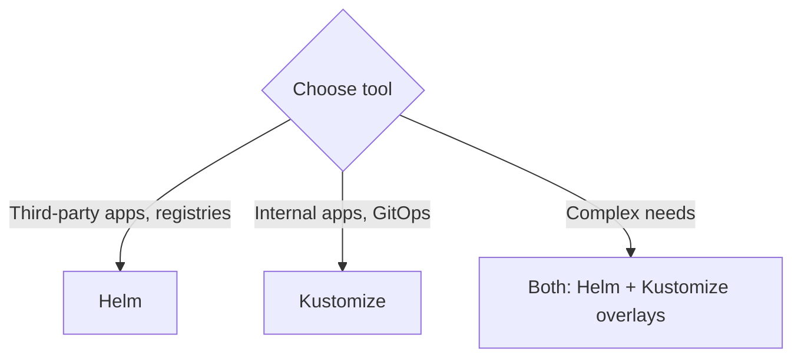

> 💡 **Quick Answer:** Compare Helm and Kustomize for Kubernetes configuration management. Covers templating vs overlays, use cases, pros and cons, and when to use both together.

## The Problem

This is one of the most searched Kubernetes topics. A comprehensive, well-structured guide helps engineers of all levels quickly find actionable solutions.

## The Solution

Detailed implementation with production-ready examples below.


### Helm: Template Engine + Package Manager

```bash
# Install a chart
helm install my-app bitnami/nginx --set replicaCount=3

# Values file
cat values.yaml
# replicaCount: 3
# image:
#   repository: nginx
#   tag: "1.25"
helm install my-app ./chart -f values.yaml

# Template preview
helm template my-app ./chart -f values.yaml
```

### Kustomize: Overlay-Based Patching

```bash
# Base
cat base/deployment.yaml    # Standard deployment
cat base/kustomization.yaml
# resources:
#   - deployment.yaml
#   - service.yaml

# Overlay (per environment)
cat overlays/production/kustomization.yaml
# resources:
#   - ../../base
# patches:
#   - path: replica-patch.yaml
# images:
#   - name: my-app
#     newTag: v2.0

# Apply
kubectl apply -k overlays/production/
```

### Comparison

| Feature | Helm | Kustomize |
|---------|------|-----------|
| Approach | Templating (Go templates) | Patching (overlays) |
| Learning curve | Steeper | Simpler |
| Package registry | ✅ (charts) | ❌ |
| Rollback | ✅ `helm rollback` | ❌ (use GitOps) |
| Dependencies | ✅ subcharts | ❌ |
| Built into kubectl | ❌ | ✅ `kubectl apply -k` |
| Best for | Third-party apps | Internal apps, GitOps |

### Use Both Together

```bash
# Render Helm chart, then patch with Kustomize
# kustomization.yaml
helmCharts:
  - name: nginx
    repo: https://charts.bitnami.com/bitnami
    version: 15.0.0
    valuesFile: values.yaml
patches:
  - path: add-labels.yaml
```



## Frequently Asked Questions

### Can I use both?

Yes! Common pattern: use Helm charts for third-party apps (Prometheus, nginx), Kustomize overlays for your own apps. ArgoCD and Flux support both natively.

## Common Issues

Check `kubectl describe` and `kubectl get events` first — most issues have clear error messages pointing to the root cause.

## Best Practices

- **Follow least privilege** — only grant the access that's needed
- **Test in staging** before applying to production
- **Monitor and alert** on key metrics
- **Document your runbooks** for the team

## Key Takeaways

- Essential knowledge for Kubernetes operations
- Start simple and evolve your approach
- Automation reduces human error
- Share knowledge with your team
