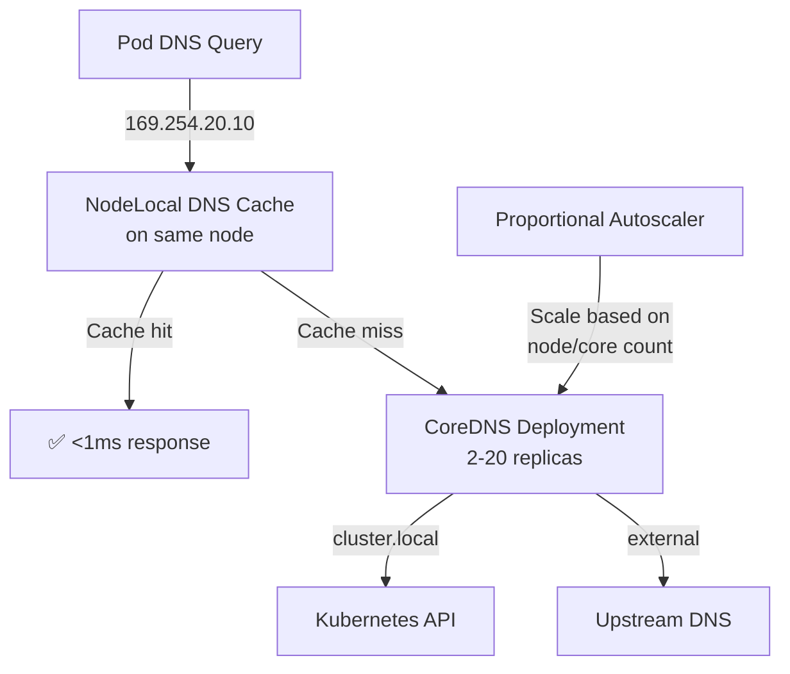

> 💡 **Quick Answer:** Deploy `cluster-proportional-autoscaler` to scale CoreDNS replicas with cluster size. For large clusters (500+ nodes), add NodeLocal DNS Cache — each node runs a local DNS cache that reduces CoreDNS load by 90%.

## The Problem

At scale (500+ nodes, 10K+ pods), CoreDNS becomes a bottleneck. Two default replicas can't handle the DNS query volume, causing 5-second resolution timeouts, failed service discovery, and cascading application failures.

## The Solution

### Proportional DNS Autoscaler

```yaml
apiVersion: apps/v1
kind: Deployment
metadata:
  name: dns-autoscaler
  namespace: kube-system
spec:
  replicas: 1
  template:
    spec:
      containers:
        - name: autoscaler
          image: registry.k8s.io/cpa/cluster-proportional-autoscaler:v1.8.9
          command:
            - /cluster-proportional-autoscaler
            - --namespace=kube-system
            - --configmap=dns-autoscaler
            - --target=deployment/coredns
            - --logtostderr=true
            - --v=2
---
apiVersion: v1
kind: ConfigMap
metadata:
  name: dns-autoscaler
  namespace: kube-system
data:
  linear: |
    {
      "coresPerReplica": 256,
      "nodesPerReplica": 16,
      "min": 2,
      "max": 20,
      "preventSinglePointFailure": true
    }
```

This scales CoreDNS: 1 replica per 16 nodes or 256 cores (whichever produces more replicas).

### NodeLocal DNS Cache

```yaml
apiVersion: apps/v1
kind: DaemonSet
metadata:
  name: node-local-dns
  namespace: kube-system
spec:
  template:
    spec:
      hostNetwork: true
      containers:
        - name: node-cache
          image: registry.k8s.io/dns/k8s-dns-node-cache:1.23.1
          args:
            - -localip
            - "169.254.20.10"
            - -conf
            - /etc/Corefile
            - -upstreamsvc
            - kube-dns
```

Pods resolve DNS via the local cache (169.254.20.10) instead of the cluster CoreDNS service. Cache hits never leave the node.



## Common Issues

**DNS 5-second timeouts at scale**

Usually conntrack table race condition (`SNAT` collision). NodeLocal DNS Cache eliminates this by using the node's loopback.

**CoreDNS OOMKilled**

Increase memory limits. Each CoreDNS pod caches data — larger clusters need more memory. Set `cache` plugin size appropriately.

## Best Practices

- **Proportional autoscaler as baseline** — 1 replica per 16 nodes
- **NodeLocal DNS Cache for 500+ node clusters** — eliminates conntrack race conditions
- **CoreDNS memory: 170Mi base + 70Mi per 1000 pods** — adjust limits accordingly
- **Monitor `coredns_dns_request_duration_seconds`** — alert on p99 > 100ms
- **Set `ndots: 2` in pod dnsConfig** — reduces unnecessary search domain lookups

## Key Takeaways

- Default 2 CoreDNS replicas is insufficient for clusters above ~100 nodes
- Proportional autoscaler scales CoreDNS based on cluster size automatically
- NodeLocal DNS Cache eliminates 90% of CoreDNS traffic and conntrack race conditions
- DNS is the #1 silent failure point at scale — monitor latency and error rates
- `ndots: 2` in pod DNS config reduces query amplification from 5x to 1-2x
