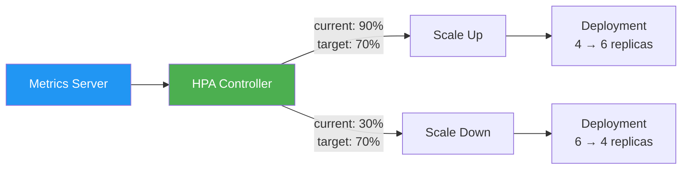

> 💡 **Quick Answer:** `kubectl autoscale deployment web --cpu-percent=70 --min=2 --max=10` creates an HPA that scales between 2-10 replicas targeting 70% CPU utilization. HPA v2 supports CPU, memory, custom metrics, and multiple metrics simultaneously. Add `behavior` to control scale-up/down speed and prevent flapping.

## The Problem

Static replica counts waste resources or cause outages:

- Over-provisioned at night, under-provisioned at peak
- Traffic spikes overwhelm fixed-replica deployments
- Manual scaling is reactive and slow
- Cost optimization requires matching capacity to demand

## The Solution

### Basic HPA (CPU)

```bash
# Imperative
kubectl autoscale deployment web-app \
  --cpu-percent=70 \
  --min=2 \
  --max=20
```

```yaml
apiVersion: autoscaling/v2
kind: HorizontalPodAutoscaler
metadata:
  name: web-app-hpa
spec:
  scaleTargetRef:
    apiVersion: apps/v1
    kind: Deployment
    name: web-app
  minReplicas: 2
  maxReplicas: 20
  metrics:
  - type: Resource
    resource:
      name: cpu
      target:
        type: Utilization
        averageUtilization: 70
```

### Multi-Metric HPA

```yaml
apiVersion: autoscaling/v2
kind: HorizontalPodAutoscaler
metadata:
  name: api-hpa
spec:
  scaleTargetRef:
    apiVersion: apps/v1
    kind: Deployment
    name: api-server
  minReplicas: 3
  maxReplicas: 50
  metrics:
  # CPU target
  - type: Resource
    resource:
      name: cpu
      target:
        type: Utilization
        averageUtilization: 70
  # Memory target
  - type: Resource
    resource:
      name: memory
      target:
        type: AverageValue
        averageValue: 512Mi
  # Custom metric (requests per second)
  - type: Pods
    pods:
      metric:
        name: http_requests_per_second
      target:
        type: AverageValue
        averageValue: "100"
```

### Scaling Behavior (Anti-Flapping)

```yaml
apiVersion: autoscaling/v2
kind: HorizontalPodAutoscaler
metadata:
  name: stable-hpa
spec:
  scaleTargetRef:
    apiVersion: apps/v1
    kind: Deployment
    name: web-app
  minReplicas: 2
  maxReplicas: 20
  metrics:
  - type: Resource
    resource:
      name: cpu
      target:
        type: Utilization
        averageUtilization: 70
  behavior:
    scaleUp:
      stabilizationWindowSeconds: 60    # Wait 60s before scaling up
      policies:
      - type: Percent
        value: 100                       # Double replicas at most
        periodSeconds: 60
      - type: Pods
        value: 4                         # Add max 4 pods per minute
        periodSeconds: 60
      selectPolicy: Max                  # Use whichever allows more
    scaleDown:
      stabilizationWindowSeconds: 300    # Wait 5 min before scaling down
      policies:
      - type: Percent
        value: 10                        # Remove max 10% per 60s
        periodSeconds: 60
      selectPolicy: Min                  # Use whichever allows fewer
```

### Monitor HPA

```bash
# Check HPA status
kubectl get hpa
# NAME          REFERENCE        TARGETS   MINPODS   MAXPODS   REPLICAS
# web-app-hpa   Deployment/web   45%/70%   2         20        4

# Detailed status
kubectl describe hpa web-app-hpa

# Watch scaling events
kubectl get hpa -w

# Check metrics availability
kubectl top pods -n production
```

### Prerequisites

```yaml
# Pods MUST have resource requests for CPU/memory HPA
containers:
- name: web
  resources:
    requests:
      cpu: 200m        # Required for CPU-based HPA
      memory: 256Mi    # Required for memory-based HPA
    limits:
      cpu: "1"
      memory: 1Gi
```



## Common Issues

**HPA shows `<unknown>/70%` for targets**

Metrics Server not installed or pods don't have resource requests. Install metrics-server and ensure all pods specify `requests.cpu`.

**HPA flapping (scaling up and down rapidly)**

Add `stabilizationWindowSeconds` in the `behavior` section. Default is 300s for scale-down but 0 for scale-up.

**HPA not scaling on memory**

Memory-based scaling is tricky — many apps don't release memory after load drops. Use CPU as primary, memory as secondary safety net.

## Best Practices

- **Always set `behavior` in production** — prevent flapping with stabilization windows
- **Scale on CPU primarily** — most predictable and responsive metric
- **Scale down slowly, up quickly** — aggressive down-scaling causes outages on traffic re-spikes
- **Set minReplicas ≥ 2** — single replica means zero availability during scaling
- **Use KEDA for event-driven scaling** — queue depth, Kafka lag, custom business metrics
- **Don't HPA + VPA on the same metric** — use VPA for memory, HPA for CPU

## Key Takeaways

- HPA v2 supports CPU, memory, custom metrics, and multiple metrics simultaneously
- Pods must have resource requests for HPA to work
- `behavior` section controls scale-up/down speed and prevents flapping
- Scale up fast (60s window), scale down slow (300s window) as a safe default
- Metrics Server is a prerequisite — install it before creating HPAs
- Combine with Cluster Autoscaler for node-level + pod-level scaling
