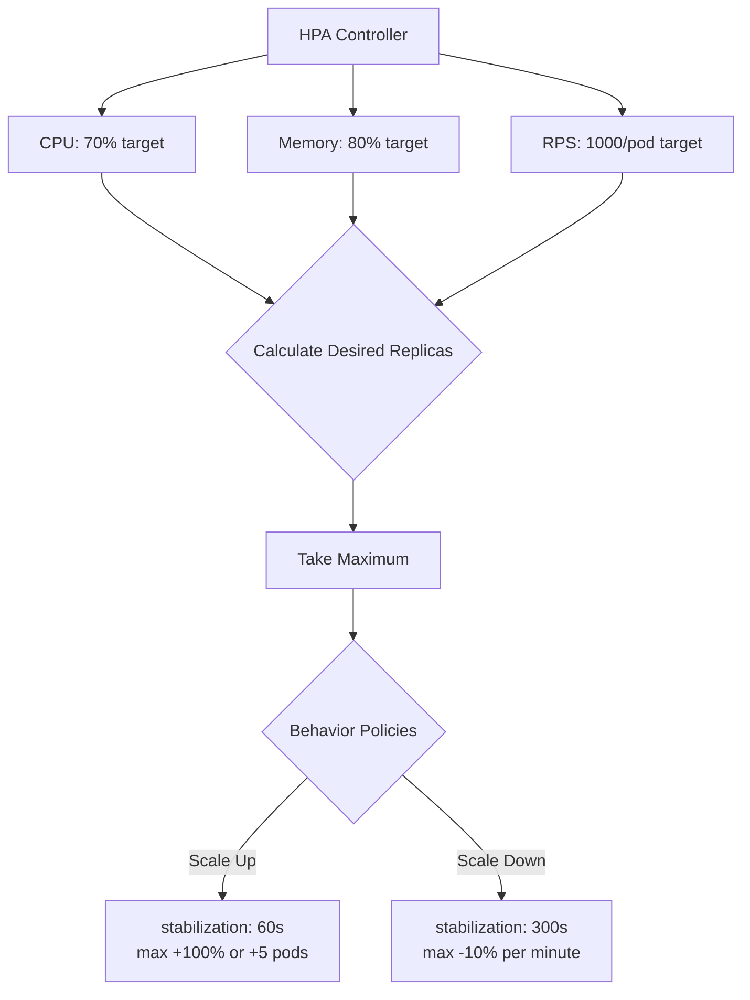

> 💡 **Quick Answer:** HPAv2 scales based on multiple metrics simultaneously (CPU + custom + external). Use `behavior` to control scale-up/down speed with stabilization windows and rate limiting.

## The Problem

HPAv1 only supports CPU percentage. Real workloads need scaling based on:
- Request latency (p99 > 200ms → scale up)
- Queue depth (messages pending > threshold)
- Multiple signals combined (CPU AND memory AND custom)
- Controlled scale-down to avoid flapping

## The Solution

### Multiple Metrics

```yaml
apiVersion: autoscaling/v2
kind: HorizontalPodAutoscaler
metadata:
  name: web-app
spec:
  scaleTargetRef:
    apiVersion: apps/v1
    kind: Deployment
    name: web-app
  minReplicas: 3
  maxReplicas: 50
  metrics:
    - type: Resource
      resource:
        name: cpu
        target:
          type: Utilization
          averageUtilization: 70
    - type: Resource
      resource:
        name: memory
        target:
          type: Utilization
          averageUtilization: 80
    - type: Pods
      pods:
        metric:
          name: http_requests_per_second
        target:
          type: AverageValue
          averageValue: "1000"
```

### Custom Metrics (Prometheus)

```yaml
metrics:
  - type: Pods
    pods:
      metric:
        name: request_latency_p99_ms
      target:
        type: AverageValue
        averageValue: "200"
  - type: Object
    object:
      metric:
        name: queue_depth
      describedObject:
        apiVersion: v1
        kind: Service
        name: rabbitmq
      target:
        type: Value
        value: "100"
```

### External Metrics

```yaml
metrics:
  - type: External
    external:
      metric:
        name: pubsub_subscription_num_undelivered_messages
        selector:
          matchLabels:
            subscription: orders
      target:
        type: AverageValue
        averageValue: "5"
```

### Behavior Control

```yaml
spec:
  behavior:
    scaleUp:
      stabilizationWindowSeconds: 60
      policies:
        - type: Percent
          value: 100
          periodSeconds: 60
        - type: Pods
          value: 5
          periodSeconds: 60
      selectPolicy: Max
    scaleDown:
      stabilizationWindowSeconds: 300
      policies:
        - type: Percent
          value: 10
          periodSeconds: 60
      selectPolicy: Min
```

### Container Resource Metrics (1.30+)

```yaml
metrics:
  - type: ContainerResource
    containerResource:
      name: cpu
      container: app
      target:
        type: Utilization
        averageUtilization: 70
```



## Common Issues

**HPA shows `<unknown>` for custom metrics**
Ensure metrics-server or Prometheus adapter is installed and serving metrics:
```bash
kubectl get --raw /apis/custom.metrics.k8s.io/v1beta1 | jq .
kubectl top pods
```

**Scaling too aggressively on spikes**
Add stabilization window:
```yaml
scaleUp:
  stabilizationWindowSeconds: 120  # Wait 2 min before acting
```

**Scale-down too fast after peak**
```yaml
scaleDown:
  stabilizationWindowSeconds: 600  # 10 minute cooldown
  policies:
    - type: Pods
      value: 1
      periodSeconds: 300  # Remove at most 1 pod per 5 min
```

**Multiple metrics conflict**
HPA takes the MAXIMUM recommended replica count across all metrics. If CPU says 5 and custom metric says 10, it scales to 10.

## Best Practices

- Use multiple metrics for robust scaling (don't rely on CPU alone)
- Set `stabilizationWindowSeconds` for scale-down (300-600s) to prevent flapping
- Use `Percent` policy for scale-up (handles both small and large deployments)
- Use `Pods` policy for scale-down (predictable, gradual reduction)
- Set `minReplicas` ≥ 2 for HA (never scale to 1 in production)
- Monitor HPA events: `kubectl describe hpa web-app`
- Use ContainerResource metrics to ignore sidecar CPU usage

## Key Takeaways

- HPAv2 supports Resource, Pods, Object, External, and ContainerResource metrics
- Multiple metrics: HPA picks the highest recommended replica count
- `behavior` controls scale-up and scale-down independently
- `stabilizationWindowSeconds` prevents rapid oscillation
- `selectPolicy: Max` picks the most aggressive policy; `Min` picks the most conservative
- External metrics enable scaling on cloud provider signals (SQS, Pub/Sub)
