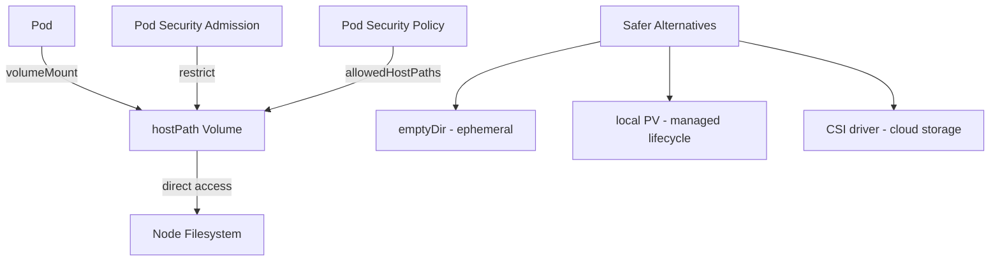

> 💡 **Quick Answer:** `hostPath` mounts a file or directory from the host node's filesystem into a pod. Use only for DaemonSets (log collectors, monitoring agents) — never for regular workloads. Prefer `local` PersistentVolumes or CSI drivers for production storage.

## The Problem

Some workloads need direct access to the node filesystem:
- Log collectors reading `/var/log/containers/`
- Monitoring agents accessing `/sys` or `/proc`
- GPU device plugins accessing `/dev/nvidia*`
- Container runtime socket (`/var/run/containerd/containerd.sock`)

But hostPath has serious risks: pod can access any file on the node, breaks portability, and bypasses storage lifecycle management.

## The Solution

### Basic hostPath Volume

```yaml
apiVersion: v1
kind: Pod
metadata:
  name: log-reader
spec:
  containers:
    - name: reader
      image: busybox
      command: ["tail", "-f", "/host-logs/syslog"]
      volumeMounts:
        - name: host-logs
          mountPath: /host-logs
          readOnly: true
  volumes:
    - name: host-logs
      hostPath:
        path: /var/log
        type: Directory
```

### hostPath Types

```yaml
volumes:
  - name: vol
    hostPath:
      path: /data/myapp
      type: DirectoryOrCreate  # Creates if missing (0755, same owner as kubelet)

# Available types:
# ""                 - No check (default, dangerous)
# DirectoryOrCreate  - Creates directory if not exists
# Directory          - Must already exist
# FileOrCreate       - Creates file if not exists
# File               - Must already exist
# Socket             - Unix socket must exist
# CharDevice         - Character device must exist
# BlockDevice        - Block device must exist
```

### DaemonSet Use Cases (Legitimate)

```yaml
# Fluentd/Vector log collector
apiVersion: apps/v1
kind: DaemonSet
metadata:
  name: log-collector
spec:
  selector:
    matchLabels:
      app: log-collector
  template:
    metadata:
      labels:
        app: log-collector
    spec:
      containers:
        - name: vector
          image: timberio/vector:0.42.0-alpine
          volumeMounts:
            - name: varlog
              mountPath: /var/log
              readOnly: true
            - name: containers
              mountPath: /var/lib/docker/containers
              readOnly: true
            - name: machine-id
              mountPath: /etc/machine-id
              readOnly: true
      volumes:
        - name: varlog
          hostPath:
            path: /var/log
            type: Directory
        - name: containers
          hostPath:
            path: /var/lib/docker/containers
            type: Directory
        - name: machine-id
          hostPath:
            path: /etc/machine-id
            type: File
```

```yaml
# Node exporter (Prometheus)
apiVersion: apps/v1
kind: DaemonSet
metadata:
  name: node-exporter
spec:
  template:
    spec:
      hostNetwork: true
      hostPID: true
      containers:
        - name: exporter
          image: prom/node-exporter:v1.8.2
          args:
            - --path.procfs=/host/proc
            - --path.sysfs=/host/sys
            - --path.rootfs=/host/root
          volumeMounts:
            - name: proc
              mountPath: /host/proc
              readOnly: true
            - name: sys
              mountPath: /host/sys
              readOnly: true
            - name: root
              mountPath: /host/root
              readOnly: true
              mountPropagation: HostToContainer
      volumes:
        - name: proc
          hostPath:
            path: /proc
            type: Directory
        - name: sys
          hostPath:
            path: /sys
            type: Directory
        - name: root
          hostPath:
            path: /
            type: Directory
```

### Safer Alternative: Local PersistentVolume

```yaml
# For workloads that need node-local SSD storage
apiVersion: v1
kind: PersistentVolume
metadata:
  name: local-ssd-pv
spec:
  capacity:
    storage: 100Gi
  accessModes:
    - ReadWriteOnce
  persistentVolumeReclaimPolicy: Delete
  storageClassName: local-ssd
  local:
    path: /mnt/ssd/data
  nodeAffinity:
    required:
      nodeSelectorTerms:
        - matchExpressions:
            - key: kubernetes.io/hostname
              operator: In
              values:
                - worker-01
```

### Architecture



## Common Issues

| Issue | Cause | Fix |
|-------|-------|-----|
| Permission denied | Container runs as non-root | Set `securityContext.runAsUser: 0` or fix host permissions |
| Pod scheduled on wrong node | hostPath data is node-local | Use `nodeSelector` or `nodeAffinity` |
| Data lost on pod reschedule | Pod moved to different node | Use PVC with network storage instead |
| Security policy blocks hostPath | PSA `restricted` profile | Use `baseline` or `privileged` for DaemonSets only |
| Disk fills up node | No quota on hostPath | Use `local` PV with capacity enforcement |

## Best Practices

1. **Always set `readOnly: true`** unless you specifically need write access
2. **Use specific `type`** — `Directory` or `File` validates path exists at schedule time
3. **Restrict with Pod Security Admission** — only allow hostPath for system DaemonSets
4. **Prefer `local` PersistentVolumes** — proper lifecycle, capacity tracking, scheduling
5. **Never use hostPath for application data** — breaks portability and HA

## Key Takeaways

- hostPath gives pods direct node filesystem access — powerful but dangerous
- Legitimate uses: log collectors, monitoring agents, device plugins (always as DaemonSets)
- Always use `readOnly: true` and specific `type` fields for safety
- For application storage, use `local` PVs (managed lifecycle) or network-attached CSI volumes
- Pod Security Admission `restricted` profile blocks hostPath — use `privileged` namespace for system DaemonSets
