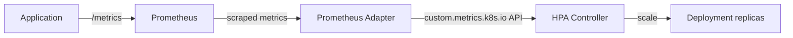

> 💡 **Quick Answer:** Install `prometheus-adapter`, configure metric rules that map Prometheus queries to the Kubernetes custom metrics API, then reference them in HPA with `type: Pods` or `type: External`. Scale on anything Prometheus can scrape: request rate, queue depth, latency, GPU usage.

## The Problem

CPU/memory-based HPA isn't enough when:
- Request latency is high but CPU is low (I/O-bound apps)
- Queue depth grows faster than CPU utilization reflects
- GPU utilization should drive scaling, not CPU
- Business metrics (orders/sec, active users) determine capacity

## The Solution

### Architecture



### Step 1: Install Prometheus Adapter

```bash
helm repo add prometheus-community https://prometheus-community.github.io/helm-charts
helm install prometheus-adapter prometheus-community/prometheus-adapter \
  --namespace monitoring \
  --set prometheus.url=http://prometheus-server.monitoring.svc \
  --set prometheus.port=9090
```

### Step 2: Configure Metric Rules

```yaml
# values.yaml for prometheus-adapter
rules:
  custom:
    # Map http_requests_total to per-pod rate
    - seriesQuery: 'http_requests_total{namespace!="",pod!=""}'
      resources:
        overrides:
          namespace: {resource: "namespace"}
          pod: {resource: "pod"}
      name:
        matches: "^(.*)_total$"
        as: "${1}_per_second"
      metricsQuery: 'sum(rate(<<.Series>>{<<.LabelMatchers>>}[2m])) by (<<.GroupBy>>)'

    # Request latency P99
    - seriesQuery: 'http_request_duration_seconds_bucket{namespace!="",pod!=""}'
      resources:
        overrides:
          namespace: {resource: "namespace"}
          pod: {resource: "pod"}
      name:
        matches: ".*"
        as: "http_request_duration_p99"
      metricsQuery: 'histogram_quantile(0.99, sum(rate(<<.Series>>{<<.LabelMatchers>>}[5m])) by (<<.GroupBy>>, le))'

    # Queue depth
    - seriesQuery: 'rabbitmq_queue_messages{namespace!=""}'
      resources:
        overrides:
          namespace: {resource: "namespace"}
      name:
        matches: "^(.*)$"
        as: "queue_messages_total"
      metricsQuery: 'sum(<<.Series>>{<<.LabelMatchers>>}) by (<<.GroupBy>>)'

  external:
    # External metrics (not per-pod)
    - seriesQuery: 'sqs_queue_depth{queue_name!=""}'
      name:
        matches: "^(.*)$"
        as: "sqs_queue_depth"
      metricsQuery: '<<.Series>>{<<.LabelMatchers>>}'
```

### Step 3: Verify Custom Metrics API

```bash
# Check if custom metrics are available
kubectl get --raw /apis/custom.metrics.k8s.io/v1beta1 | jq '.resources[].name'
# "pods/http_requests_per_second"
# "pods/http_request_duration_p99"
# "namespaces/queue_messages_total"

# Query a specific metric
kubectl get --raw "/apis/custom.metrics.k8s.io/v1beta1/namespaces/default/pods/*/http_requests_per_second" | jq .
```

### Step 4: Create HPA with Custom Metrics

```yaml
# Scale on requests per second per pod
apiVersion: autoscaling/v2
kind: HorizontalPodAutoscaler
metadata:
  name: myapp-hpa
spec:
  scaleTargetRef:
    apiVersion: apps/v1
    kind: Deployment
    name: myapp
  minReplicas: 2
  maxReplicas: 20
  metrics:
    # Custom metric: target 100 req/s per pod
    - type: Pods
      pods:
        metric:
          name: http_requests_per_second
        target:
          type: AverageValue
          averageValue: "100"

    # Keep CPU as fallback
    - type: Resource
      resource:
        name: cpu
        target:
          type: Utilization
          averageUtilization: 70

  behavior:
    scaleUp:
      stabilizationWindowSeconds: 30
      policies:
        - type: Percent
          value: 50
          periodSeconds: 60
    scaleDown:
      stabilizationWindowSeconds: 300
      policies:
        - type: Percent
          value: 10
          periodSeconds: 60
---
# Scale on external metric (SQS queue depth)
apiVersion: autoscaling/v2
kind: HorizontalPodAutoscaler
metadata:
  name: worker-hpa
spec:
  scaleTargetRef:
    apiVersion: apps/v1
    kind: Deployment
    name: queue-worker
  minReplicas: 1
  maxReplicas: 50
  metrics:
    - type: External
      external:
        metric:
          name: sqs_queue_depth
          selector:
            matchLabels:
              queue_name: processing-queue
        target:
          type: AverageValue
          averageValue: "5"  # 5 messages per pod
```

### Scale on Latency (P99)

```yaml
apiVersion: autoscaling/v2
kind: HorizontalPodAutoscaler
metadata:
  name: latency-hpa
spec:
  scaleTargetRef:
    apiVersion: apps/v1
    kind: Deployment
    name: api-server
  minReplicas: 3
  maxReplicas: 30
  metrics:
    - type: Pods
      pods:
        metric:
          name: http_request_duration_p99
        target:
          type: AverageValue
          averageValue: "500m"  # Target P99 < 500ms (0.5 seconds)
```

### Debugging HPA

```bash
# Check HPA status
kubectl get hpa myapp-hpa
# NAME        REFERENCE       TARGETS              MINPODS   MAXPODS   REPLICAS
# myapp-hpa   Deployment/myapp   85/100 (avg), 60%/70%   2        20        4

# Detailed events
kubectl describe hpa myapp-hpa
# Events:
#   Normal  SuccessfulRescale  ScaledUp 2 -> 4 (metric http_requests_per_second above target)

# Check if metrics are being fetched
kubectl get --raw "/apis/custom.metrics.k8s.io/v1beta1/namespaces/default/pods/*/http_requests_per_second"
```

## Common Issues

| Issue | Cause | Fix |
|-------|-------|-----|
| "unable to fetch metrics" | Prometheus adapter misconfigured | Check `seriesQuery` matches actual metric name |
| Metric shows `<unknown>` | No data for that metric/label | Verify metric exists in Prometheus UI |
| HPA not scaling | Metric below target | Check `kubectl describe hpa` for current values |
| Flapping replicas | Metric too volatile | Increase `stabilizationWindowSeconds` |
| "no matches for kind CustomMetrics" | Adapter not installed | Install prometheus-adapter |
| Wrong values | rate() window too short | Use 2-5m rate windows for stability |

## Best Practices

1. **Use `rate()` over 2-5 minutes** — too short causes noise, too long causes lag
2. **Set `stabilizationWindowSeconds`** — 300s for scale-down prevents flapping
3. **Combine custom + resource metrics** — custom for precision, CPU as safety net
4. **Use `AverageValue` for per-pod metrics** — easier to reason about targets
5. **Test with `kubectl get --raw`** — verify metrics before creating HPA

## Key Takeaways

- Prometheus Adapter bridges Prometheus metrics → Kubernetes custom metrics API
- `type: Pods` for per-pod metrics (req/s, latency); `type: External` for shared metrics (queue depth)
- Configure `metricsQuery` with PromQL — supports rate(), histogram_quantile(), sum()
- Behavior policies control scale-up/down speed — prevent oscillation
- Always verify metrics are available via `/apis/custom.metrics.k8s.io/v1beta1` before creating HPA
