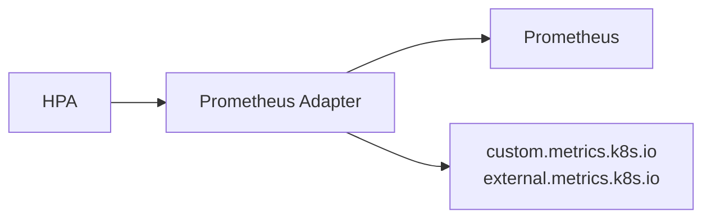

> 💡 **Quick Answer:** Install **Prometheus Adapter** to expose custom metrics to HPA. Configure adapter rules to convert Prometheus metrics into the Kubernetes custom metrics API. Reference in HPA with `type: Pods` or `type: External` and `metric.name` matching your adapter config.
>
> **Key command:** `kubectl get --raw /apis/custom.metrics.k8s.io/v1beta1` to verify the adapter is working.
>
> **Gotcha:** Metric names in HPA must exactly match adapter `seriesQuery` output; use `kubectl get --raw` to debug available metrics.

## The Problem

CPU and memory utilization don't capture what actually matters for many workloads — queue depth, request latency, or business KPIs. Scaling on those requires bridging Prometheus metrics into the Kubernetes metrics API.

## The Solution

### Architecture Overview



### Install Prometheus Adapter

```bash
helm repo add prometheus-community https://prometheus-community.github.io/helm-charts
helm install prometheus-adapter prometheus-community/prometheus-adapter \
  --namespace monitoring \
  --set prometheus.url=http://prometheus.monitoring.svc \
  --set prometheus.port=9090
```

### Configure Custom Metrics Rules

```yaml
apiVersion: v1
kind: ConfigMap
metadata:
  name: prometheus-adapter
  namespace: monitoring
data:
  config.yaml: |
    rules:
      # HTTP requests per second
      - seriesQuery: 'http_requests_total{namespace!="",pod!=""}'
        resources:
          overrides:
            namespace: {resource: "namespace"}
            pod: {resource: "pod"}
        name:
          matches: "^(.*)_total$"
          as: "${1}_per_second"
        metricsQuery: 'sum(rate(<<.Series>>{<<.LabelMatchers>>}[2m])) by (<<.GroupBy>>)'

      # Request latency (p99)
      - seriesQuery: 'http_request_duration_seconds_bucket{namespace!="",pod!=""}'
        resources:
          overrides:
            namespace: {resource: "namespace"}
            pod: {resource: "pod"}
        name:
          matches: "^(.*)_bucket$"
          as: "${1}_p99"
        metricsQuery: 'histogram_quantile(0.99, sum(rate(<<.Series>>{<<.LabelMatchers>>}[2m])) by (le, <<.GroupBy>>))'

      # Queue depth
      - seriesQuery: 'rabbitmq_queue_messages{namespace!=""}'
        resources:
          overrides:
            namespace: {resource: "namespace"}
        name:
          matches: "^(.*)$"
          as: "queue_messages"
        metricsQuery: 'sum(<<.Series>>{<<.LabelMatchers>>}) by (<<.GroupBy>>)'

      # Active connections
      - seriesQuery: 'app_active_connections{namespace!="",pod!=""}'
        resources:
          overrides:
            namespace: {resource: "namespace"}
            pod: {resource: "pod"}
        name:
          matches: "^(.*)$"
          as: "active_connections"
        metricsQuery: 'sum(<<.Series>>{<<.LabelMatchers>>}) by (<<.GroupBy>>)'
```

### Verify Custom Metrics Available

```bash
kubectl get --raw "/apis/custom.metrics.k8s.io/v1beta1" | jq .
kubectl get --raw "/apis/custom.metrics.k8s.io/v1beta1/namespaces/default/pods/*/http_requests_per_second" | jq .
kubectl get --raw "/apis/external.metrics.k8s.io/v1beta1" | jq .
```

### HPA with Custom Metrics

```yaml
apiVersion: autoscaling/v2
kind: HorizontalPodAutoscaler
metadata:
  name: api-hpa
  namespace: default
spec:
  scaleTargetRef:
    apiVersion: apps/v1
    kind: Deployment
    name: api-server
  minReplicas: 2
  maxReplicas: 20
  metrics:
    # Scale on requests per second per pod
    - type: Pods
      pods:
        metric:
          name: http_requests_per_second
        target:
          type: AverageValue
          averageValue: 1000  # 1000 req/s per pod

    # Scale on latency
    - type: Pods
      pods:
        metric:
          name: http_request_duration_p99
        target:
          type: AverageValue
          averageValue: 500m  # 500ms p99 latency target
  behavior:
    scaleDown:
      stabilizationWindowSeconds: 300
      policies:
        - type: Percent
          value: 10
          periodSeconds: 60
    scaleUp:
      stabilizationWindowSeconds: 0
      policies:
        - type: Percent
          value: 100
          periodSeconds: 15
        - type: Pods
          value: 4
          periodSeconds: 15
      selectPolicy: Max
```

### HPA with External Metrics

```yaml
apiVersion: autoscaling/v2
kind: HorizontalPodAutoscaler
metadata:
  name: queue-worker-hpa
spec:
  scaleTargetRef:
    apiVersion: apps/v1
    kind: Deployment
    name: queue-worker
  minReplicas: 1
  maxReplicas: 50
  metrics:
    # Scale based on queue depth (external metric)
    - type: External
      external:
        metric:
          name: rabbitmq_queue_messages
          selector:
            matchLabels:
              queue: tasks
        target:
          type: AverageValue
          averageValue: 10  # 10 messages per pod
```

### Application Exposing Custom Metrics

```yaml
apiVersion: apps/v1
kind: Deployment
metadata:
  name: api-server
  annotations:
    prometheus.io/scrape: "true"
    prometheus.io/port: "9090"
    prometheus.io/path: "/metrics"
spec:
  template:
    spec:
      containers:
        - name: api
          image: api-server:v1
          ports:
            - containerPort: 8080
              name: http
            - containerPort: 9090
              name: metrics
```

Sample metrics endpoint output:

```prometheus
# HELP http_requests_total Total HTTP requests
# TYPE http_requests_total counter
http_requests_total{method="GET",path="/api/users",status="200"} 15234
http_requests_total{method="POST",path="/api/orders",status="201"} 3421

# HELP http_request_duration_seconds HTTP request latency
# TYPE http_request_duration_seconds histogram
http_request_duration_seconds_bucket{le="0.1"} 14532
http_request_duration_seconds_bucket{le="0.5"} 15100
http_request_duration_seconds_bucket{le="1.0"} 15200
http_request_duration_seconds_bucket{le="+Inf"} 15234

# HELP app_active_connections Current active connections
# TYPE app_active_connections gauge
app_active_connections 42
```

### Multiple Metrics Combined

```yaml
apiVersion: autoscaling/v2
kind: HorizontalPodAutoscaler
metadata:
  name: web-app-hpa
spec:
  scaleTargetRef:
    apiVersion: apps/v1
    kind: Deployment
    name: web-app
  minReplicas: 3
  maxReplicas: 100
  metrics:
    # CPU as baseline
    - type: Resource
      resource:
        name: cpu
        target:
          type: Utilization
          averageUtilization: 70

    # Custom requests metric
    - type: Pods
      pods:
        metric:
          name: http_requests_per_second
        target:
          type: AverageValue
          averageValue: 500

    # Memory as safety
    - type: Resource
      resource:
        name: memory
        target:
          type: Utilization
          averageUtilization: 80
```

### Object Metrics (Ingress-based)

```yaml
apiVersion: autoscaling/v2
kind: HorizontalPodAutoscaler
metadata:
  name: ingress-based-hpa
spec:
  scaleTargetRef:
    apiVersion: apps/v1
    kind: Deployment
    name: web-app
  minReplicas: 2
  maxReplicas: 50
  metrics:
    - type: Object
      object:
        metric:
          name: requests_per_second
        describedObject:
          apiVersion: networking.k8s.io/v1
          kind: Ingress
          name: web-ingress
        target:
          type: Value
          value: 10000  # Total 10k req/s across all pods
```

### Custom Metric ServiceMonitor

```yaml
apiVersion: monitoring.coreos.com/v1
kind: ServiceMonitor
metadata:
  name: api-server
  namespace: monitoring
spec:
  selector:
    matchLabels:
      app: api-server
  namespaceSelector:
    matchNames:
      - default
  endpoints:
    - port: metrics
      interval: 15s
      path: /metrics
```

## Debug HPA Scaling

```bash
# Check HPA status
kubectl describe hpa api-hpa

# View HPA events
kubectl get events --field-selector involvedObject.name=api-hpa

# Check current metric values
kubectl get hpa api-hpa -o yaml | grep -A 20 "status:"

# Verify adapter is serving metrics
kubectl logs -n monitoring -l app=prometheus-adapter
```

## Common Issues

**Metric not found / HPA shows `<unknown>`**

The metric name in the HPA spec must exactly match the adapter's `as:` output, not the raw Prometheus metric name. Run `kubectl get --raw /apis/custom.metrics.k8s.io/v1beta1` to see what's actually registered.

**Adapter registered but values never update**

Check `metricsQuery` — a missing `<<.LabelMatchers>>` or wrong `by (<<.GroupBy>>)` clause silently returns empty results instead of erroring.

## Best Practices

- **Start with `type: Pods` for per-pod metrics**, `type: External` for cluster-wide signals like queue depth
- **Verify with `kubectl get --raw` before wiring into HPA** — debugging inside the HPA controller loop is much harder
- **Combine custom metrics with CPU/memory as a safety net** — a stalled custom metric shouldn't leave a service unable to scale at all
- **Tune `behavior.scaleDown.stabilizationWindowSeconds`** — custom metrics like queue depth can be spiky; avoid flapping
- **One ServiceMonitor per app** — keeps Prometheus scrape config declarative and discoverable

## Key Takeaways

- Prometheus Adapter bridges Prometheus metrics into `custom.metrics.k8s.io` / `external.metrics.k8s.io`
- HPA `type: Pods` averages a metric per pod; `type: External` and `type: Object` scale on cluster- or resource-wide values
- Metric names must match the adapter's `as:` field exactly — this is the #1 cause of `<unknown>` HPA targets
- `behavior` blocks control scale-up/down aggressiveness independently — critical for spiky custom metrics
- Always keep a CPU/memory metric alongside custom metrics as a fallback

---

## 📘 Go Further with Kubernetes Recipes

**Love this recipe? There's so much more!** This is just one of **100+ hands-on recipes** in our comprehensive **[Kubernetes Recipes book](https://amzn.to/3DzC8QA)**.

Inside the book, you'll master:
- ✅ Production-ready deployment strategies
- ✅ Advanced networking and security patterns  
- ✅ Observability, monitoring, and troubleshooting
- ✅ Real-world best practices from industry experts

> *"The practical, recipe-based approach made complex Kubernetes concepts finally click for me."*

**👉 [Get Your Copy Now](https://amzn.to/3DzC8QA)** — Start building production-grade Kubernetes skills today!
