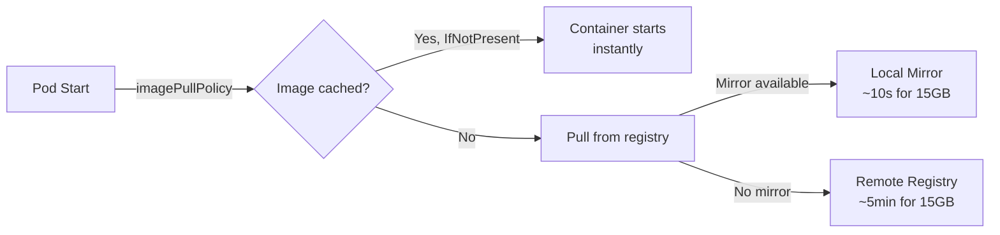

> 💡 **Quick Answer:** Use a pull-through registry mirror (Harbor, Zot) to cache images locally. Pre-pull large images (GPU/AI containers) with a DaemonSet. Set `imagePullPolicy: IfNotPresent` and use immutable tags to avoid unnecessary pulls.

## The Problem

Large container images (NVIDIA GPU: 15GB, ML frameworks: 8GB) take minutes to pull, causing slow pod startup, autoscaler lag, and cold-start latency spikes. In air-gapped environments, external registries are unreachable entirely.

## The Solution

### Pre-Pull DaemonSet

```yaml
apiVersion: apps/v1
kind: DaemonSet
metadata:
  name: image-prepuller
  namespace: kube-system
spec:
  template:
    spec:
      initContainers:
        - name: prepull-gpu-image
          image: registry.example.com/nvidia/cuda:12.6-runtime
          command: ["sh", "-c", "echo Image pulled successfully"]
        - name: prepull-inference
          image: registry.example.com/nim/nim-llm:2.0.2
          command: ["sh", "-c", "echo Image pulled successfully"]
      containers:
        - name: pause
          image: registry.k8s.io/pause:3.9
      tolerations:
        - operator: Exists
      nodeSelector:
        nvidia.com/gpu.present: "true"
```

### Pull-Through Registry Mirror

```yaml
# containerd config (/etc/containerd/config.toml)
[plugins."io.containerd.grpc.v1.cri".registry.mirrors]
  [plugins."io.containerd.grpc.v1.cri".registry.mirrors."docker.io"]
    endpoint = ["https://mirror.example.com"]
  [plugins."io.containerd.grpc.v1.cri".registry.mirrors."nvcr.io"]
    endpoint = ["https://mirror.example.com"]
```

### Image Pull Policies

| Policy | Behavior | Use When |
|--------|----------|----------|
| `IfNotPresent` | Pull only if not cached | Immutable tags (`:v1.2.3`) |
| `Always` | Check registry every time | `:latest` (avoid in production) |
| `Never` | Only use cached images | Air-gapped, pre-pulled images |



## Common Issues

**ImagePullBackOff on large images**

Kubelet timeout. Increase `--image-pull-progress-deadline` (default 1m, set to 10m for large images). Or pre-pull with DaemonSet.

**Registry mirror not being used**

containerd config requires restart: `systemctl restart containerd`. Verify with `crictl pull` and check mirror logs.

## Best Practices

- **Pre-pull GPU/AI images** with DaemonSet — 15GB images should be cached before needed
- **`imagePullPolicy: IfNotPresent`** with immutable tags — never use `:latest` in production
- **Pull-through mirror** for frequently used images — reduces external bandwidth
- **Multi-stage builds** to minimize image size — smaller images = faster pulls
- **`imagePullSecrets` per namespace** — don't share registry credentials cluster-wide

## Key Takeaways

- Large images (GPU, ML) need pre-pulling — cold pulls take 3-10 minutes
- Pull-through mirrors cache images locally — subsequent pulls are 10-100x faster
- `IfNotPresent` with immutable tags is the production standard
- DaemonSet pre-puller ensures images are cached on all target nodes
- Air-gapped clusters use `Never` policy with images pre-loaded via `ctr import`
