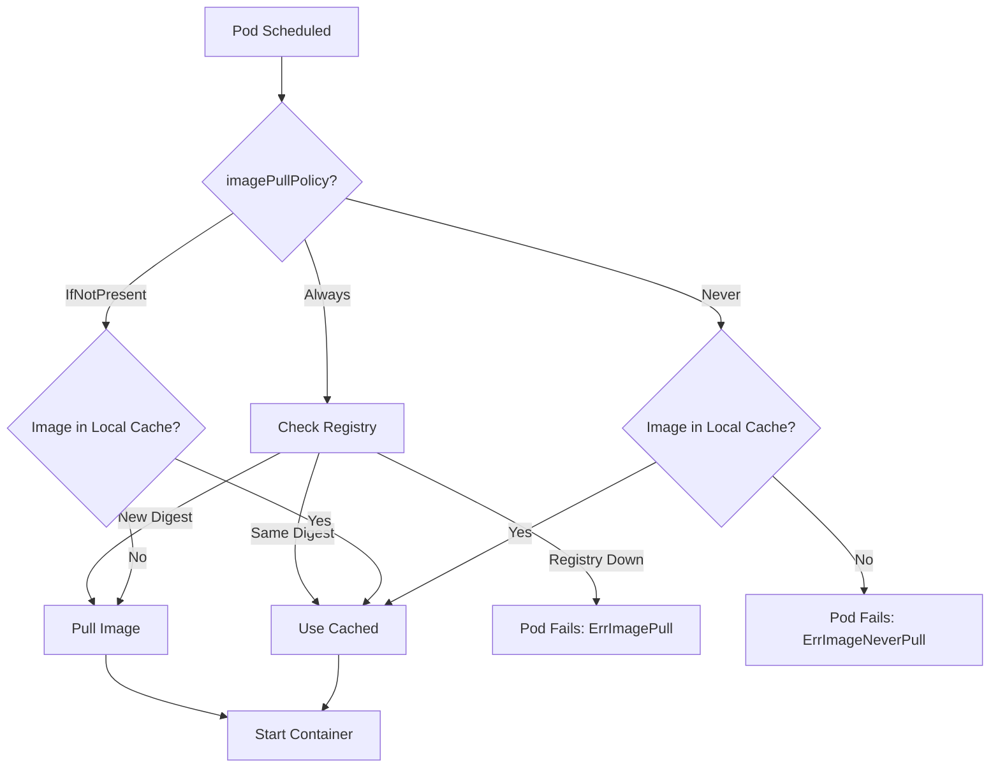

> 💡 **Quick Answer:** `IfNotPresent` uses cached images (default for tagged images); `Always` checks the registry every time (default for `:latest`); `Never` only uses pre-pulled local images.

## The Problem

Misunderstanding `imagePullPolicy` leads to:
- Running stale images after tag updates (`IfNotPresent` with mutable tags)
- Unnecessary registry pulls increasing startup time and bandwidth
- Failed pods on nodes without pre-cached images (`Never` policy)
- Outages when registries are unreachable (`Always` policy)

## The Solution

### Explicit Policy Configuration

```yaml
apiVersion: apps/v1
kind: Deployment
metadata:
  name: web-app
spec:
  replicas: 3
  selector:
    matchLabels:
      app: web-app
  template:
    spec:
      containers:
        - name: app
          image: myregistry.io/app:v2.1.0
          imagePullPolicy: IfNotPresent
```

### Default Behavior Rules

```yaml
# Tag specified → defaults to IfNotPresent
image: nginx:1.25.3        # → IfNotPresent

# :latest tag → defaults to Always
image: nginx:latest        # → Always
image: nginx               # → Always (implicit :latest)

# Digest → defaults to IfNotPresent
image: nginx@sha256:abc... # → IfNotPresent
```

### Production: Digest Pinning

```yaml
containers:
  - name: app
    image: myregistry.io/app@sha256:a1b2c3d4e5f6...
    imagePullPolicy: IfNotPresent  # Safe — digest is immutable
```

### Air-Gapped: Never Policy

```yaml
containers:
  - name: app
    image: internal-app:v1.0
    imagePullPolicy: Never  # Only use pre-loaded images
```

Pre-load images on nodes:
```bash
# On each node (or via DaemonSet init)
crictl pull myregistry.io/app:v1.0
```



## Common Issues

**Stale images with mutable tags**
Using `imagePullPolicy: IfNotPresent` with tags like `v2-latest` means nodes with cached old images won't pull updates:
```bash
# Force re-pull by changing the tag
image: myapp:v2.1.1  # Instead of overwriting v2.1.0
```

**ErrImageNeverPull**
Pod uses `Never` policy but image isn't cached on the scheduled node:
```bash
kubectl describe pod app | grep -A5 Events
# Pre-pull or switch to IfNotPresent
```

**Always policy causing slow rollouts**
Every new pod pulls from registry. Use `IfNotPresent` with immutable tags (semver or digest).

## Best Practices

- Use immutable tags (semver like `v1.2.3`) with `IfNotPresent`
- Never use `:latest` in production — it defaults to `Always` and is mutable
- Pin by digest (`@sha256:...`) for maximum reproducibility
- Use `Always` only when you intentionally overwrite tags (dev/staging)
- Use `Never` for air-gapped environments with pre-loaded images
- Configure `imagePullSecrets` for private registries

## Key Takeaways

- `IfNotPresent` is fastest — pulls only on cache miss
- `Always` verifies the digest with the registry (doesn't always re-download)
- `Never` fails if the image isn't already on the node
- `:latest` triggers `Always` by default — avoid in production
- Immutable tags + `IfNotPresent` is the production best practice
- Digests are the only truly immutable image references
