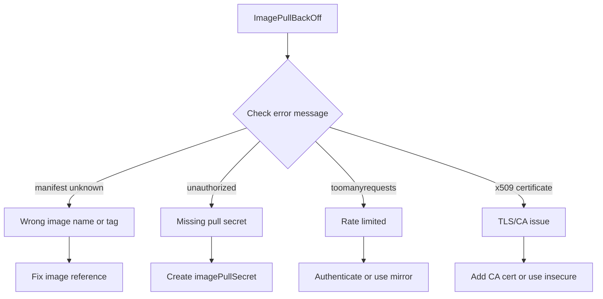

> 💡 **Quick Answer:** Debug and fix ImagePullBackOff errors in Kubernetes. Covers wrong image names, private registry auth, rate limits, and network connectivity issues.

## The Problem

This is one of the most searched Kubernetes topics. A comprehensive, well-structured guide helps engineers of all levels quickly find actionable solutions.

## The Solution

Detailed implementation with production-ready examples below.


### Diagnose the Error

```bash
# Check pod events
kubectl describe pod <name> | grep -A10 Events
# Look for: Failed to pull image, ErrImagePull, ImagePullBackOff

# Common error messages:
# "manifest unknown" — wrong image name or tag
# "unauthorized" — missing or wrong pull secret
# "toomanyrequests" — Docker Hub rate limit
# "x509: certificate" — private registry TLS issue
```

### Fix: Wrong Image Name/Tag

```bash
# Verify the image exists
docker pull nginx:1.25    # Does this work locally?
crane manifest nginx:1.25  # Check without pulling

# Common mistakes:
# nginx:lastest  (typo — "lastest" not "latest")
# myapp:v1.0     (tag doesn't exist)
# registry.example.com/myapp  (missing tag, defaults to :latest which may not exist)

# Fix the deployment
kubectl set image deployment/my-app app=nginx:1.25
```

### Fix: Private Registry Authentication

```bash
# Create pull secret
kubectl create secret docker-registry regcred \
  --docker-server=registry.example.com \
  --docker-username=user \
  --docker-password=token

# Add to deployment
kubectl patch deployment my-app -p '{"spec":{"template":{"spec":{"imagePullSecrets":[{"name":"regcred"}]}}}}'

# Or add to ServiceAccount (applies to all pods using that SA)
kubectl patch serviceaccount default -p '{"imagePullSecrets":[{"name":"regcred"}]}'
```

### Fix: Docker Hub Rate Limit

```bash
# Anonymous: 100 pulls/6h, Authenticated: 200 pulls/6h
# Check your rate limit status:
curl -s https://auth.docker.io/token?service=registry.docker.io&scope=repository:library/nginx:pull | jq -r .token | xargs -I{} curl -sI -H "Authorization: Bearer {}" https://registry-1.docker.io/v2/library/nginx/manifests/latest | grep ratelimit

# Fix: authenticate to Docker Hub
kubectl create secret docker-registry dockerhub \
  --docker-server=https://index.docker.io/v1/ \
  --docker-username=myuser \
  --docker-password=mytoken
```



## Frequently Asked Questions

### How long does ImagePullBackOff retry?

Like CrashLoopBackOff, it retries with exponential backoff up to 5 minutes between attempts. It retries indefinitely until fixed.

### ImagePullBackOff vs ErrImagePull?

**ErrImagePull** is the initial failure. **ImagePullBackOff** means Kubernetes is now throttling retries after repeated failures.

## Common Issues

Check `kubectl describe` and `kubectl get events` first — most issues have clear error messages pointing to the root cause.

## Best Practices

- **Follow least privilege** — only grant the access that's needed
- **Test in staging** before applying to production
- **Monitor and alert** on key metrics
- **Document your runbooks** for the team

## Key Takeaways

- Essential knowledge for Kubernetes operations
- Start simple and evolve your approach
- Automation reduces human error
- Share knowledge with your team
