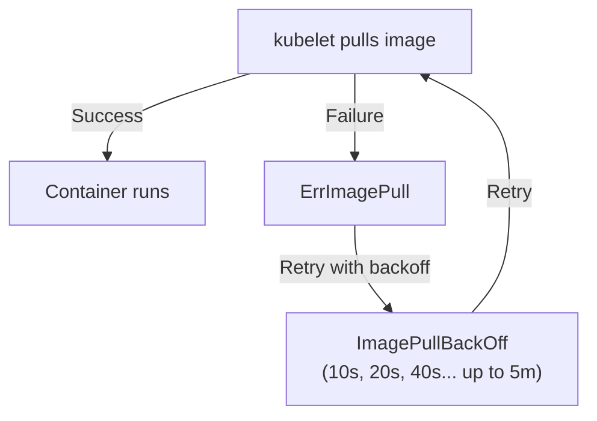

> 💡 **Quick Answer:** \`ImagePullBackOff\` means Kubernetes failed to pull a container image and is backing off retries. Common causes: wrong image name/tag, missing \`imagePullSecrets\` for private registries, Docker Hub rate limits, or network issues. Check \`kubectl describe pod\` for the exact error message.

## The Problem

Your pod is stuck in \`ImagePullBackOff\` or \`ErrImagePull\` status:

```bash
kubectl get pods
# NAME        READY   STATUS             RESTARTS   AGE
# my-app      0/1     ImagePullBackOff   0          5m
# my-app-2    0/1     ErrImagePull       0          1m
```



## The Solution

### Step 1: Check the Error Message

```bash
kubectl describe pod my-app | grep -A10 "Events:"
# Events:
#   Warning  Failed  kubelet  Failed to pull image "myregistry.com/app:v1":
#     rpc error: code = Unknown desc = Error response from daemon:
#     pull access denied for myregistry.com/app, repository does not exist
#     or may require 'docker login'
```

### Common Causes and Fixes

#### 1. Wrong Image Name or Tag

```bash
# Error: "manifest unknown" or "not found"
# The image or tag doesn't exist

# Check if image exists
docker pull myregistry.com/app:v1.0
# or
crane manifest myregistry.com/app:v1.0

# Fix: correct the image reference
# WRONG:
image: nginx:lates    # typo!
# RIGHT:
image: nginx:latest
```

#### 2. Private Registry — Missing imagePullSecrets

```yaml
# Create the secret
kubectl create secret docker-registry regcred \
  --docker-server=myregistry.com \
  --docker-username=myuser \
  --docker-password=mypassword \
  --docker-email=me@example.com

# Reference in pod spec
apiVersion: v1
kind: Pod
metadata:
  name: my-app
spec:
  imagePullSecrets:
    - name: regcred          # Must match secret name
  containers:
    - name: app
      image: myregistry.com/app:v1.0
```

#### 3. Docker Hub Rate Limit (429 Too Many Requests)

```bash
# Error: "toomanyrequests: You have reached your pull rate limit"

# Fix 1: Authenticate to Docker Hub (higher limits)
kubectl create secret docker-registry dockerhub \
  --docker-server=https://index.docker.io/v1/ \
  --docker-username=myuser \
  --docker-password=mytoken

# Fix 2: Use a mirror registry
# Fix 3: Cache images locally with a pull-through proxy
```

#### 4. NVIDIA NGC Registry

```yaml
# NGC requires API key authentication
kubectl create secret docker-registry ngc-secret \
  --docker-server=nvcr.io \
  --docker-username='$oauthtoken' \
  --docker-password=<NGC_API_KEY>

# Pod spec
imagePullSecrets:
  - name: ngc-secret
containers:
  - image: nvcr.io/nvidia/pytorch:24.04-py3
```

#### 5. Image Tag Doesn't Exist

```bash
# List available tags
crane ls myregistry.com/app
# v1.0
# v1.1
# latest

# If using :latest and it was deleted/moved:
# Pin to a specific version
image: myregistry.com/app:v1.1    # Not :latest
```

#### 6. Network Issues

```bash
# Pod can't reach the registry
kubectl exec -it debug-pod -- nslookup myregistry.com
kubectl exec -it debug-pod -- curl -I https://myregistry.com/v2/

# Check if egress NetworkPolicy blocks registry access
kubectl get networkpolicy -n my-namespace

# Check node-level DNS
kubectl get pods -n kube-system -l k8s-app=kube-dns
```

### Diagnostic Commands

```bash
# 1. Get pod events (most useful)
kubectl describe pod <pod-name> | tail -20

# 2. Check imagePullSecrets
kubectl get pod <pod-name> -o jsonpath='{.spec.imagePullSecrets}'

# 3. Verify secret exists and is correct
kubectl get secret regcred -o jsonpath='{.data.\.dockerconfigjson}' | base64 -d | jq .

# 4. Test pull from a node
# SSH to node, then:
crictl pull myregistry.com/app:v1.0

# 5. Check service account default pull secrets
kubectl get serviceaccount default -o yaml
# imagePullSecrets attached at SA level apply to all pods
```

### ServiceAccount-Level imagePullSecrets

Avoid adding \`imagePullSecrets\` to every pod:

```yaml
# Attach to service account — applies to all pods using this SA
apiVersion: v1
kind: ServiceAccount
metadata:
  name: default
imagePullSecrets:
  - name: regcred
```

```bash
# Or patch the default service account
kubectl patch serviceaccount default \
  -p '{"imagePullSecrets": [{"name": "regcred"}]}'
```

## Common Issues

| Error Message | Cause | Fix |
|--------------|-------|-----|
| \`repository does not exist or may require docker login\` | Missing auth or wrong image name | Add \`imagePullSecrets\` or fix image name |
| \`manifest unknown\` | Tag doesn't exist | Check available tags with \`crane ls\` |
| \`unauthorized: authentication required\` | Wrong credentials | Recreate secret with correct creds |
| \`toomanyrequests\` | Docker Hub rate limit | Authenticate or use mirror |
| \`x509: certificate signed by unknown authority\` | Self-signed registry cert | Add CA cert to node trust store |
| \`dial tcp: lookup registry.example.com: no such host\` | DNS resolution failure | Check CoreDNS and node DNS |
| \`context deadline exceeded\` | Network timeout | Check firewall, proxy, egress policies |

## Best Practices

- **Always use \`imagePullSecrets\`** for private registries — even in development
- **Pin image tags** — never use \`:latest\` in production
- **Attach secrets to ServiceAccounts** — avoid repetition in every pod spec
- **Use image pull-through caches** — reduces rate limit issues and speeds up pulls
- **Monitor image pull latency** — slow pulls increase pod startup time
- **Pre-pull images on nodes** — DaemonSet that pulls frequently used images

## Key Takeaways

- \`ImagePullBackOff\` = image pull failed, Kubernetes retrying with exponential backoff
- \`kubectl describe pod\` shows the exact error — always check events first
- Missing \`imagePullSecrets\` is the #1 cause for private registry failures
- Docker Hub has rate limits (100 pulls/6h anonymous, 200 authenticated)
- Attach pull secrets to ServiceAccounts for cluster-wide coverage
- Pin image tags and verify they exist before deploying
