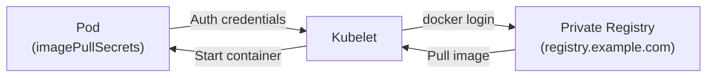

> 💡 **Quick Answer:** Create a docker-registry secret with `kubectl create secret docker-registry myregistry --docker-server=registry.example.com --docker-username=user --docker-password=pass`, then reference it in your pod spec with `imagePullSecrets: [{name: myregistry}]`. For cluster-wide access, attach the secret to the `default` ServiceAccount in each namespace.

## The Problem

Pulling images from private registries (Docker Hub paid, ECR, GCR, Quay, Harbor, Artifactory) requires authentication. Without `imagePullSecrets`, Kubernetes returns `ImagePullBackOff` or `ErrImagePull`. You need to create registry credentials as a Secret and tell pods or ServiceAccounts to use them.



## The Solution

### Create Registry Secret

```bash
# Method 1: kubectl create (most common)
kubectl create secret docker-registry myregistry \
  --docker-server=registry.example.com \
  --docker-username=myuser \
  --docker-password=mypassword \
  --docker-email=user@example.com \
  --namespace=my-app

# Method 2: From existing Docker config
kubectl create secret generic myregistry \
  --from-file=.dockerconfigjson=$HOME/.docker/config.json \
  --type=kubernetes.io/dockerconfigjson \
  --namespace=my-app

# Method 3: YAML manifest
cat << 'EOF' | kubectl apply -f -
apiVersion: v1
kind: Secret
metadata:
  name: myregistry
  namespace: my-app
type: kubernetes.io/dockerconfigjson
data:
  .dockerconfigjson: eyJhdXRocyI6...   # base64-encoded docker config
EOF

# Verify
kubectl get secret myregistry -o jsonpath='{.data.\.dockerconfigjson}' | base64 -d | jq .
```

### Use in Pod Spec

```yaml
apiVersion: v1
kind: Pod
metadata:
  name: my-app
spec:
  containers:
    - name: app
      image: registry.example.com/my-app:v1.0
  imagePullSecrets:
    - name: myregistry
---
# Deployment with imagePullSecrets
apiVersion: apps/v1
kind: Deployment
metadata:
  name: my-app
spec:
  template:
    spec:
      containers:
        - name: app
          image: registry.example.com/my-app:v1.0
      imagePullSecrets:
        - name: myregistry
```

### Attach to ServiceAccount (Cluster-Wide)

```bash
# Attach to default ServiceAccount — all pods in namespace get it
kubectl patch serviceaccount default \
  -n my-app \
  -p '{"imagePullSecrets": [{"name": "myregistry"}]}'

# Verify
kubectl get serviceaccount default -n my-app -o yaml

# Automate for all namespaces
for ns in $(kubectl get ns -o jsonpath='{.items[*].metadata.name}'); do
  kubectl create secret docker-registry myregistry \
    --docker-server=registry.example.com \
    --docker-username=myuser \
    --docker-password=mypassword \
    -n "$ns" --dry-run=client -o yaml | kubectl apply -f -
  kubectl patch serviceaccount default -n "$ns" \
    -p '{"imagePullSecrets": [{"name": "myregistry"}]}'
done
```

### Multiple Registries

```yaml
# Pod pulling from multiple private registries
apiVersion: v1
kind: Pod
metadata:
  name: multi-registry
spec:
  containers:
    - name: app
      image: registry.example.com/app:v1
    - name: sidecar
      image: quay.io/myorg/sidecar:v2
  imagePullSecrets:
    - name: example-registry       # registry.example.com
    - name: quay-registry          # quay.io
```

### Cloud Provider Registries

```bash
# AWS ECR
TOKEN=$(aws ecr get-login-password --region us-east-1)
kubectl create secret docker-registry ecr-secret \
  --docker-server=123456789.dkr.ecr.us-east-1.amazonaws.com \
  --docker-username=AWS \
  --docker-password="$TOKEN"
# ⚠️ ECR tokens expire in 12h — use ECR credential helper or CronJob to refresh

# GCR / Artifact Registry
kubectl create secret docker-registry gcr-secret \
  --docker-server=us-docker.pkg.dev \
  --docker-username=_json_key \
  --docker-password="$(cat service-account-key.json)"

# Azure ACR
kubectl create secret docker-registry acr-secret \
  --docker-server=myregistry.azurecr.io \
  --docker-username=myregistry \
  --docker-password="$(az acr credential show -n myregistry --query passwords[0].value -o tsv)"
```

### Using --docker-password-stdin

```bash
# Pipe password from file or command (avoids password in shell history)
kubectl create secret docker-registry myregistry \
  --docker-server=registry.example.com \
  --docker-username=myuser \
  --docker-password="$(cat /path/to/password-file)"

# Or from environment variable
kubectl create secret docker-registry myregistry \
  --docker-server=registry.example.com \
  --docker-username=myuser \
  --docker-password="$REGISTRY_PASSWORD"
```

## Common Issues

| Issue | Cause | Fix |
|-------|-------|-----|
| `ImagePullBackOff` | Missing or wrong imagePullSecrets | Verify secret exists in same namespace as pod |
| `unauthorized: authentication required` | Wrong credentials | Recreate secret with correct password |
| `Secret not found` | Secret in different namespace | Create secret in pod's namespace |
| ECR auth expired | Token valid only 12h | Use CronJob to refresh or credential helper |
| `no basic auth credentials` | docker-server URL mismatch | Ensure server URL matches image prefix exactly |
| Works in default SA, not in custom | Custom SA missing secret | Patch the specific ServiceAccount |

## Best Practices

- **Attach to ServiceAccount** — avoid repeating `imagePullSecrets` in every pod spec
- **Use External Secrets Operator** — sync registry creds from Vault/AWS Secrets Manager
- **Rotate credentials regularly** — update secrets without redeploying pods
- **Never hardcode passwords in YAML** — use `kubectl create` or sealed secrets
- **One secret per registry** — easier to rotate and audit
- **ECR: automate token refresh** — CronJob every 10h to recreate the secret

## Key Takeaways

- `imagePullSecrets` provides registry authentication for private container images
- Create with `kubectl create secret docker-registry` — fastest method
- Attach to ServiceAccount for namespace-wide access without per-pod config
- Cloud registries (ECR, GCR, ACR) have provider-specific credential patterns
- Always create the secret in the same namespace as the pods that need it
- `ImagePullBackOff` is almost always a missing or misconfigured imagePullSecrets
