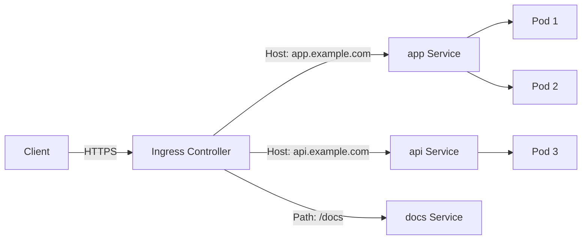

> 💡 **Quick Answer:** Configure Kubernetes Ingress for HTTP routing, TLS termination, and path-based routing. Covers NGINX, Traefik, and HAProxy ingress controllers.

## The Problem

This is one of the most searched Kubernetes topics. Having a comprehensive, well-structured guide helps both beginners and experienced users quickly find what they need.

## The Solution

### Install NGINX Ingress Controller

```bash
helm repo add ingress-nginx https://kubernetes.github.io/ingress-nginx
helm install ingress-nginx ingress-nginx/ingress-nginx \
  --namespace ingress-nginx --create-namespace
```

### Basic Ingress

```yaml
apiVersion: networking.k8s.io/v1
kind: Ingress
metadata:
  name: my-app-ingress
  annotations:
    nginx.ingress.kubernetes.io/rewrite-target: /
spec:
  ingressClassName: nginx
  rules:
    - host: myapp.example.com
      http:
        paths:
          - path: /
            pathType: Prefix
            backend:
              service:
                name: my-app
                port:
                  number: 80
          - path: /api
            pathType: Prefix
            backend:
              service:
                name: api-service
                port:
                  number: 8080
    - host: other.example.com
      http:
        paths:
          - path: /
            pathType: Prefix
            backend:
              service:
                name: other-app
                port:
                  number: 80
```

### TLS with cert-manager

```yaml
apiVersion: networking.k8s.io/v1
kind: Ingress
metadata:
  name: secure-ingress
  annotations:
    cert-manager.io/cluster-issuer: letsencrypt-prod
spec:
  ingressClassName: nginx
  tls:
    - hosts:
        - myapp.example.com
      secretName: myapp-tls
  rules:
    - host: myapp.example.com
      http:
        paths:
          - path: /
            pathType: Prefix
            backend:
              service:
                name: my-app
                port:
                  number: 80
---
apiVersion: cert-manager.io/v1
kind: ClusterIssuer
metadata:
  name: letsencrypt-prod
spec:
  acme:
    server: https://acme-v02.api.letsencrypt.org/directory
    email: admin@example.com
    privateKeySecretRef:
      name: letsencrypt-prod
    solvers:
      - http01:
          ingress:
            class: nginx
```

### Rate Limiting & Security

```yaml
metadata:
  annotations:
    nginx.ingress.kubernetes.io/rate-limit: "10"
    nginx.ingress.kubernetes.io/rate-limit-window: "1m"
    nginx.ingress.kubernetes.io/ssl-redirect: "true"
    nginx.ingress.kubernetes.io/force-ssl-redirect: "true"
    nginx.ingress.kubernetes.io/proxy-body-size: "10m"
    nginx.ingress.kubernetes.io/proxy-read-timeout: "60"
```



## Frequently Asked Questions

### What is the difference between Ingress and Service?

A **Service** provides internal load balancing and DNS within the cluster. An **Ingress** provides external HTTP/HTTPS routing with host-based and path-based rules, TLS termination, and virtual hosting.

### Ingress vs Gateway API?

Gateway API is the successor to Ingress with more features: cross-namespace routing, traffic splitting, header-based matching. Ingress is simpler and more widely supported today.

### Do I need an Ingress Controller?

Yes. The Ingress resource is just configuration — you need a controller (NGINX, Traefik, HAProxy, or cloud-specific) to implement it.

## Best Practices

- **Start simple** — use the basic form first, add complexity as needed
- **Be consistent** — follow naming conventions across your cluster
- **Document your choices** — add annotations explaining why, not just what
- **Monitor and iterate** — review configurations regularly

## Key Takeaways

- This is fundamental Kubernetes knowledge every engineer needs
- Start with the simplest approach that solves your problem
- Use `kubectl explain` and `kubectl describe` when unsure
- Practice in a test cluster before applying to production
