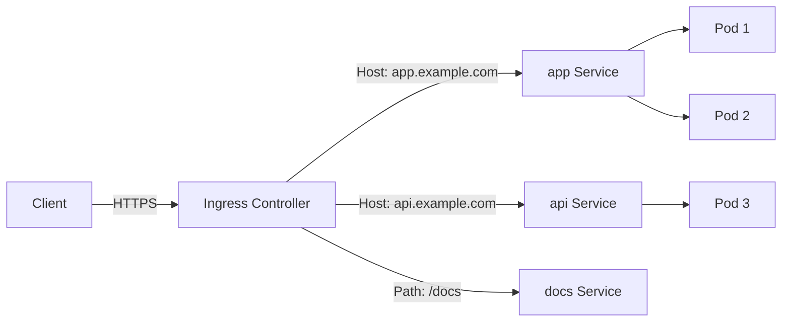

> 💡 **Quick Answer:** An Ingress is an L7 routing rule (host + path → Service) that only works once an Ingress controller is installed. Install one (`helm install ingress-nginx ingress-nginx/ingress-nginx -n ingress-nginx --create-namespace`, or Traefik/HAProxy/your cloud's ALB controller), set `spec.ingressClassName`, and add `cert-manager.io/cluster-issuer` for automatic TLS. For new platforms, evaluate [Gateway API](/recipes/networking/kubernetes-gateway-api/).
>
> **Heads-up:** the community `ingress-nginx` project was retired by Kubernetes SIG Network in March 2026 (no further releases or security fixes). Existing Ingress objects keep working with other controllers; plan a move to a maintained controller or Gateway API.

## The Solution

### Install an Ingress Controller

```bash
helm repo add ingress-nginx https://kubernetes.github.io/ingress-nginx
helm install ingress-nginx ingress-nginx/ingress-nginx \
  --namespace ingress-nginx --create-namespace

kubectl get ingressclass
```

### Basic Ingress

```yaml
apiVersion: networking.k8s.io/v1
kind: Ingress
metadata:
  name: my-app-ingress
spec:
  ingressClassName: nginx
  rules:
    - host: myapp.example.com
      http:
        paths:
          - path: /
            pathType: Prefix
            backend:
              service:
                name: my-app
                port:
                  number: 80
          - path: /api
            pathType: Prefix
            backend:
              service:
                name: api-service
                port:
                  number: 8080
    - host: other.example.com
      http:
        paths:
          - path: /
            pathType: Prefix
            backend:
              service:
                name: other-app
                port:
                  number: 80
```

Don't add `rewrite-target: /` here: it would rewrite `/api/users` to `/` for the backend. Use regex rewrites (below) only when the backend expects a stripped prefix.

### TLS with cert-manager

```bash
helm repo add jetstack https://charts.jetstack.io
helm install cert-manager jetstack/cert-manager \
  --namespace cert-manager --create-namespace \
  --set crds.enabled=true
```

```yaml
apiVersion: networking.k8s.io/v1
kind: Ingress
metadata:
  name: secure-ingress
  annotations:
    cert-manager.io/cluster-issuer: letsencrypt-prod
spec:
  ingressClassName: nginx
  tls:
    - hosts:
        - myapp.example.com
      secretName: myapp-tls
  rules:
    - host: myapp.example.com
      http:
        paths:
          - path: /
            pathType: Prefix
            backend:
              service:
                name: my-app
                port:
                  number: 80
---
apiVersion: cert-manager.io/v1
kind: ClusterIssuer
metadata:
  name: letsencrypt-prod
spec:
  acme:
    server: https://acme-v02.api.letsencrypt.org/directory
    email: admin@example.com
    privateKeySecretRef:
      name: letsencrypt-prod
    solvers:
      - http01:
          ingress:
            class: nginx
```

### Rate Limiting & Security

```yaml
metadata:
  annotations:
    nginx.ingress.kubernetes.io/limit-rps: "10"          # per client IP
    nginx.ingress.kubernetes.io/limit-burst-multiplier: "5"
    nginx.ingress.kubernetes.io/ssl-redirect: "true"
    nginx.ingress.kubernetes.io/force-ssl-redirect: "true"
    nginx.ingress.kubernetes.io/proxy-body-size: "10m"
    nginx.ingress.kubernetes.io/proxy-read-timeout: "60"
```

| Annotation (ingress-nginx) | Purpose |
|-----------|---------|
| `ssl-redirect: "true"` | Redirect HTTP to HTTPS when TLS is set |
| `proxy-body-size: "50m"` | Max upload size (413 errors) |
| `limit-rps` / `limit-connections` | Per-IP rate limiting |
| `auth-type: basic` | Basic auth |
| `enable-cors: "true"` + `cors-allow-origin` | CORS headers |
| `affinity: cookie` | Session affinity |

All keys are prefixed `nginx.ingress.kubernetes.io/`. Other controllers (Traefik, HAProxy, OpenShift Router) use their own annotations.


```mermaid
graph LR
    A[Client] -->|HTTPS| B[Ingress Controller]
    B -->|Host: app.example.com| C[app Service]
    B -->|Host: api.example.com| D[api Service]
    B -->|Path: /docs| E[docs Service]
    C --> F[Pod 1]
    C --> G[Pod 2]
    D --> H[Pod 3]
```

### Path Types

`pathType` controls how the path is matched:

```yaml
# Exact matching — path must match exactly
- path: /api/v1/users
  pathType: Exact
  backend:
    service:
      name: users-v1
      port:
        number: 80

# Prefix matching — matches the URL path prefix (most common)
- path: /api/v1
  pathType: Prefix
  backend:
    service:
      name: api-v1
      port:
        number: 80
```

### URL Rewriting

```yaml
apiVersion: networking.k8s.io/v1
kind: Ingress
metadata:
  name: rewrite-ingress
  annotations:
    nginx.ingress.kubernetes.io/rewrite-target: /$2
spec:
  ingressClassName: nginx
  rules:
    - host: app.example.com
      http:
        paths:
          # /api/users -> /users
          - path: /api(/|$)(.*)
            pathType: ImplementationSpecific
            backend:
              service:
                name: api-service
                port:
                  number: 80
```

### Canary Deployments

Weight-based canary splits traffic between a main and canary Ingress pointing at different Services:

```yaml
# Main ingress
apiVersion: networking.k8s.io/v1
kind: Ingress
metadata:
  name: main-ingress
spec:
  ingressClassName: nginx
  rules:
    - host: app.example.com
      http:
        paths:
          - path: /
            pathType: Prefix
            backend:
              service: {name: main-service, port: {number: 80}}
---
# Canary ingress (10% of traffic)
apiVersion: networking.k8s.io/v1
kind: Ingress
metadata:
  name: canary-ingress
  annotations:
    nginx.ingress.kubernetes.io/canary: "true"
    nginx.ingress.kubernetes.io/canary-weight: "10"
spec:
  ingressClassName: nginx
  rules:
    - host: app.example.com
      http:
        paths:
          - path: /
            pathType: Prefix
            backend:
              service: {name: canary-service, port: {number: 80}}
```

Header-based canary routes to the canary Service whenever a specific header is present, instead of splitting by weight:

```yaml
metadata:
  annotations:
    nginx.ingress.kubernetes.io/canary: "true"
    nginx.ingress.kubernetes.io/canary-by-header: "X-Canary"
    nginx.ingress.kubernetes.io/canary-by-header-value: "true"
```

### Session Affinity

```yaml
metadata:
  annotations:
    nginx.ingress.kubernetes.io/affinity: "cookie"
    nginx.ingress.kubernetes.io/affinity-mode: "persistent"
    nginx.ingress.kubernetes.io/session-cookie-name: "SERVERID"
    nginx.ingress.kubernetes.io/session-cookie-max-age: "3600"
```

### Basic Authentication

```yaml
apiVersion: networking.k8s.io/v1
kind: Ingress
metadata:
  name: auth-ingress
  annotations:
    nginx.ingress.kubernetes.io/auth-type: basic
    nginx.ingress.kubernetes.io/auth-secret: basic-auth
    nginx.ingress.kubernetes.io/auth-realm: "Authentication Required"
spec:
  ingressClassName: nginx
  rules:
    - host: admin.example.com
      http:
        paths:
          - path: /
            pathType: Prefix
            backend:
              service: {name: admin-service, port: {number: 80}}
```

```bash
htpasswd -c auth admin
kubectl create secret generic basic-auth --from-file=auth
```

### Default Backend

```yaml
apiVersion: networking.k8s.io/v1
kind: Ingress
metadata:
  name: ingress-with-default
spec:
  ingressClassName: nginx
  defaultBackend:
    service: {name: default-service, port: {number: 80}}
  rules:
    - host: app.example.com
      http:
        paths:
          - path: /api
            pathType: Prefix
            backend:
              service: {name: api-service, port: {number: 80}}
```

### Debug Ingress

```bash
kubectl get ingress
kubectl describe ingress my-ingress
kubectl logs -n ingress-nginx -l app.kubernetes.io/name=ingress-nginx
curl -H "Host: app.example.com" http://<ingress-ip>/
kubectl exec -n ingress-nginx <nginx-pod> -- cat /etc/nginx/nginx.conf
```

## Frequently Asked Questions

### What is the difference between Ingress and Service?

A **Service** provides internal load balancing and DNS within the cluster. An **Ingress** provides external HTTP/HTTPS routing with host-based and path-based rules, TLS termination, and virtual hosting.

### Ingress vs Gateway API?

Gateway API is the successor to Ingress with more features: cross-namespace routing, traffic splitting, header-based matching. Ingress is simpler and more widely supported today.

### Do I need an Ingress Controller?

Yes. The Ingress resource is just configuration — you need a controller (NGINX, Traefik, HAProxy, or cloud-specific) to implement it.

### Which Ingress controller should I use?

Traefik and HAProxy are mature general-purpose options; F5 NGINX Ingress Controller is the maintained NGINX-based alternative to the retired community ingress-nginx. On cloud, the AWS Load Balancer Controller or GKE Ingress provision native L7 load balancers. On OpenShift, the built-in Router (HAProxy) implements both Routes and Ingress.

### What is the difference between pathType Prefix and Exact?

`Exact` matches only the exact path. `Prefix` matches by path elements split on `/`, so `/api` matches `/api` and `/api/v1` but not `/apiv1`. `ImplementationSpecific` defers to the controller and is required for regex paths in ingress-nginx.

## Best Practices

- **Always set `ingressClassName`** — relying on a default class breaks when a second controller is installed
- **Terminate TLS at the Ingress** with cert-manager and force HTTPS redirects
- **Keep rewrites explicit** — only use `rewrite-target` with regex capture groups
- **Test with `curl -H "Host: ..."`** against the controller IP before touching DNS

## Key Takeaways

- Ingress = host/path routing rules; the controller does the actual proxying
- Use `Prefix` for most paths, `Exact` for single endpoints, `ImplementationSpecific` for regex
- Annotations are controller-specific — they don't port between controllers
- Gateway API is the successor for multi-team, traffic-splitting, and header-routing needs
