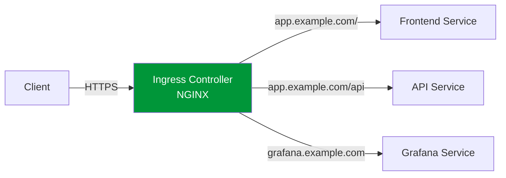

> 💡 **Quick Answer:** Ingress routes external HTTP/HTTPS traffic to internal Services based on hostname and path. Install an Ingress Controller (NGINX, Traefik, HAProxy), then create Ingress resources: `host: app.example.com` → `service: app-svc, port: 80`. Add TLS with a Secret reference. For Kubernetes 1.28+, consider Gateway API as the modern replacement.

## The Problem

Exposing multiple services externally without Ingress means:

- One LoadBalancer per service ($$$)
- No hostname-based routing
- No TLS termination at the edge
- No path-based routing to different backends
- No centralized access logging

## The Solution

### Install NGINX Ingress Controller

```bash
helm repo add ingress-nginx https://kubernetes.github.io/ingress-nginx
helm repo update

helm install ingress-nginx ingress-nginx/ingress-nginx \
  --namespace ingress-nginx \
  --create-namespace
```

### Basic Ingress

```yaml
apiVersion: networking.k8s.io/v1
kind: Ingress
metadata:
  name: app-ingress
  annotations:
    nginx.ingress.kubernetes.io/rewrite-target: /
spec:
  ingressClassName: nginx
  rules:
  - host: app.example.com
    http:
      paths:
      - path: /
        pathType: Prefix
        backend:
          service:
            name: frontend-svc
            port:
              number: 80
      - path: /api
        pathType: Prefix
        backend:
          service:
            name: api-svc
            port:
              number: 8080
```

### TLS Termination

```yaml
apiVersion: networking.k8s.io/v1
kind: Ingress
metadata:
  name: secure-ingress
  annotations:
    nginx.ingress.kubernetes.io/ssl-redirect: "true"
spec:
  ingressClassName: nginx
  tls:
  - hosts:
    - app.example.com
    secretName: app-tls-secret       # TLS cert + key
  rules:
  - host: app.example.com
    http:
      paths:
      - path: /
        pathType: Prefix
        backend:
          service:
            name: app-svc
            port:
              number: 80
```

```bash
# Create TLS secret
kubectl create secret tls app-tls-secret \
  --cert=tls.crt \
  --key=tls.key \
  -n default
```

### Multi-Host Ingress

```yaml
apiVersion: networking.k8s.io/v1
kind: Ingress
metadata:
  name: multi-host
spec:
  ingressClassName: nginx
  rules:
  - host: app.example.com
    http:
      paths:
      - path: /
        pathType: Prefix
        backend:
          service:
            name: app-svc
            port:
              number: 80
  - host: api.example.com
    http:
      paths:
      - path: /
        pathType: Prefix
        backend:
          service:
            name: api-svc
            port:
              number: 8080
  - host: grafana.example.com
    http:
      paths:
      - path: /
        pathType: Prefix
        backend:
          service:
            name: grafana-svc
            port:
              number: 3000
```

### Common Annotations

```yaml
annotations:
  # Rate limiting
  nginx.ingress.kubernetes.io/limit-rps: "10"
  
  # Request size
  nginx.ingress.kubernetes.io/proxy-body-size: "50m"
  
  # Timeouts
  nginx.ingress.kubernetes.io/proxy-read-timeout: "300"
  nginx.ingress.kubernetes.io/proxy-send-timeout: "300"
  
  # CORS
  nginx.ingress.kubernetes.io/enable-cors: "true"
  nginx.ingress.kubernetes.io/cors-allow-origin: "https://app.example.com"
  
  # Auth
  nginx.ingress.kubernetes.io/auth-type: basic
  nginx.ingress.kubernetes.io/auth-secret: basic-auth
```



### Path Types

| PathType | Behavior |
|----------|----------|
| `Prefix` | Matches URL path prefix (e.g., `/api` matches `/api/v1`) |
| `Exact` | Exact path match only |
| `ImplementationSpecific` | Controller-dependent |

## Common Issues

**Ingress shows no ADDRESS**

Ingress Controller not installed or not running. Check `kubectl get pods -n ingress-nginx`.

**404 for all requests**

`host` in Ingress doesn't match the request's Host header. Test with `curl -H "Host: app.example.com" http://<ingress-ip>/`.

**TLS certificate not working**

Secret must be in the same namespace as the Ingress and contain `tls.crt` and `tls.key` keys.

## Best Practices

- **One Ingress Controller, many Ingress resources** — shared edge proxy
- **Always enable TLS** — use cert-manager for automatic Let's Encrypt certs
- **Use `ingressClassName`** — explicit controller selection (required since v1.18+)
- **Consider Gateway API** for new clusters — it's the successor to Ingress
- **Set rate limits and body size** — protect backends from abuse
- **Monitor Ingress Controller** — it's a single point of failure

## Key Takeaways

- Ingress routes HTTP/HTTPS traffic by hostname and path to backend Services
- Requires an Ingress Controller (NGINX, Traefik, HAProxy) — Ingress resource alone does nothing
- TLS termination at the Ingress saves per-service certificate management
- One LoadBalancer for the Ingress Controller serves all Ingress resources
- Gateway API is the modern successor — consider it for new projects
