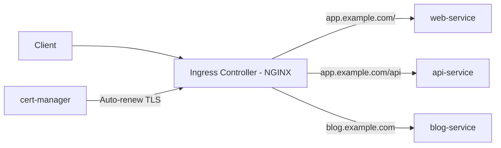

> 💡 **Quick Answer:** networking

## The Problem

This is one of the most searched Kubernetes topics with thousands of monthly searches. A comprehensive, production-ready guide prevents hours of trial and error.

## The Solution

### Install NGINX Ingress Controller

```bash
helm repo add ingress-nginx https://kubernetes.github.io/ingress-nginx
helm install ingress-nginx ingress-nginx/ingress-nginx \
  --namespace ingress-nginx --create-namespace
```

### Basic Ingress

```yaml
apiVersion: networking.k8s.io/v1
kind: Ingress
metadata:
  name: web-ingress
  annotations:
    nginx.ingress.kubernetes.io/rewrite-target: /
spec:
  ingressClassName: nginx
  rules:
    - host: app.example.com
      http:
        paths:
          - path: /
            pathType: Prefix
            backend:
              service:
                name: web-service
                port:
                  number: 80
          - path: /api
            pathType: Prefix
            backend:
              service:
                name: api-service
                port:
                  number: 8080
    - host: blog.example.com
      http:
        paths:
          - path: /
            pathType: Prefix
            backend:
              service:
                name: blog-service
                port:
                  number: 80
```

### TLS with cert-manager

```bash
helm repo add jetstack https://charts.jetstack.io
helm install cert-manager jetstack/cert-manager \
  --namespace cert-manager --create-namespace \
  --set crds.enabled=true
```

```yaml
# ClusterIssuer for Let's Encrypt
apiVersion: cert-manager.io/v1
kind: ClusterIssuer
metadata:
  name: letsencrypt-prod
spec:
  acme:
    server: https://acme-v02.api.letsencrypt.org/directory
    email: admin@example.com
    privateKeySecretRef:
      name: letsencrypt-prod
    solvers:
      - http01:
          ingress:
            class: nginx
---
# Ingress with auto TLS
apiVersion: networking.k8s.io/v1
kind: Ingress
metadata:
  name: secure-ingress
  annotations:
    cert-manager.io/cluster-issuer: letsencrypt-prod
spec:
  ingressClassName: nginx
  tls:
    - hosts:
        - app.example.com
      secretName: app-tls
  rules:
    - host: app.example.com
      http:
        paths:
          - path: /
            pathType: Prefix
            backend:
              service:
                name: web-service
                port:
                  number: 80
```

### Common Annotations

| Annotation | Purpose |
|-----------|---------|
| `nginx.ingress.kubernetes.io/ssl-redirect: "true"` | Force HTTPS |
| `nginx.ingress.kubernetes.io/proxy-body-size: "50m"` | Max upload size |
| `nginx.ingress.kubernetes.io/rate-limit: "10"` | Rate limiting |
| `nginx.ingress.kubernetes.io/auth-type: basic` | Basic auth |
| `nginx.ingress.kubernetes.io/cors-allow-origin: "*"` | CORS headers |
| `nginx.ingress.kubernetes.io/affinity: cookie` | Session affinity |



## Frequently Asked Questions

### Ingress vs Gateway API?

Ingress is stable and widely supported. **Gateway API** is the next-generation replacement with better multi-tenancy, traffic splitting, and header-based routing. New clusters should consider Gateway API.

### Which Ingress Controller?

**NGINX** is the most popular. **Traefik** is simpler with auto-discovery. **HAProxy** for high-performance. **AWS ALB** or **GCP** for cloud-native.

## Best Practices

- Start with the simplest configuration that solves your problem
- Test in staging before production
- Use `kubectl describe` and events for troubleshooting
- Document team conventions for consistency

## Key Takeaways

- This is fundamental Kubernetes operational knowledge
- Follow established conventions and recommended labels
- Monitor and iterate based on real production behavior
- Automate repetitive tasks to reduce human error
