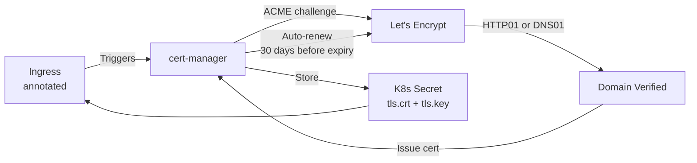

> 💡 **Quick Answer:** Install cert-manager, create a `ClusterIssuer` for Let's Encrypt, then annotate your Ingress with `cert-manager.io/cluster-issuer: letsencrypt-prod`. cert-manager automatically requests, renews, and stores TLS certificates as Kubernetes Secrets.

## The Problem

Managing TLS certificates manually is error-prone: certificates expire, renewals are forgotten, and each new service needs certificate provisioning. cert-manager automates the entire lifecycle — request, validate, issue, renew — for every Ingress in the cluster.

## The Solution

### Install cert-manager

```bash
helm install cert-manager jetstack/cert-manager \
  --namespace cert-manager \
  --create-namespace \
  --set crds.enabled=true
```

### ClusterIssuer (Let's Encrypt)

```yaml
apiVersion: cert-manager.io/v1
kind: ClusterIssuer
metadata:
  name: letsencrypt-prod
spec:
  acme:
    server: https://acme-v02.api.letsencrypt.org/directory
    email: admin@example.com
    privateKeySecretRef:
      name: letsencrypt-prod-key
    solvers:
      - http01:
          ingress:
            class: nginx
---
# Staging issuer for testing (higher rate limits)
apiVersion: cert-manager.io/v1
kind: ClusterIssuer
metadata:
  name: letsencrypt-staging
spec:
  acme:
    server: https://acme-staging-v02.api.letsencrypt.org/directory
    email: admin@example.com
    privateKeySecretRef:
      name: letsencrypt-staging-key
    solvers:
      - http01:
          ingress:
            class: nginx
```

### Ingress with Automatic TLS

```yaml
apiVersion: networking.k8s.io/v1
kind: Ingress
metadata:
  name: my-app
  annotations:
    cert-manager.io/cluster-issuer: letsencrypt-prod
spec:
  ingressClassName: nginx
  tls:
    - hosts:
        - app.example.com
      secretName: app-example-com-tls
  rules:
    - host: app.example.com
      http:
        paths:
          - path: /
            pathType: Prefix
            backend:
              service:
                name: my-app
                port:
                  number: 8080
```

### DNS01 Challenge (Wildcard Certs)

```yaml
apiVersion: cert-manager.io/v1
kind: ClusterIssuer
metadata:
  name: letsencrypt-dns
spec:
  acme:
    server: https://acme-v02.api.letsencrypt.org/directory
    email: admin@example.com
    privateKeySecretRef:
      name: letsencrypt-dns-key
    solvers:
      - dns01:
          cloudflare:
            email: admin@example.com
            apiTokenSecretRef:
              name: cloudflare-api-token
              key: api-token
---
apiVersion: cert-manager.io/v1
kind: Certificate
metadata:
  name: wildcard-cert
  namespace: production
spec:
  secretName: wildcard-example-com-tls
  issuerRef:
    name: letsencrypt-dns
    kind: ClusterIssuer
  dnsNames:
    - "*.example.com"
    - example.com
```



## Common Issues

**Certificate stuck in "Pending" — challenge fails**

Check the Challenge resource: `kubectl describe challenge -n production`. HTTP01 requires the ingress controller to be reachable on port 80 from the internet.

**Rate limited by Let's Encrypt**

Use `letsencrypt-staging` for testing. Production has a limit of 50 certificates per domain per week.

**Wildcard certs require DNS01**

HTTP01 cannot validate wildcard domains. You must use DNS01 with a supported DNS provider (Cloudflare, Route53, Google DNS, etc.).

## Best Practices

- **Start with staging issuer** — test your setup before hitting production rate limits
- **Use DNS01 for wildcards** — HTTP01 only works for specific hostnames
- **One Secret per Ingress** — don't share TLS secrets across Ingresses
- **Monitor Certificate expiry** — cert-manager exposes Prometheus metrics
- **Use `ClusterIssuer`** (not `Issuer`) for shared issuers across namespaces

## Key Takeaways

- cert-manager automates TLS certificate lifecycle — request, validate, issue, renew
- Annotate Ingress with `cert-manager.io/cluster-issuer` for automatic cert provisioning
- HTTP01 for specific hostnames, DNS01 for wildcard certificates
- Certificates auto-renew 30 days before expiry
- Use staging issuer for testing to avoid rate limits
